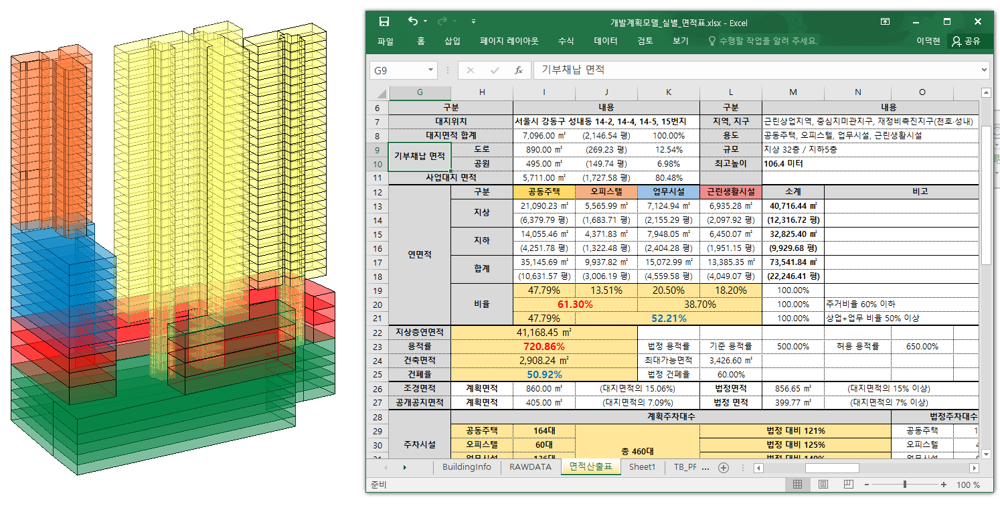
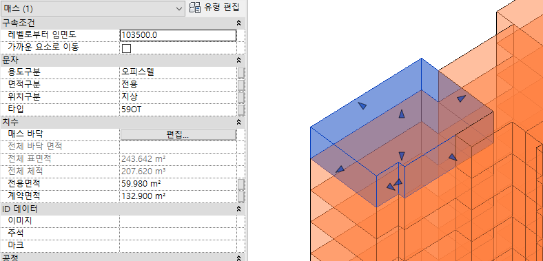

`2022.01.27`

# 면적 검토 자동화 도구

## Introduction
개발계획 및 면적 검토에 활용 가능한 도구로서 'Revit 매스' 와 엑셀을 기반으로 하며, 모델링 시 특정 정보를 실시간으로 추출할 수 있어 각종 검토에 효과적입니다.

기본적으로 실별 바닥면적, 높이, 용도, 세대타입, 세대수, 주차대수 등의 추출 및 검토가 가능하고, 여러 집계를 통하여 용적률, 주거비율, 층별 면적표 등도 계산할 수 있습니다.

## Contents

### BIM 시각화 검토

### 엑셀 집계

### 실시간 정보 추출
이이잉

### 매스 모델링

- 개발계획
- 면적검토
- 매스 모델
- 매스 모델링
- revit
- 매개변수
- 엑셀
- 실시간
- 집계
- 자유 양식
- 최고 높이
- 용도별 면적
- 주차대수
- 세대수
- 주거비율
- 용적률
- 건폐율

