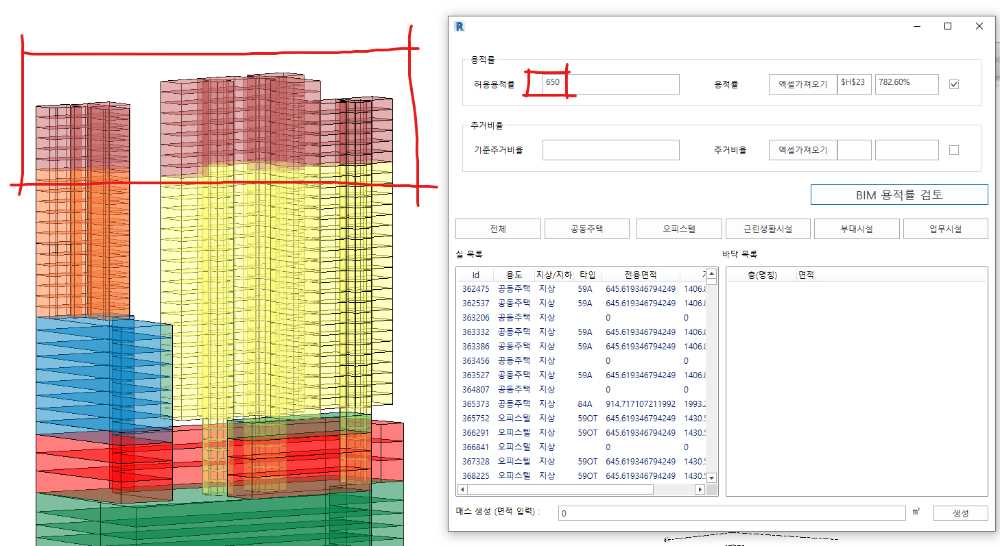
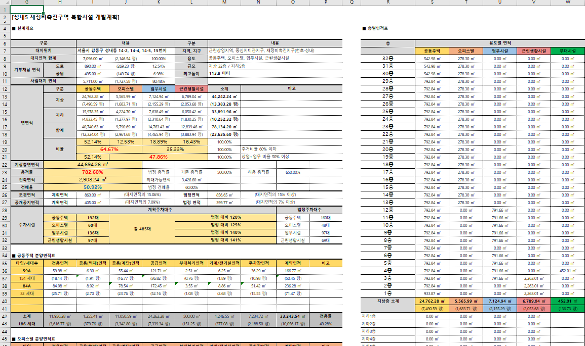
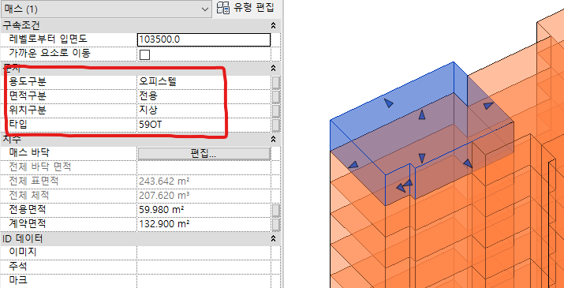

`2022.01.27`

# 면적 검토 자동화 도구

## Introduction
개발계획 및 면적 검토에 활용 가능한 도구로서 'Revit 매스' 와 엑셀을 기반으로 하며, 모델링 시 특정 정보를 실시간으로 추출할 수 있어 각종 검토에 효과적입니다.

기본적으로 실별 바닥면적, 높이, 용도, 세대타입, 세대수, 주차대수 등의 추출 및 검토가 가능하고, 여러 집계를 통하여 용적률, 주거비율, 층별 면적표 등도 계산할 수 있습니다.

## Contents
### BIM 시각화 검토
엑셀의 계산 결과값 (연면적, 용적률, 최고높이, 주거비율 등) 에 의해 BIM의 재 검토가 가능합니다. 프로젝트별 각기 다른 양식에서 원하는 위치 셀을 데이터로 인식하여 그 값에 대한 판단을 합니다.

### 엑셀 양식 지원
기존 방식인 엑셀집계 형태를 지원합니다. 집계에 필요한 면적, 용도, 층 구분 등을 엑셀로 추출하여 필요에 따라 유연하게 집계/ 활용 가능합니다. 

### 실시간 정보 추출
용도, 면적구분, 위치, 타입 등의 지정속성을 모델링 변경시 실시간으로 엑셀 추출합니다. 이로써 미리 만들어놓은 집계용 시트에 변경된 값들이 자동 변경될 것입니다.

- 개발계획
- 면적검토
- 매스 모델
- 매스 모델링
- revit
- 매개변수
- 엑셀
- 실시간
- 집계
- 자유 양식
- 최고 높이
- 용도별 면적
- 주차대수
- 세대수
- 주거비율
- 용적률
- 건폐율

