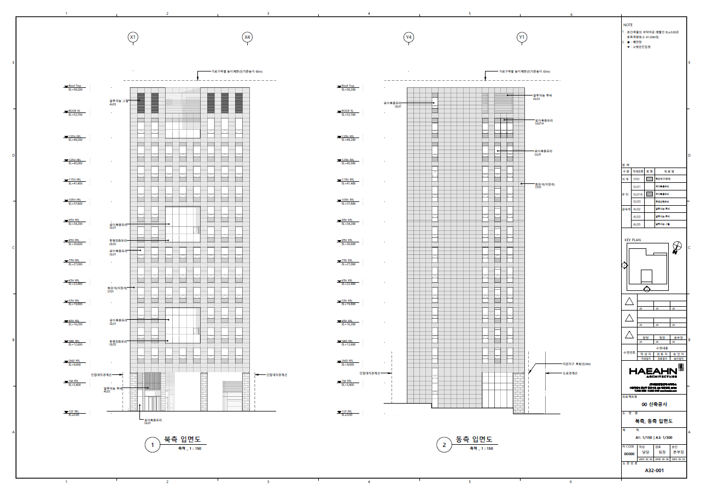
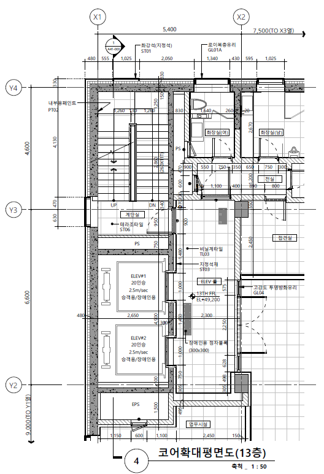
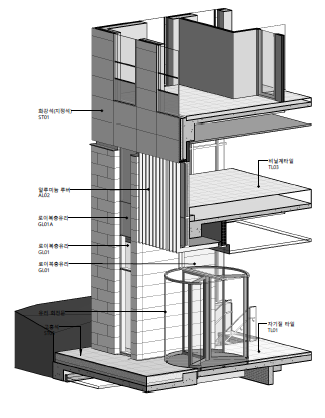
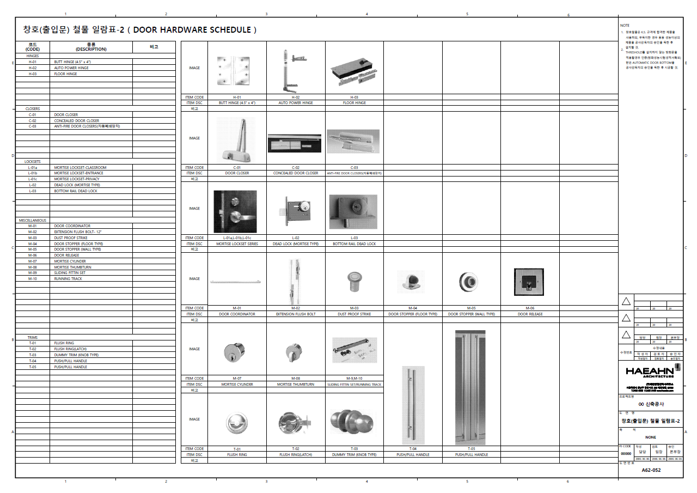
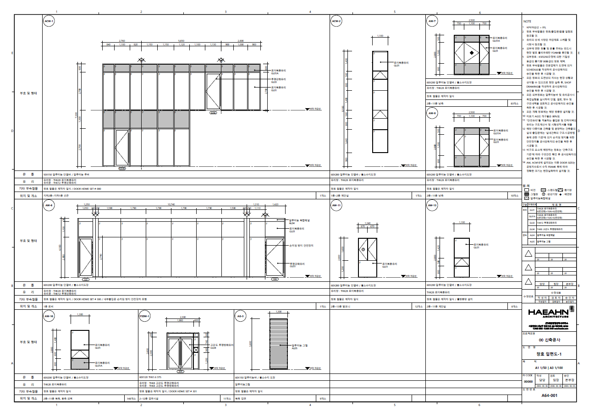

`2022.02.08`

# 도면 생성 자동화 시스템

## Introduction
BIM 모델링 후, 도면 작성을 위한 2차 업무를 간소화 하기 위하여 BIM의 형상, 속성, 도면작성기준을 적극 활용하여 목록표 생성, 도면 추출, 도면 작성 등을 자동화 지원합니다.  

## Contents
### 외주용 도면 생성
기계, 전기/통신, 소방 분야 도면외주용 참고도면(건축, 구조)을 자동으로 생성하여 관리에 소요되는 시간을 절약할 수 있습니다. 외주용 도면은 최소한의 정보만을 포함하여 추출/ 생성되므로 자동 생성이 가능합니다.

### 평면/ 입면/ ISO뷰 생성
주요 도면 들을 자동으로 생성하여 줍니다. 세대평면, 코어평면, 계단실단면, 창호안내도, 동 입면, 화장실전개도 등의 도면을 90% 이상 완성도로 생성하여 설계자의 업무 시간을 대폭 줄여줄 수 있습니다.

### 구조/ 창호/ 마감 등 일람표 생성
BIM 의 구조부재, 창호, 룸 객체 등의 형상 및 속성을 이용하여 해당부재 일람표를 자동으로 생성하여 줍니다. 

- 도면
- 실시설계
- 기본설계
- revit
- mep
- 기계
- 전기,통신
- 소방
- 협의용도면
- 외주용도면
- 창호안내도
- 창호입면도
- 실내마감재료표
- 기둥/보 일람표
