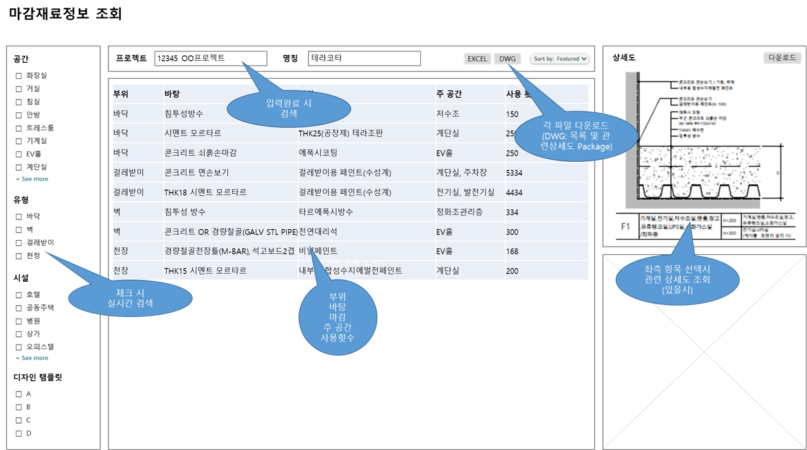
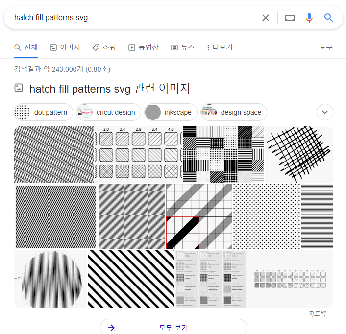

`2022.03.10`

# 설계데이터조회시스템

## 플랫폼
- 웹
- Revit

## 실내마감재료 조회/ 활용

### 검색조건
- 프로젝트 별
- 실 유형별
- 마감 재료별
- 구분 별 (바닥, 벽, 걸레받이, 천정)

### 정보/ 자료제공
- 재료마감 목록
- 자재정보 (내용, 이미지)
- 유사 프로젝트
- 상세도
- 디자인 탬플릿 조회 및 활용

### 기능
- 마감이 사용된 프로젝트 목록 찾기
  - 프로젝트목록 띄운 후 용도, 규모 등 결과내검색하기
- 재료마감목록을 눌러 상세정보 보기
  - 원클릭으로 썸네일방식 상세도 보기
  - 자재이미지 보기
- 도면 추출, 도면 작성 (상세)
  - 재료마감 항목 여러개 선택하여 상세도 다운로드 받기
- 자재목록 집계, 통계 보기
  - 구분별 많이 쓰이는 마감재료 조회
  - 실 구분, 연도, 지역, 클라이언트별
- 패밀리 추출
- 프로젝트 패밀리 업데이트

### 웹 페이지 기획

[화면기획_20220310](설계서_20220310.pptx)

- 화면기획
- 화면설계
- DB설계
- 웹서버

## 상세도면 DB화

### DWG 파일 SVG 데이터 변환

https://visual-integrity.com/wp-content/uploads/2012/04/floorplan.svg

### 해치 패턴 SVG
