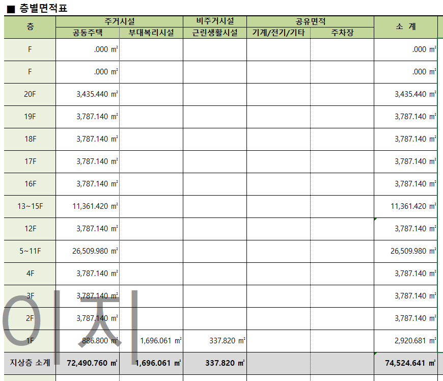

`2022.02.07`

# 면적표 분석
## 층별면적표
설계 부문의 의견으로 보면 동일 면적의 층은 아래 이미지의 13~15F 와 같이 Grouping 하여 보여줘야 하며 그 면적은 총 면적이 입력되어야 한다.

## 층별면적표 셋팅
- 1차 기획은 층별면적표 양식을 현업에서 만들고 Counting 또는 Summation 이었다.
- 현실적으로 현업에서 RAW DATA 를 통해 sumifs, countifs, vlookup 등 함수로 층별면적표 생성하기 어렵다.
- 단순 함수 사용법이 어렵다기 보다 층 Grouping, 용도구분 등 복잡한 내용을 양식화 하기에 시간이 오래 걸릴 수 있다.

## 층별면적표 추출 자동화
- 층별면적표를 자동으로 뽑아 주면 그 이후의 업무는 상당히 줄어들 것 이다.
- 가로축=용도, 세로축=층