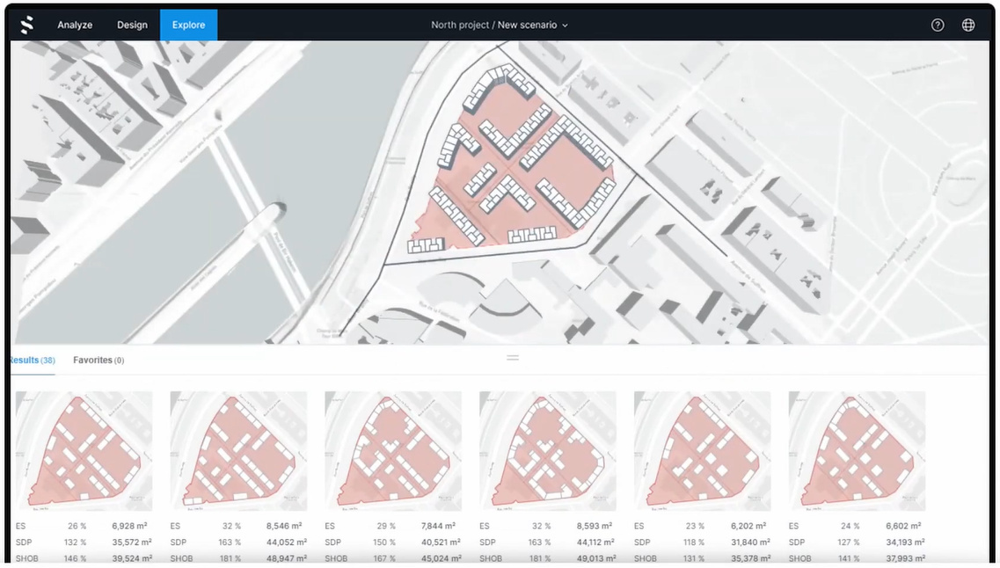

`2022.03.07`

# Spacemaker
Autodesk 사의 Spacemaker 앱 분석 내용이다. 노르웨이의 Spacemaker를 20년 Autodesk 가 100%인수하였고 21년 오토데스크코리아의 특별약관이 업데이트되면서 곧 사용할 수 있으리라 기대된다.  
사례와 기능을 봤을 때 주거시설 기준으로 만들어진 것 같다. 주거시설 특성상 주거 환경 평가, 주변환경의 영향 정도 등의 검토를 중요하게 생각하는 것 같다.

## 검토
주거검토전용 도구로써의 가치가 있다. 외국 기준이기 때문에 국내사이트에 적용도 쉽지 않을것이다. 지도, 주변환경도 국내 데이터를 이용하지 못할 가능성이 있다. 상업 또는 복합시설의 사업성 및 규모검토의 기준은 전혀 다를것이기 때문에 다른 솔루션을 찾아봄이 마땅하다.

## Spacemaker 주요 기능
### 사이트 분할 계획
- 대지 자체적으로 분할하여 건물들의 레이아웃 기준으로 정한다.
- 분할계획은 동선이 된다.
- 분할된 각 단지마다 용도를 지정한다.

### 3D 형상 디자인
- 3D뷰에서 직접 모델 편집이 가능하다.
- 실시간 환경검토 결과를 보며 모델링이 가능하다.

### 주차장 설계
- 지상 건물레이아웃 또는 Background 도면을 보고 주차장 영역을 디자인한다.
- 주차공간이 자동으로 배치되며 주차ZONE 단위로 넣고 빼고를 할수 있다.
- 회피영역을 추가로 그릴수 있고 각 주차공간의 사용성을 고려하여 자동 디자인된다.

### 주변 소음도 분석
- 주변 도로, 공원 등 환경에 따른 소음도 분석이 가능하다.
- 건물 각 세대별 소음영향도 평가가 가능하다.

### 바람 영향
