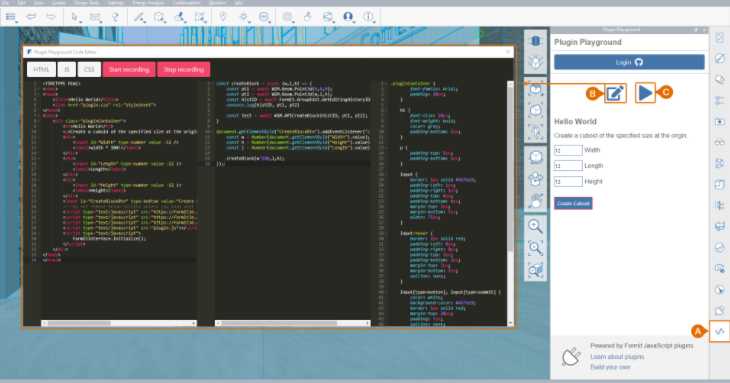
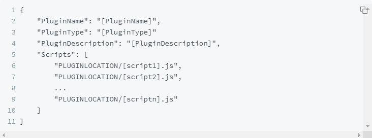
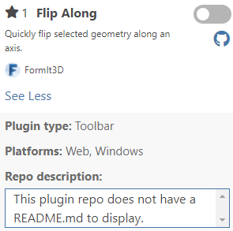
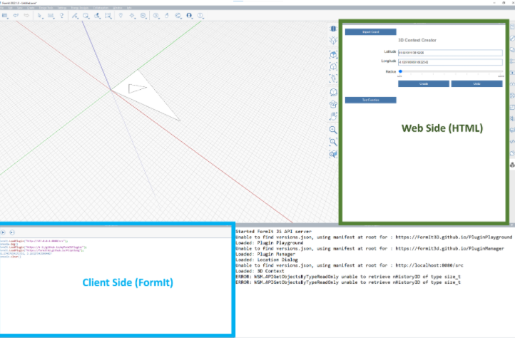
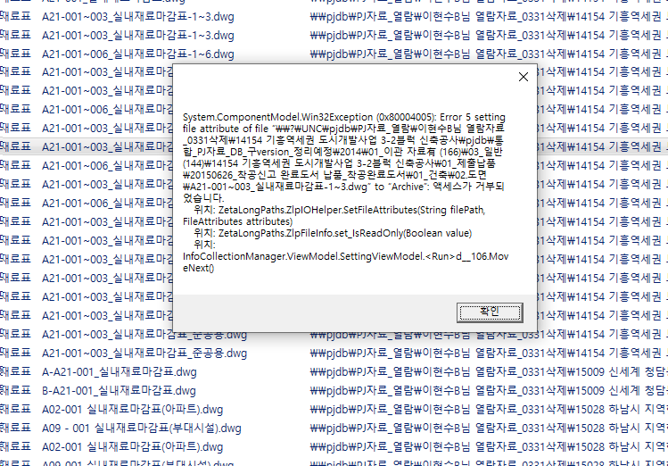
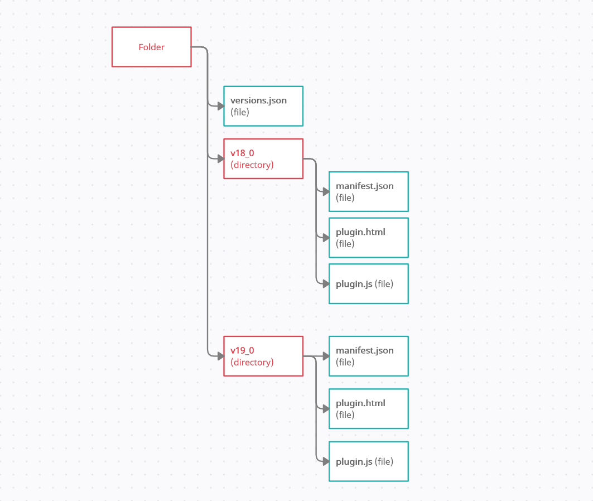

`2022.03.23`
`플랫폼 검토 (FormIt)`
- 사업성분석 내용 제외
- 규모검토내용 우선 기획

# 플랫폼 검토 (FormIt)
- Autodesk 판 스케치업
- 웹 방식 API 제공 (js)
- 객체 생성, 수정, 정보취득
- Opensource 방식
- Github호스팅, 로컬호스팅 방식
- Github 호스팅시 애드인구동을 위한 인터넷연결 필요
- 로컬 방식에서는 불필요

## 개발 기초
- API Document <https://formit3d.github.io/FormItExamplePlugins/docs/FormItJSAPI/index.html>
- <https://windows.help.formit.autodesk.com/plugins/how-to-develop-plugins/advanced-development/hosting-a-plugin-on-a-local-server>

  

- FormIt 플러그인인 'Plugin Playground' 활용하여 간단한 테스트 가능

  

- VS Code 또는 다른 IDE 사용 가능
- 기존 플러그인 Github 통해 참조 가능

## 로컬서버에서 플러그인 호스팅
vs code 에서 간단히 http-server 설치하여 호스팅 가능

## Manifest 플러그인 설정

## 웹 Html, 클라이언트 FormIt
UI는 html 방식의 웹으로 구동되며, function은 js 방식으로 동작(manifest.json)

## Html 에서 클라이언트 사이드 기능 호출방식
- Method 1: FormItInterface.CallMethod
- Method 2: FormIt.CallJS
- Method 3 (async/await)
- Method 4 (RegisterAsyncAPI)

## 소스 구조

