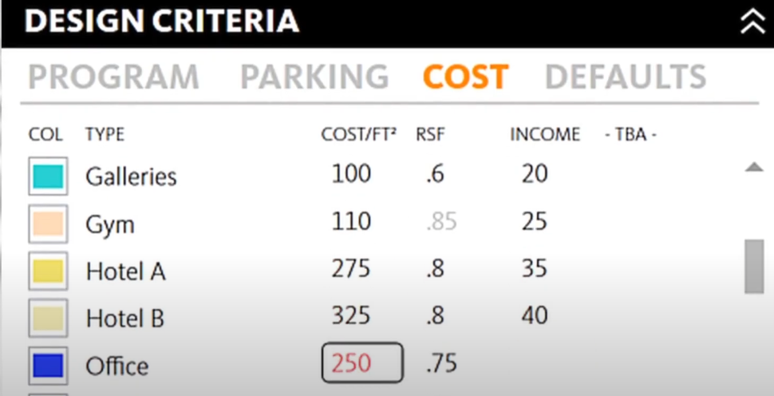
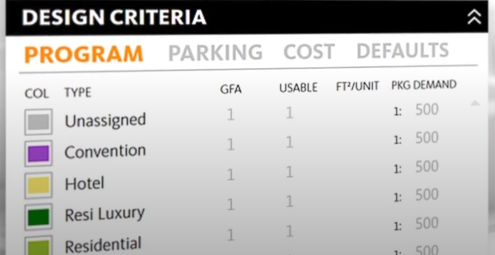
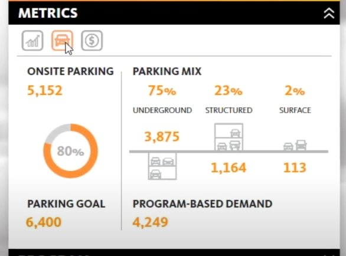
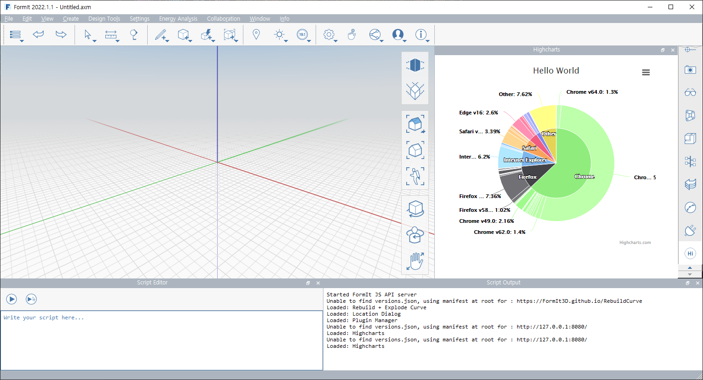

`2022.03.28`
`전체 프로세스`

# KEY
`DATA DRIVEN` 

`DESIGN PLATFORM`

`FAR & ZONING`

`WARNING! WE BROKE THE ENVELOPE`

`AGILE PROGRAM DESIGN`

`PARKING ABOVE & BELOW`

`LIVE DATA ENABLES RAPID DECISIONS`

`DESIGN AT SCALE`

`PROJECT ASSETS & FINANCIALS`

`REAL-TIME ADJUSTABLE INPUTS`

`DESIGN CRITERIA`

`DEEP DATA INSIGHTS`

`DYNAMIC CLIENT EXPERIENCE`

`DESIGN WITH DATA`

`DESIGN WITH AGILITY`

`DESIGN WITH INSIGHTS`

`DESIGN WITH H-LAB`

 
 

# 기본 프로세스
- 앱 실행
- 프로젝트 생성
- 대지정보 관리
  - 지도 연동
  - 지역지구, 용도 등 기본정보 불러오기
  - 건축기준, 법규, 조래 확인
- 대지 작업
  - 지도 연동
  - 지형 CAD 불러오기
  - 주변건물 작업 (GIS 불러오기, 자동 모델링)
- 기본매스작업
  - 대지정보이용 자동 모델링
  - 기본대안검토
- 매스편집
  - 매스수정
  - 매스배치
- 건축기준적용
  - 매스편집
  - 매스 시각화 검토
  - 사선 검토
  - 용적률, 건폐율 검토

 
 

# 작업 설명
## 레이어 생성 단계
건물의 대략 배치 단계, 레이어매스 모델링
- 레이어 작성
- 대략 매스 작성
- 한계 높이 입력
- 기준 층고 입력
- 지하/지상 층 배치
- 최고층수 검토

## 매스 모델링, 프로그램 단계
레이어별 용도 설정으로 속성이 포함된 매스가 배치되는 단계, 동 레이어 Boundary MAX 값으로 매스 생성, 기준층고에 의해 자동으로 층 분할
- 용도 입력
- 레이어 선택
- 용도입력 순서에 따라 적층
- 층수 매개변수 입력 (지하0층, 지하00층)
- 용도별 연면적, 총 연면적 등 기본면적검토

## 대지 경계 확인
- 대지 레이어 지오매트리
- 레이어 및 프로그램매스와 대지 레이어의 경계 확인

## 설계 기준 입력
- 프로그램 기준 관리
- 주차장 기준 관리
- 분양가 기준 관리
- 공사비 기준 관리 (옵션)
- 기본설정

## 주차장 그리기/ 계산
- 매스 그린 후 주차장으로 설정
- 주차장그리기 기능으로 생성
- 등록된 프로그램에 따른 필요 주차대수 계산
- 주차장모델에 따른 현재 주차대수 계산 및 비교

## 신속한 매스 편집 및 의사결정
- 이미 프로그래밍된 용도의 매스 편집
- 층 수정
- 매스형상 편집
- 전체 면적 등 즉시 재계산
- 대안 저장 및 비교

## 분양가 관리
- 평당 분양가
- 집계
 

# 활용
## 데이터의 집계 및 표현 방식 (차트 구현 가능)
차트 기능을 Plugin 창에 띄울 수 있으므로 데이터의 조회가 가능하다.  

 