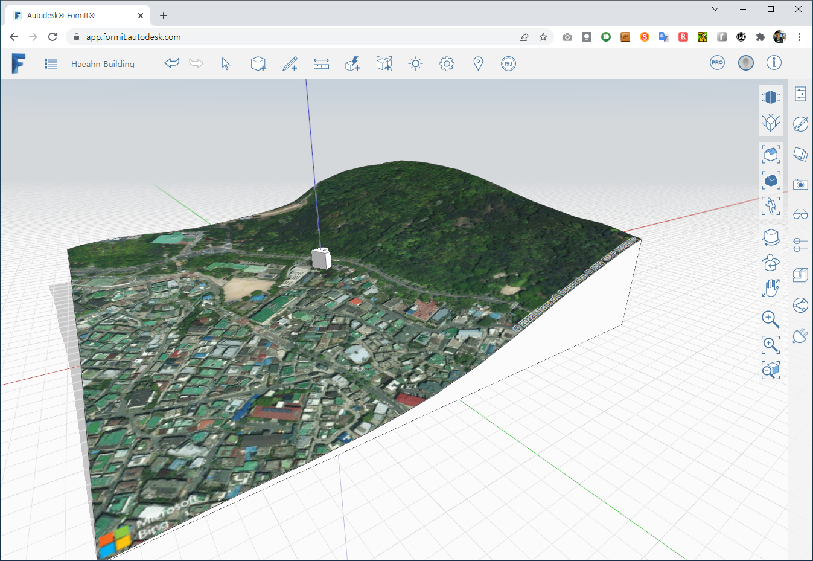

대지의 경계선은 Autocad 에서 작성하여 DWG 를 불러오는 것으로 한다. CAD 원점대 원점으로 Import 되는 것으로 확인되었다. 

지도 연동으로 사업지를 선택한다. 사업지의 지번을 가지고 용도지역, 건축물정보 등을 가져올 수 있다. ([공공데이터포털](https://www.data.go.kr/), [건축물대장](https://www.data.go.kr/data/15044713/openapi.do))

API 를 통해서 `GetLocation` 하거나 `SetLocation` 할수 있을것으로 보인다. ([FormIt.SunAndLocation API](https://formit3d.github.io/FormItExamplePlugins/docs/FormItJSAPI/group__mod__jsapi__formit__sunandlocation.html))

지형 모델을 자동으로 생성하여 준다. 경사도가 적용되어 있다.

