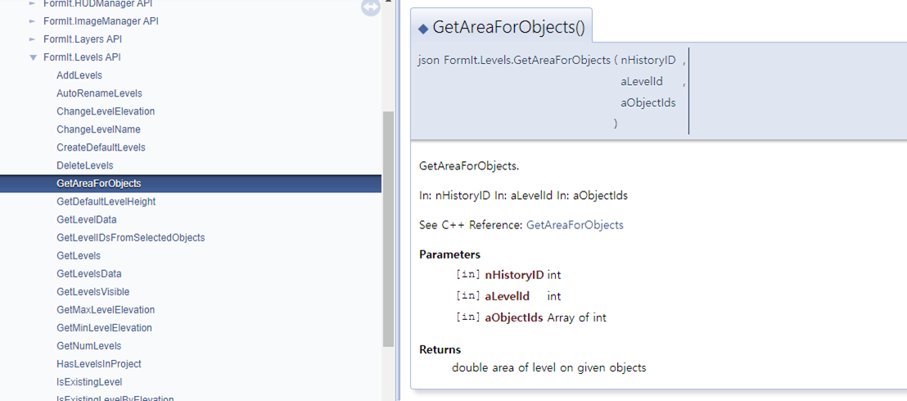
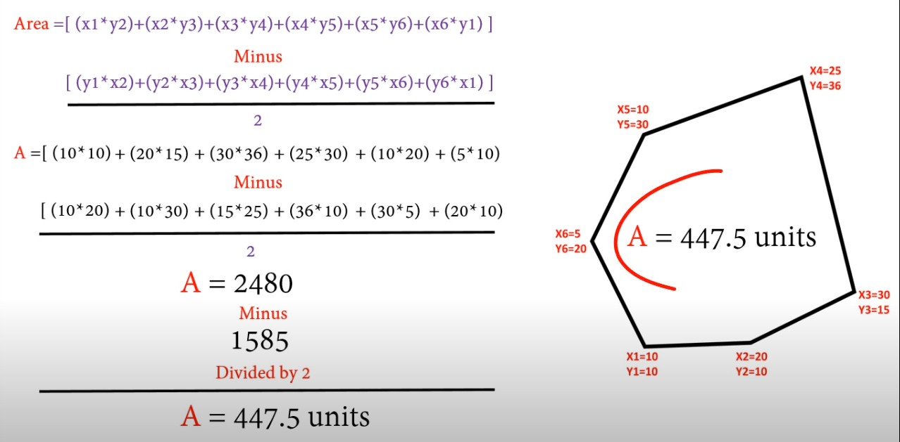

매스 모델링 후 기준층고로 기본적인 레벨이 생성되고 나면 매스별 바닥 리스트가 생성될 것이다. 각 바닥리스트별 Area 를 가져올 수 있어야 연면적 계산이 가능하다. 

매스의 각 Face 별로 `GetArea()` 가능한지는 확인되지 않았다. 그러나 위에서 처럼 Level 기준의 바닥별 Area 는 아래 Function 으로 가져올 수 있는것 같다.

[FormIt.Levels API](https://formit3d.github.io/FormItExamplePlugins/docs/FormItJSAPI/group__mod__jsapi__formit__levels.html)

아래는 보안책이다. 경우에 따라 임의의 Face 면적을 계산해햐 할텐데 Function 이 제공되지 않을때 Array 좌표가 있다면 Math Function을 만들어 계산할 수 있다.

