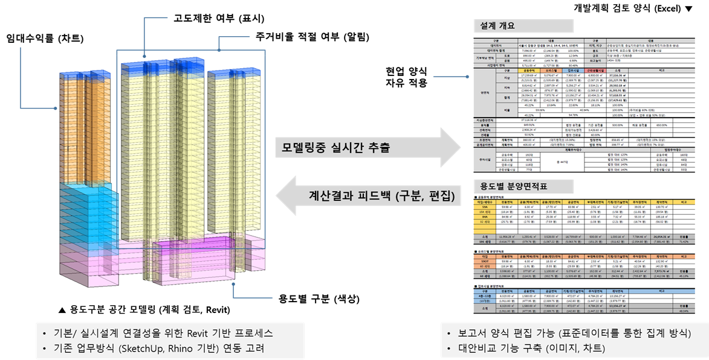
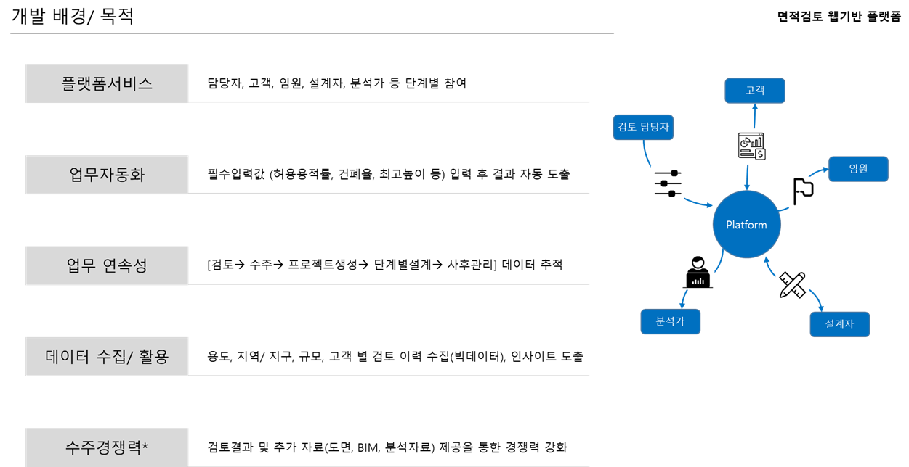
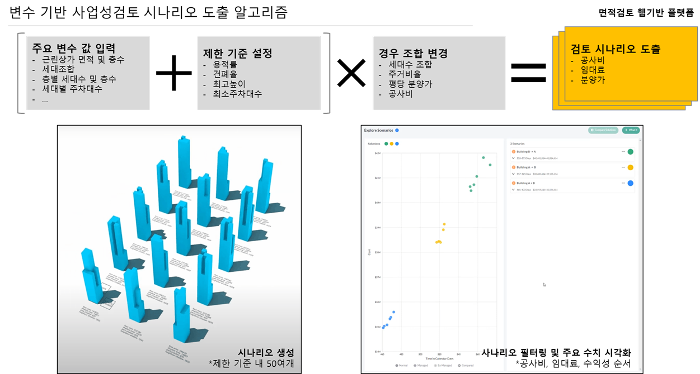
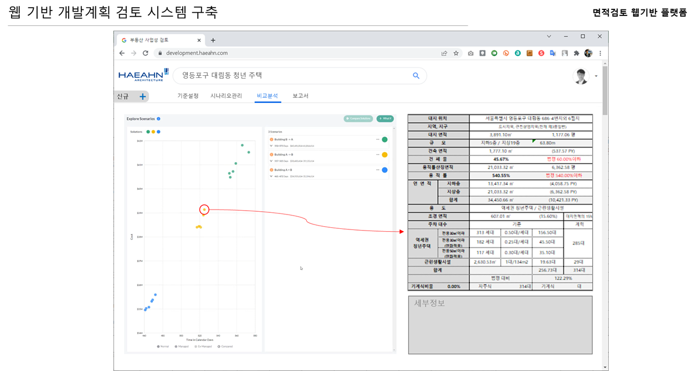
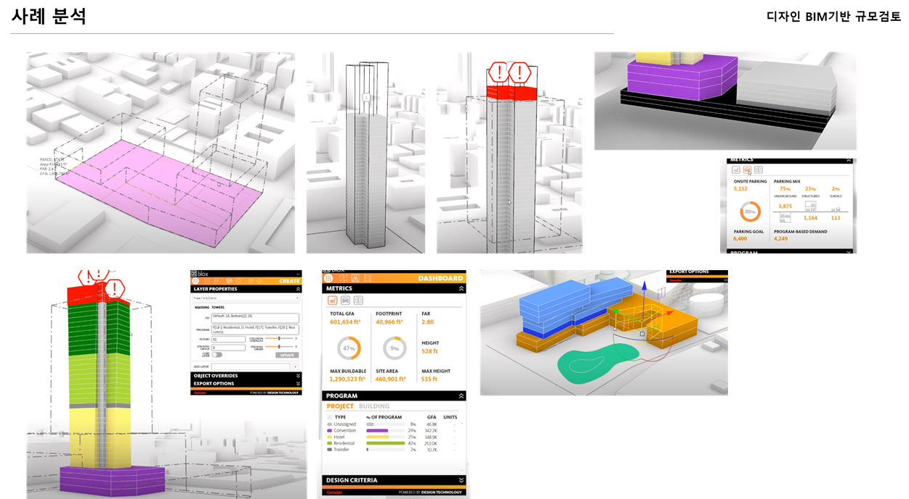
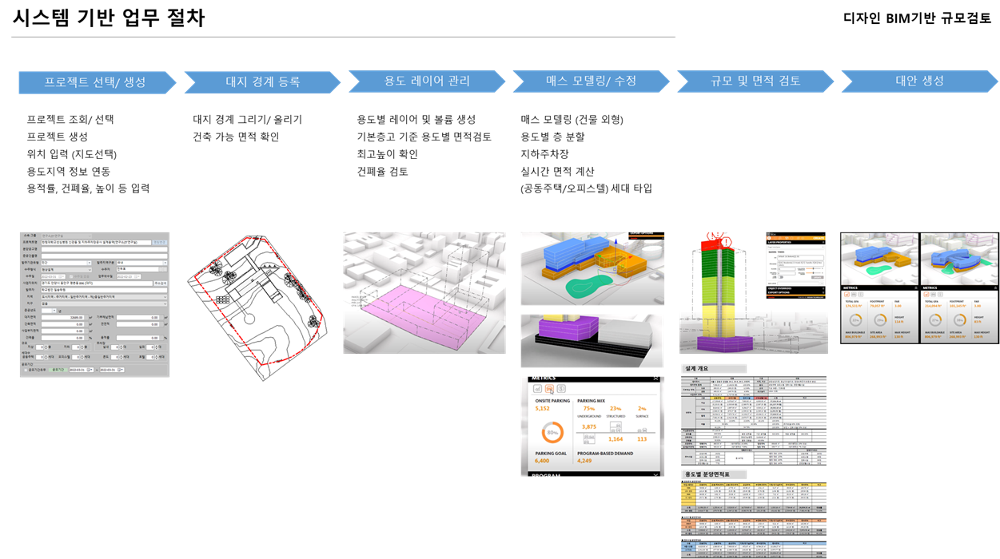
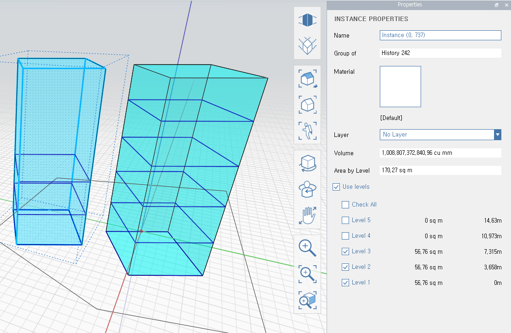

## 1차 (Revit 매스모델 기반 면적검토)
Revit 플러그인 방식의 시스템으로써 데이터의 집계는 주로 엑셀을 이용하고 Revit과 실시간으로 데이터를 주고 받아 검토 시간을 단축하도록 하였다.

### 진행 내용
1. 사업성검토 사례 분석
2. 프로토타입 Revit 애드인 개발
3. 함수 기반 엑셀 양식 개발
 
 

### 검토 결과
1. 장점
    - Excel을 통한 집계 양식의 유연함
    - 표준 설계도구인 Revit 기반 (연속성)
    - 실시간 데이터 추출 및 집계
2. 단점
    - Excel 수식 설정 필요
    - Revit을 통한 매스디자인 어려움
3. 결과
    - 매스 모델링 기능의 한계로 인해 유연한 형태의 디자인이 어려우며 자동화 불가능
    - 다양한 유형의 사업검토를 위하여 많은 양의 Excel 산식이 설정되어야 함, 관리 및 초기 설정 어려움 
 
 

## 2차 (모델링 자동화를 통한 최적 대안 도출 (Web))
제너레이티브디자인과 인공지능 기술을 활용하여 최적 규모의 디자인도출이 가능하도록 하며 웹 기반 플랫폼화 하여 이해관계자 들이 활용 가능하도록 기획하였다.

 
 

### 진행 내용
1. 디자인 자동화 (제너레이티브 디자인) 사례 분석
2. 업무 프로세스 기획
 
 

### 검토 결과
1. 장점
    - 빠른 최적 규모 안 도출 가능
    - 웹 플랫폼 방식으로 이해관계자 접근 쉬움
2. 단점
    - 다양한 용도에 대한 모델링자동화 구현 어려움
    - 최적화를 위한 설계 데이터 수집 및 정제 어려움
3. 결과
    - 다양한 사업 형태를 대상으로 적용하기엔 기술적 한계가 있는 것으로 판단.
    - 의도한 형태가 나오기까지 결국 의사결정이 필요하기에 불필요한 대안을 비교하는데 시간을 낭비하게될 가능성 있음.
 
 

## 3차 (디자인 BIM도구 기반 사업성/ 규모 검토 도구 개발)

매스디자인 가능한 BIM 도구를 활용하여 규모 검토를 진행하며, 시스템에는 모델링을 지원하는 자동화기능, 규모 및 간단한 법규 검토 기능, 프로젝트관리기능, 대안리뷰기능 등을 포함한다.

사업성/ 규모 검토 업무를 염두에 두고 모델링도구를 검토하며, 도구의 특징에 따른 업무 절차 개발, 자동화 개발 항목 정리와 함께 검토 완료 사례를 BIM기반으로 재진행 해봄으로 문제점 및 추가 활용안의 도출이 가능할것이다.
 
 

 
 

### BIM 도구 검토 및 테스트베드 진행 (주관: 설계2부문)
1. 도구(FormIt) 소개 (IT연구실)
    - 선정 배경
    - 특징
    - 확장 가능성
2. 모델링 방법 스터디 (업무용 기능)
    - 기존사례 모델링 기반 재 검토 수행
    - 모델링기능 개선점 도출 > 자동화 개발
    - Revit 연동 등 추가 활용안 도출
3. 테스트베드 기반 시스템 개선 및 절차 등 개발
    - 시스템 품질 및 사용성 피드백
    - 사업성검토 수준별(개요> 도면> 모델) 시스템 활용 절차 개발
    - 업그레이드된 결과물 디자인 (시스템 보완)
 

### 시스템 개발 (주관: IT연구실)
1. 프로토타입 기획 및 개발 (~`22년4월)
    - IT연구실 주도 기획 (도구선정, 화면디자인, 프로세스)
    - 업무 절차 및 결과물 검토요청
2. 테스트베드 수행 결과 반영
    - 설계부문 피드백 반영
    - 본 시스템 기획 및 개발
    - 대 고객용 시스템 기획