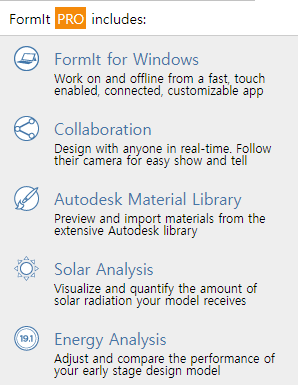
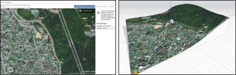
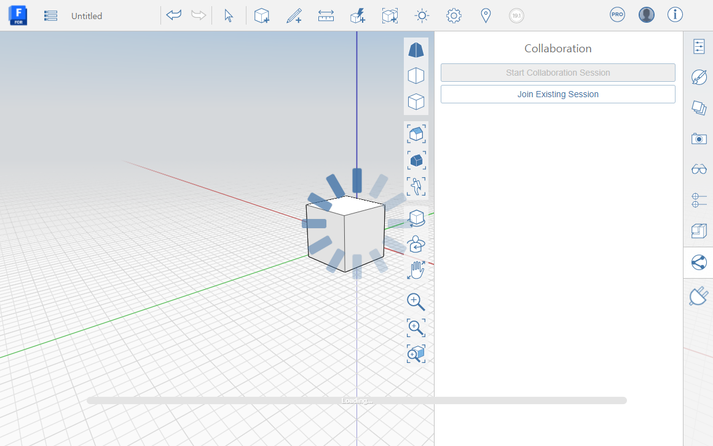
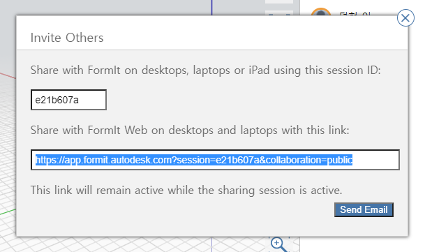
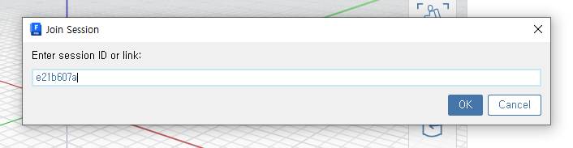
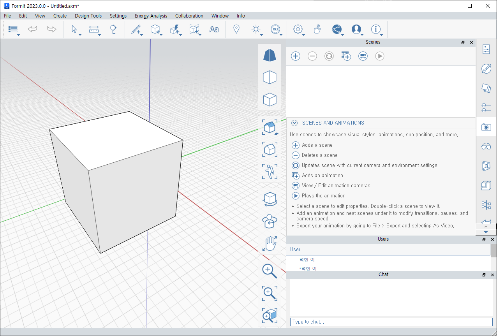
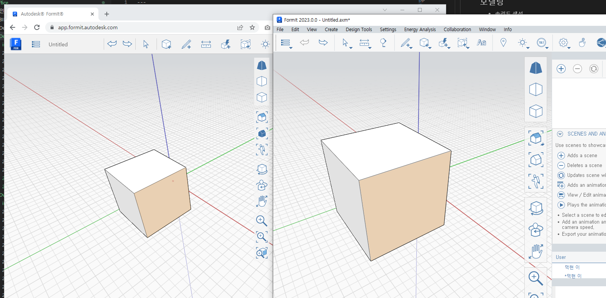
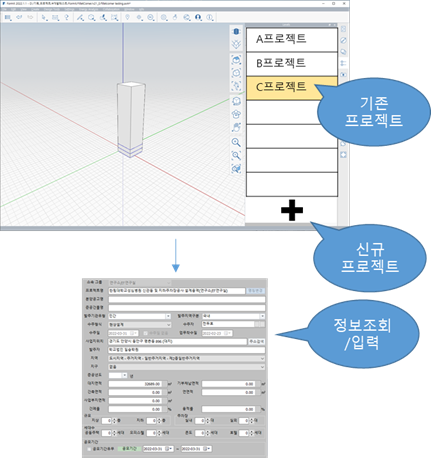
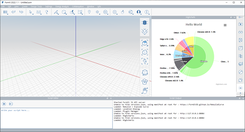
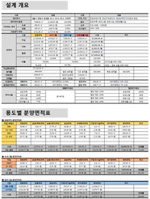

## FormIt

 

FormIt + Revit for Programming Studies

 

Gensler, BLOX Platform

## FormIt 프로

- 주요 기능

  

## 모델링

- 솔리드 생성
- 솔리드 편집
- 지도기반 대지 가져오기

  

## 협업기능

- FormIT Desktop - FormIT Desktop
- FormIt Desktop - FormIt Web
- FormIt Web - FormIt Web
- 실시간 공유

  

  

  

  

  

## 변환

- 3D모델 [Import Export](https://haeahn-dukhyun.github.io/2022/04/Import-Export)

- 이미지, 동영상

## 레이어, 그룹

- 레이어생성
- 그룹생성

## 시뮬레이션

- 태양경로
- 에너지

## 플러그인

- 시스템연동

  

  

  

- 보고서

  

  

- 모델링자동화
