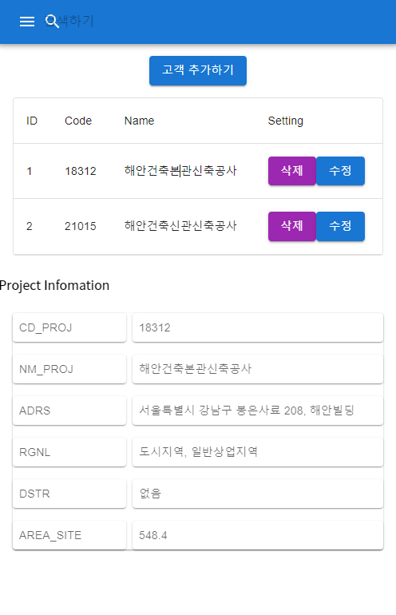

## 프로젝트 조회 및 생성

### 조회, 로드
1. 플러그인 실행하면 전체 목록을 보여준다. 
2. 목록을 클릭하면 프로젝트 정보가 하단에 보여진다. 
3. 목록의 'LOAD'를 클릭하면 프로젝트파일을 다운로드받고 FormIt에 로드한다. 

### 생성
1. 하단의 별도 'CREATE' 클릭시 새 창이 열린다.
2. 새 창에 프로젝트 정보를 입력한다.
3. 'SAVE'를 클릭하면 정보가 전송되고 입력한 프로젝트가 목록에 보여진다.
4. 방금 추가한 프로젝트로 FormIt New Sketch가 열린다. 

> 프로젝트관리부분 시나리오 수정: 2022-04-22

FormIt에는 OpenFile, NewFile 매소드가 있다. 다만, 웹 기반이기 때문에 fakepath를 이용하는 점이 테스트되어야 하고 몇 가지 C# 베이스일 때와는 개념이 다르다.

### 조회, 로드
1. 플러그인 형태로 프로젝트목록 보여주고 일반 웹 형태로도 보여준다.
2. 목록을 클릭하면 정보를 보는 것은 동일하다.
3. 모델 다운로드 누르면 경로에 저장한다.
4. 다운로드가 완료되면 Client App. 실행방식으로 모델을 열어준다.
5. 또는 사용자가 직접 모델을 연다.

### 프로젝트 연동
- 모델에는 프로젝트 속성이 없기 때문에 연동 방식의 고민이 필요하다.
- 새 모델과 함께 프로젝트를 생성한 후 프로젝트를 저장할때는 서버에 올리게 된다.
- 최초로 서버에 올리기 전에 파일명의 변경을 거친후 몇 가지 설정파일을 같이 올린다.
- 프로젝트라는 것을 인지할 수 있는 config 파일을 같이 올리는 것이다.
- 다운받을 때는 config 파일을 포함하여 받는다.
- 모델을 열때는 모델파일 상위 폴더를 선택하고 하위에 config 파일을 읽어 프로젝트임을 확인한다. 

> 프로젝트 관리부분 시나리오 수정: 2022-04-25

- web 기반에서 파일을 관리하는 것은 일단, 불가능. 보안 문제로 전체 경로를 가져올 수 없다.
- electron 을 이용하면 가능할지도? 그러나 테스트가 안되고 있다. ㅡㅡ

- 현재 가능한 것들
    - axm 파일 선택 및 업로드
    - 업로드 후 checksum 확인 (md5)
    - api 를 통해 파일다운로드 db uri 정보 가져오기
    - axm 파일 다운로드
    - (FormIt에서 수동으로 파일 열기)
    - 프로젝트 선택
    - 동기화
    - 

* nodejs checksum

<https://www.zerocho.com/category/NodeJS/post/5950a6c4f7934c001894ea83>

* cryptojs 

<https://stackoverflow.com/questions/34492637/how-to-calculate-md5-checksum-of-blob-using-cryptojs>