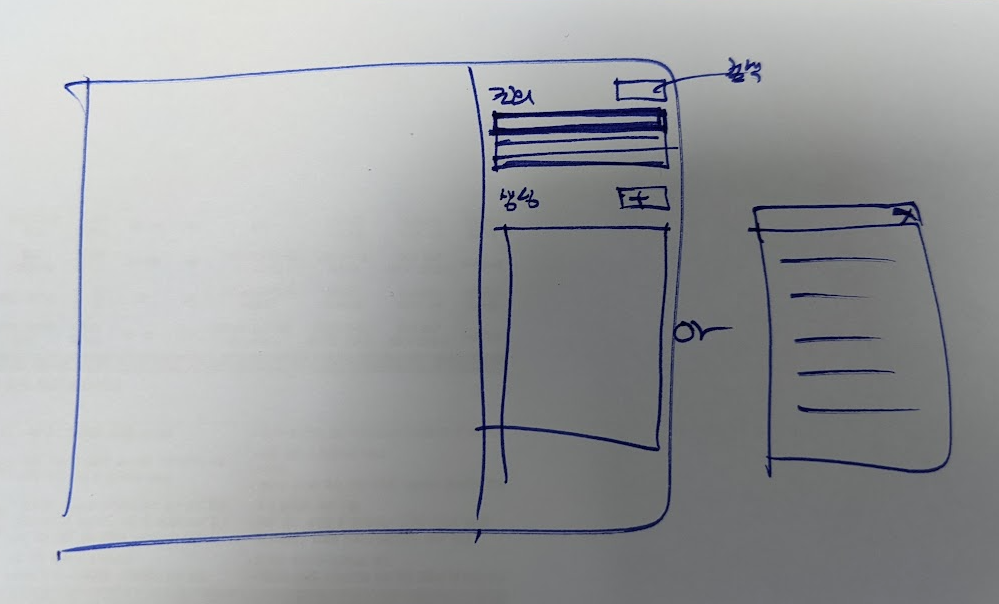

## 프로젝트 조회 및 생성

### 조회, 로드
1. 플러그인 실행하면 전체 목록을 보여준다. 
2. 목록을 클릭하면 프로젝트 정보가 하단에 보여진다. 
3. 목록의 'LOAD'를 클릭하면 프로젝트파일을 다운로드받고 FormIt에 로드한다. 

### 생성
1. 하단의 별도 'CREATE' 클릭시 새 창이 열린다.
2. 새 창에 프로젝트 정보를 입력한다.
3. 'SAVE'를 클릭하면 정보가 전송되고 입력한 프로젝트가 목록에 보여진다.
4. 방금 추가한 프로젝트로 FormIt New Sketch가 열린다. 

