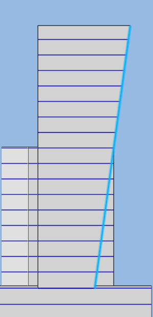
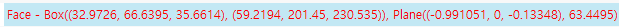
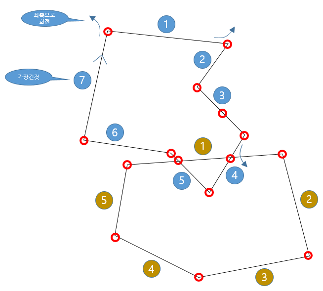

## 건축면적 계산
건축면적이란, 바닥으로 투영된 건축물 최외곽 경계선을 합한 면적을 말하며 FormIt API에는 현재 제공되지 않고 있고 기하학로직을 만들어야 한다.

각 body에서도 경계가 다양하게 나올수 있는데, 예를들어 건물의 입면이 복잡할때 층별 면적이 달라 많은 경계분석이 필요해진다. 

1)body별 경계분석 2)전체 경계분석

## body 경계 찾기
경계를 찾는 방법은 뭐가 있을까, 모든 vertex의 Z=0으로 만들어 분석하는 방법이 정확하지 않을까? body의 모든 vertex를 직접 가져오면 순서와 종속관계가 보이지 않아 선을 이어줄 수 없으니 다른 방법을 거쳐서 vertex를 가져오도록 한다.

### face 활용
vertex는 curve에서 가져올 수 있다. curve는 face의 경계이다. 정말 이상하게 디자인하지 않는 이상 body의 face중 normal이 z=0인 face를 선택하고 공간데이터형식의 공간연산(union)을 통해 최종결과를 얻을 수 있을 것이다.

### 공간데이터형식과 공간연산
[SQL Server 공간데이터](https://docs.microsoft.com/ko-kr/sql/relational-databases/spatial/spatial-data-sql-server?view%3Dsql-server-ver15)

공간데이터형식이란, RDBMS 의 자료 형식중 하나로 공간(Space)을 이루는 POINT, LINE, POLYGON의 기하학정보를 저장하는 형태를 말한다. 대부분의 RDBMS에는 이러한 형식을 선택하고 저장할수 있으며 내장함수를 통해 공간의 관계확인과 연산을 수행할 수 있다.

[공간데이터-geometry 인스턴스 만들기, 구성 및 쿼리](https://docs.microsoft.com/ko-kr/sql/relational-databases/spatial/create-construct-and-query-geometry-instances?view%3Dsql-server-ver15)

## 공간데이터형식 활용
공간데이터와 내장 연산함수를 쓰면 여렵게 기하학 function 개발을 하지 않아도 될 것 같다. MS SQL Server 에서 제공하는 연산함수의 종류는 다음과 같다.

[geometry 인스턴스 만들기, 구성 및 쿼리](https://docs.microsoft.com/ko-kr/sql/relational-databases/spatial/create-construct-and-query-geometry-instances?view%3Dsql-server-ver15)

### FormIt 관련 정보
FormIt의 body->face를 선택할때 면적에 관여하는 대상은 `normal.z <> 0` 인것이다. 왜냐면 일반적인 벽체와 같이 수직으로 서있는 경우는 건축면적에 관여하지 않기 때문이다. normal.z값이 0보다 크거나 작은 경우, 즉 면이 어느쪽으로던 누워있는 경우에 해당한다.

### face 기하학정보의 추출 및 변환
FormIt의 기하학정보는 3차원이다. 규모검토에는 2차원 좌표가 활용되며 그중 건축면적의 경우 바닥 투영 좌표만 있으면 된다. 즉 x,y 좌표로 변환하면 된다는 이야기이다.

변환은 쉽다. 대상 face(normal.z <> 0) 별로 x,y,z 중 z만 제거하면 된다.  

## 참고
RDBMS의 공간데이터형식을 알기 전엔 아래와 같은 멋진 로직을 개발하여야 했다.. 공간데이터형식은 혁명이다.

[Check Point in Polygon (inpolygon)](https://enginius.tistory.com/387)

  
