`2022.02.07`

# 면적검토시스템 개발 기획
## 배경 및 개요
- 초기, BIM 정보 집계 방식으로 컨셉을 잡았으나 모델링이 우선이 될 경우 그 행위에 빠져 본연의 사업성검토 업무의 비중이 줄어들 가능성이 있음
- 사업성검토는 경험과 자료를 바탕으로 수치를 집계하여 대안을 만들어내는 방식으로 계속되어져 왔다. 그 결과 초급자가 접근하기 힘든 구조가 되고 있고 일부 담당 체제로 보고서 방식의 결과가 만들어지고 그 Know-how는 전파되지 않고 있음
- 검토 내용 대부분이 면적값을 이용하는바 이러한 허용기준을 조건으로 닮고 몇 가지가 조합된 조건식 기반의 면적계산 Rule을 만듬

## 프로세스의 변화
### 기존
1. 모델링
2. 속성수집
3. 집계
4. 면적표작성

### 개선
1. 조건입력 (개발계획 검토 조건)
2. Rule에 의한 면적 등 계산
* 예시
   - 건축면적 = 대지면적 X 법정건폐율
   - 연면적 = 대지면적 X 법정용적률
   - 조경면적 = 대지면적 X 법정조경비율
   - 법정주거주차대수 = 세대수 X 세대당주차대수
   - 주거주차대수 = 법정주거주차대수 X 계획주차비율
3. 배치 방식의 모델링 (#Option)

## 개발계획 검토 조건
- 대지면적
- 용적률
- 건폐율
- 최고높이
- 주거비율
- 공공기여
- 지역,지구
- 규모
- 조경면적비율
- 주차대수기준
- 주거계획주차대수
- 상업계획주차대수
- 지하층수
- 세대타입
- 전용면적
- 공용면적
- 분양면적
- 임대비율
- 용도
- 용도별동수

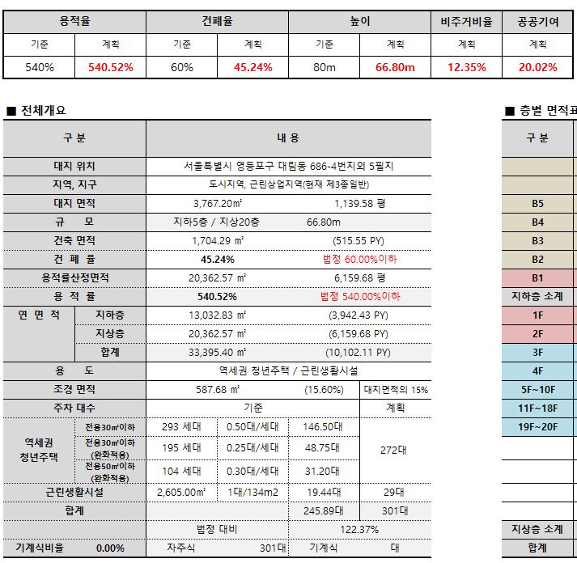

## 변수 이용 면적 검토
- 근린상가 면적 및 층수, 세대조합, 층별 세대수 및 층수, 세대별 주차대수 등 주요 변수 입력을 통한 결과 도출
- 용적률, 건폐율, 최고높이, 최소주차대수 등 제한기준 설정
- 세대수 조합, 주거비율, 평당 분양가 및 공사비 등 변경을 통하여 시나리오 결과값 도출

## 사나리오 필터링 및 제안
- 50여개 사니라오의 개요와 변수들을 이용한 Ordering, Filtering
- 2~3개의 제안 용 시나리오 선정
- 시나리오 별 대안 사업성검토 보고서 작성 (자동 리포트)  

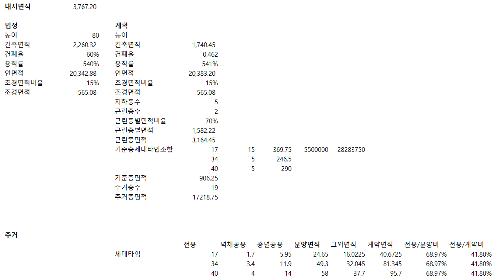 

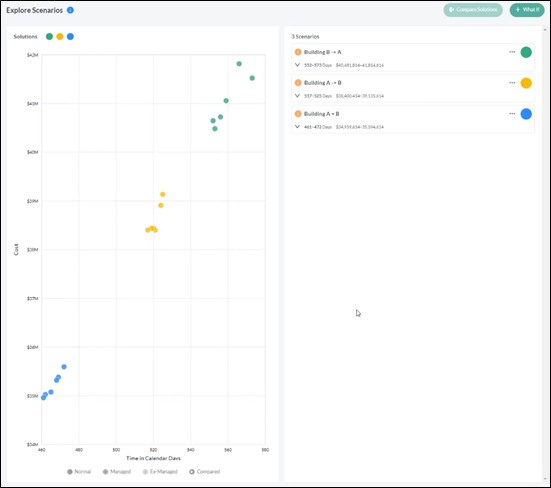

## 시나리오 컨셉 모델링 자동화
- 디자인이 가미된 모델링은 불가
- 볼륨 검토용 모델링 수준
- 예) 용도별 볼륨 생성 및 Stack
  - 근린 2개층, 면적 1,500m2
  - 주거저층부 3개층, 면적 1,200m2
  - 주거기준층 13개층, 면적 950m2
  - 지하 5층, 대지면적 80% 수준

## #참고1. Rule 생성 UI
사이트의 조건을 변수로 만들어 다양한 방식의 계산 결과를 얻어낼 수 있도록 UI 구축 필요함. 면적 검토 시스템의 경우 CASE를 분석하여 계산식을 MACRO 화 하여 편리하게 사용할 수 있도록 만들어야 함.

* 상용UI 예제, https://www.grapecity.com/componentone/expression-editor-control-net

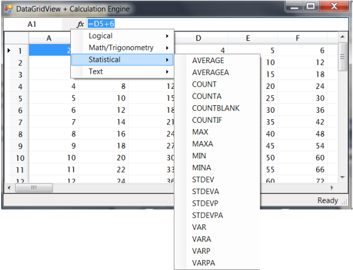

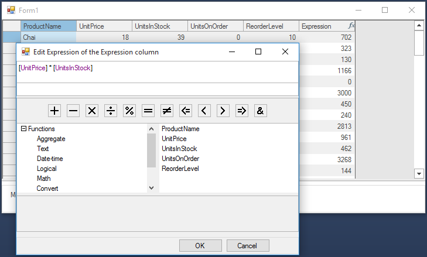

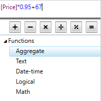 Read your formulas more easily with syntax highlighting

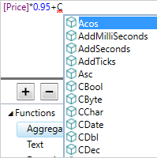 Write faster with IntelliSense-like smart code completion  

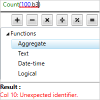 Catch formula errors with full error reporting

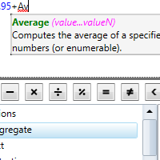 See the details of a function with ToolTip Helper

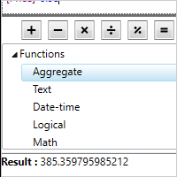 Check your work with results preview

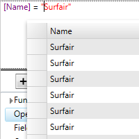 Filter results using expressions