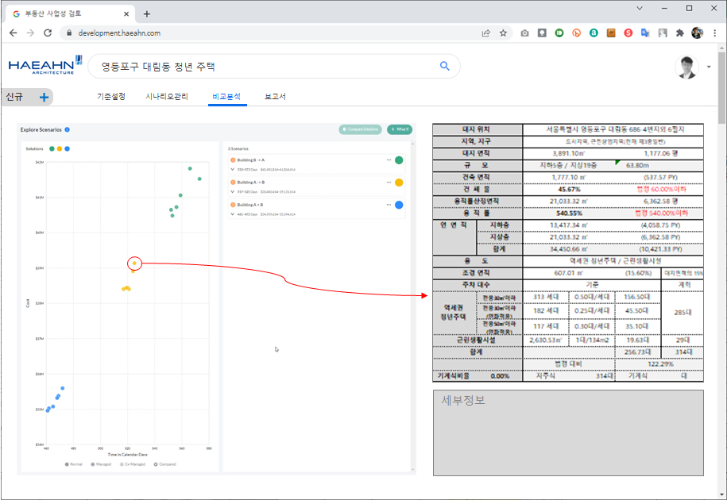

`2022.02.10`

# 면적 검토 플랫폼 기획
## 개발 배경/ 목적

1. 플랫폼서비스
   - 담당자, 고객, 임원, 설계자, 분석가 등 단계별 참여
2. 업무자동화
   - 필수입력값 (허용용적률, 건폐율, 최고높이 등) 입력 후 결과 자동 도출
3. 업무 연속성
   - [검토-> 수주-> 프로젝트생성-> 단계별설계-> 사후관리] 데이터 추적 
4. 데이터 수집/ 활용
   - 용도, 지역/ 지구, 규모, 고객 별 검토 이력 수집(빅데이터), 인사이트 도출 
5. 수주경쟁력 
   - 검토결과 및 추가 자료(도면, BIM, 분석자료) 제공을 통한 경쟁력 강화

## 현재 개발계획 검토 방식 (사례, 엑셀)

## 개발계획 검토 방식 개발 – 변수 입력, 제한 기준 설정, 비율 조정

## 변수 기반 사업성검토 시나리오 도출 알고리즘

## 웹 기반 개발계획 검토 시스템 구축

## 로드맵

## 설계부문 협력 사항
| 항목 | 설명 | 방법 및 순서 |
|:---|:---|:---|
| 입력 변수 및 제한사항(건설기준, 조례 등) 확인  | - 입력 변수 최소화 목적 - 기준되는 제한사항 결정 및 검토자 수정 여부 확인  | 1) IT연구소 사례 연구, 계산 방식 도출 **2) 계산 방식 설계부문 점검**  |
| 면적 검토 계산방식 점검|예) - 근린생활시설 면적 = 대지면적의 비율로 산정 - 지하주차장 층수 = 주차대수 산정 + 일반적 기계실 면적  | 1) IT연구소 사례 연구, 계산 방식 도출 2) **계산 방식 설계부문 점검**  | 1) IT연구소 사례 연구, 계산 방식 도출 **2) 계산 방식 설계부문 점검**  |
| 웹 시스템 기획  | - 메뉴 구성 - 입/출력 형태  | 1) IT연구소 1차 기획 및 설명 진행 **2) 설계부문 추가 및 수정사항 확인**  |
| 사업성 검토 보고서 기획  | - 보고서 양식 및 출력 형태 - 대안 비교 방법  | **1) 설계부문 보고서 양식 디자인 2) 시스템 반영 사항 검토**  |