`2022.02.24`

# 지능화사업성검토시스템
부동산개발사업 사업성 검토 업무의 고도화 내용이다.

 

## 시스템 범위
기본검토, 매스검토, 스페이스프로그램, 사업성검토, 기본설계

 

## 주요 기능
- 2D/ 3D뷰어(WebGL2)
- 대지경계조건에 의한 매스 검토
- 빅데이터, 인공지능 기반 스페이스프로그램
- 대안별 사업성검토
- 자동 기본설계(2D, 3D 작성)

 

## 인력 구성 및 담당
1. 이덕현: 분석, 기획, 사업성검토, 2D/3D엔진, 알고리즘
2. 이윤재: 기획, DB, 2D/3D엔진, 알고리즘
3. 민성재: DB, 알고리즘, 2D/3D엔진
4. 개발자A: 2D/ 3D엔진, 뷰어부가기능
4. 개발자B: 웹 시스템

 

## 개발계획
### 기본 플랫폼 구축: 1.0M/M  (빅데이터, 설계 정보 조회)
- 설계 빅데이터(도면, BIM 수집) 집계/ 통계 결과 조회, 설계용 정보 제공 웹기반 플랫폼

### 본 시스템 분석/ 기획: 6.0M/M
- 주요 기능 정의
- 요구사항 접수
- 프로세스, 화면 기획
- 프로토타입 개발

### 설계/ 개발: 20.0M/M
- 2D/ 3D뷰어(WebGL2)
- 대지경계조건에 의한 매스 검토
- 빅데이터, 인공지능 기반 스페이스프로그램
- 대안별 사업성검토
- 자동 기본설계(2D, 3D 작성)

 

## 기본검토
기존방식 조건 검토 내용으로 엑셀 산정방식을 웹으로 양식화 하여 전환/ 개발하는 내용이다.  

- 엑셀 양식 분석
- 웹 시스템 구축
- ***기본 개발인력 활용***

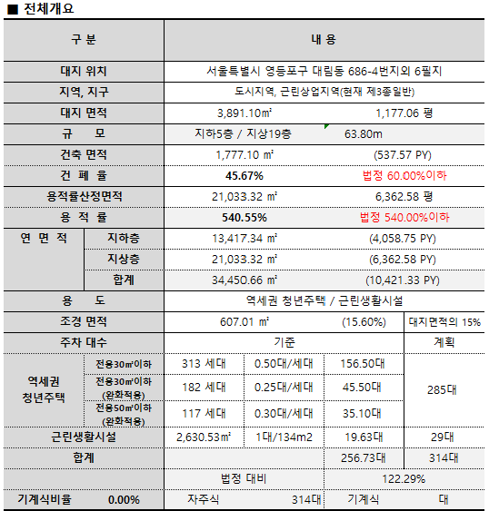 

### 대지정보
- 대지면적
- 용도

### 건축기준검토
- 용적률
- 건폐율
- 최고층수
- 주차대수
  
### 주차장계획
- 시설별기준
- 필요주차대수산정

 

## 2D/ 3D뷰어
기본검토 이후의 모든 과정에는 2D/ 3D 뷰어가 필수이다. WebGL2 활용한 WEB 기반 엔진을 목표로 하며 알고리즘 및 웹 개발과 병행하여 진행하여야 한다.  

- 스페이스프로그램, 공간관계도, 평면뷰, 단면뷰, 부가기능
- ***별도 인력 보충***
  
### 참고
- https://architosh.com/2019/02/webgl-2-0-why-its-the-path-to-stable-open-standards-based-3d-web-graphics/
- https://threejs.org/examples/#webgl_animation_skinning_morph

 

## 매스 검토
기본검토 결과(수치)와 연동하여 매스를 만들어내는 과정이다. 대지조건으로 매스 생성의 제한을 걸고 난수방식 검토 후 매스를 만들어낸다. 사업의 성격에 따라, 포함되는 시설물별 매스를 배치하고 적층하게 되며 경우에 따라 매스간 인동거리 등 확인한다.  

- 대지경계선, 매스형상, 교차여부, 간격 등 검토
- ***기본 개발인력 활용***

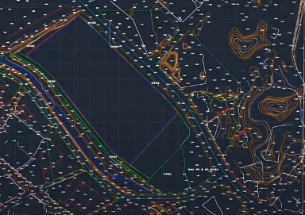 
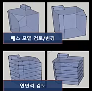 
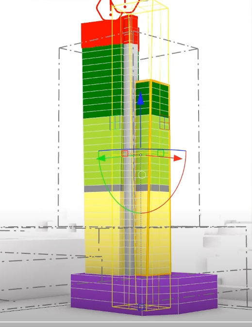 
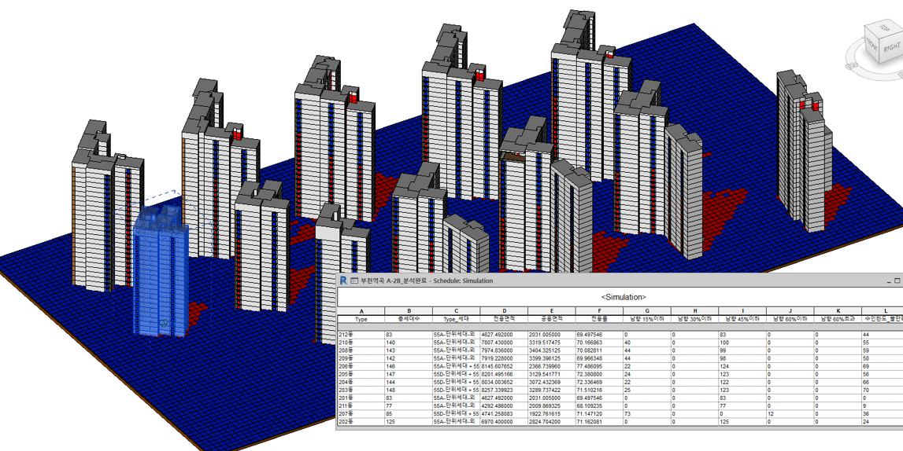 

### 대지조건
- 대지경계
- 인접대지
- 도로폭
- 진출입로
- 방위

### 매스생성
- 건축기준
- 시설배치기준
- 시설면적산정
- 대지조건

### 단지배치
- 인동거리
- 최고높이

 

## 스페이스프로그램
건축주의 요구조건 또는 사업의 성격에 맞도록 스페이스프로그램을 정의한다. 공간의 유형 및 개별의 규격을 설정하고 각 관계성을 다이어그램화 하면 공간의 배치 기준이 만들어 진다. 그 기준에 의해 다양한 방식의 배치안을 만들 수 있다. 난수 및 인공지능기술을 활용하는데, 추가적인 공간별 확실한 배치기준을 지정하면 올바른 대안이 나올 수 있다.

- 공간유형DB, 공간유형별 조건DB, 관계다이어그램생성
- 공간배치 알고리즘 구축
- 인공지능, 난수알고리즘
- 평면, 단면, ISO뷰
- ***기본 개발인력 활용(인력 보충 검토)***

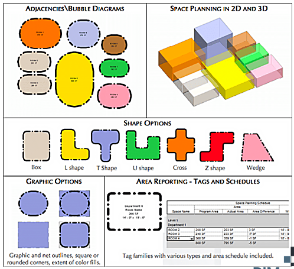 
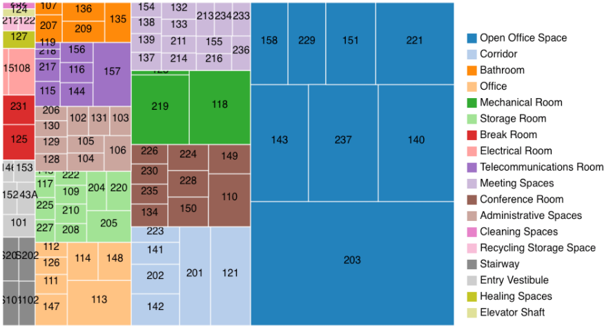 
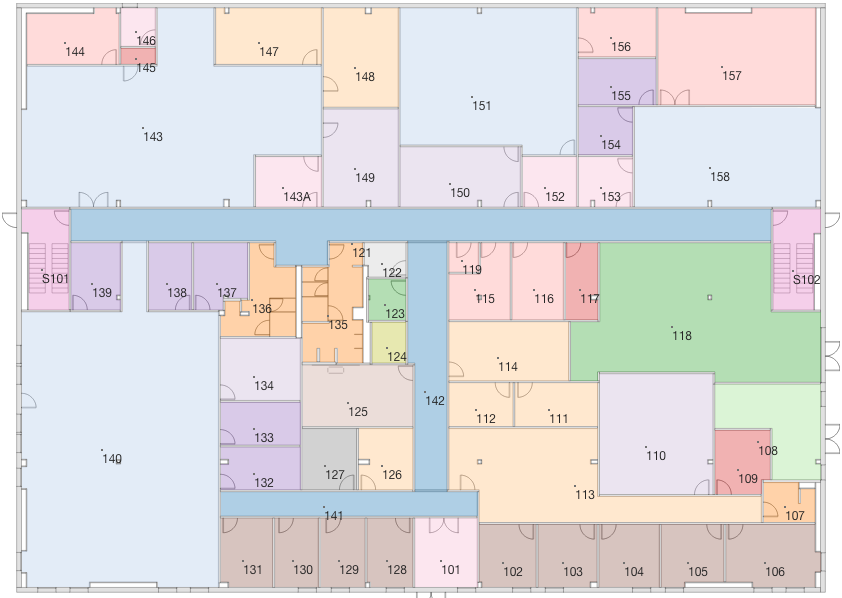 
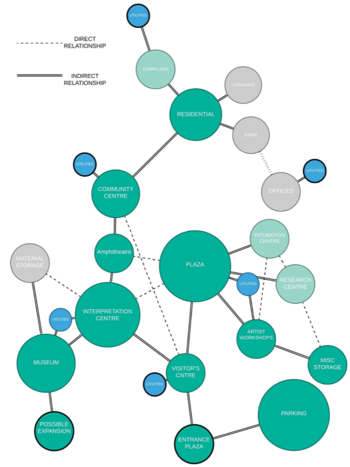 

### 공간형상규칙
- 최소규격
- 인간규격
- 형태조건

### 공간관계다이어그램
- 시설별표준
- BIM기반추출

### 스페이스프로그램
- 시설용도
- 사업성검토피드백

### 단지배치
- 인동거리
- 세대수
- 최고층수

### 공간배치
- 공간형상규칙
- 난수배치
- 인공지능배치
- 시설별배치
- 수평,층별배치
- 수직배치

 

## 사업성검토
공간 배치가 끝나고 난 후 개산견적 및 예상공사기간 등 조건을 입력하여 사업성 검토가 이루어진다. 스페이스프로그램의 다양한 대안별 자동 계산을 통해 쉬운 비교가 가능하다.

- 기본 산식 검토
- ***기본 개발인력 활용***

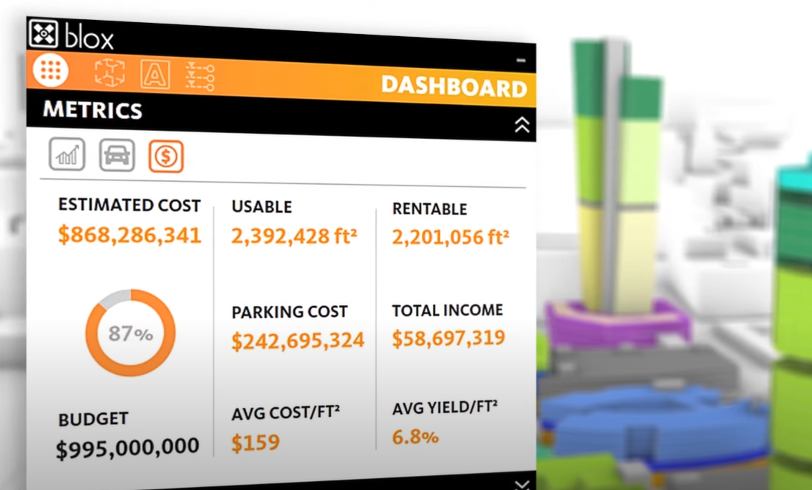 

### 사업성검토
- 사업예산
- 공사비
- 분양가
- ROI(투자수익율)
- NPV(순현재가치)
- IRR(내부수익율)
- PP(회수기간)

 

## 기본설계
대안의 확정 후 공간to디자인이 가능하다. 공간들의 용도 및 관계에 따라 바닥, 간벽을 모델링하고 통로에 따른 출입구 배치가 가능할 것이다. 추가적으로 빅데이터 형태로 수집한 설계정보를 다양한 기준으로 분류하여 마감 디자인 탬플릿 구축 후 기본설계에 반영할 수도 있다.

- 평면, 단면, ISO뷰
- 공간별 속성정보
- 골조 생성 알고리즘
- 주차장 자동배치 알고리즘
- 공간 관계데이터
- 출입문 생성 알고리즘
- 마감자재데이터 구축
- ***기본 개발인력 외 인력보충 필요***
- ***구조, 주차장 설계 자문 필요***

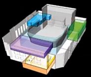 
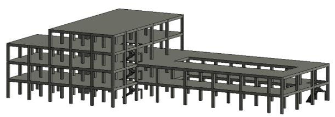 
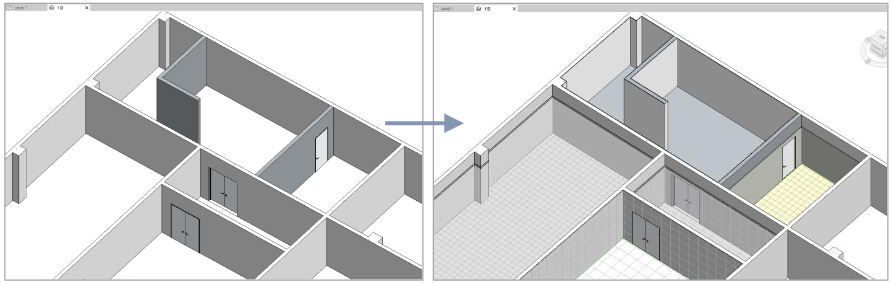 
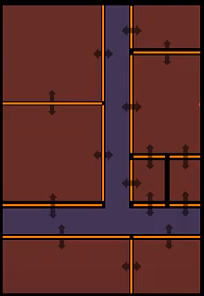 

### 기획설계대안
- 공간배치
- 공사비
- 사업성검토결과
- 대안비교

### 건축구조모델링자동화
- 바닥, 벽 모델링
- 공간별하중기준
- 공간모듈화
- 골조모델링
- 기둥배치
- 주차장배치

### 주차장배치
- 통로배치
- 최대대수
- 기둥간격

### 마감자재정보
- 표준마감자재
- 제안마감자재
- 데이터기반마감자재
- 용도별마감분류

### 출입문자동배치
- 공간배치
- 공간용도
- 공간면적

### 마감자동모델링
- 투자비용
- 공간용도
- 유사사례
