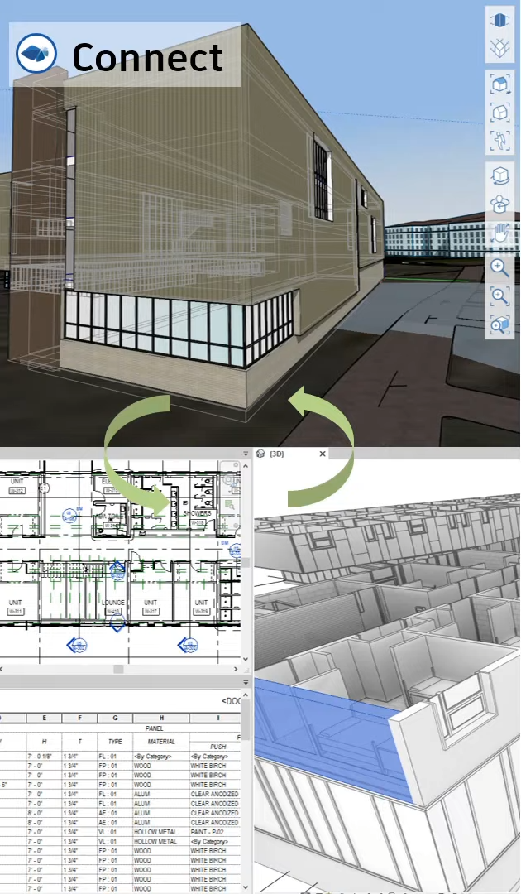

`2022.03.08`

# BIM기반면적검토

## 프로토타입 분석
- 매스모델 기반
- 속성정보 입력
- 사전 모델링 필요
- RAW데이터 엑셀 추출
- 엑셀 양식 작성필요
- 계산결과 레빗 가져오기
- 모델수정 실시간 반영

## 생각
- 엑셀과 UI에서 따로 수치 검증을 하는것은 불편하다. 엑셀 또는 UI 한쪽으로 모는것이 합리적이다.  
- 엑셀에서 수치검증을 할경우 레빗의 역할은 무엇인가. 면적추출기능 밖에 없는것이다. 검증이 완료된 후의 3D모델 정도 남는다.  
- 꼭 엑셀 보고서를 내려줘야 하는지 모르겠다. 엑셀이 익숙한 상황만은 아닌것 같다.
- UI를 시스템 내에 넣어버리면 쉽겠지만, 그 방식이 좋을까?
- 보고서는 따로 뽑아주는 걸로 하자.
- 모델링을 자동으로 해주는건 기능구현도 어렵고 신뢰할수도 없다.
- 레빗방식처럼 모델링 되어져 있을때 그것을 가져오자.
- 레빗의 문제는 무엇일까. 모델링이 수월하지 않다.
- 모델링이 자유롭고 API가 있고 개발이 수월하고 검토가 쉬운.. Rhino는? rhino는 모델링이 쉬운가?
- Autodesk 에서 밀고 있는 FormIt은 어떤가, 스케치업을 대체한다기 보다는 모델링 플랫폼으로.. 솔루션 전용 도구로 적용할 수는 없는가

## 검토
### FormIt
- SketchUp 대비 강점 많음
  - Sketchup과 유사한 모델링 방식
  - Solid 기반 (sketchup은 face 기반)
  - Revit Category, material, level..
  - Dynamo 연동
  - API (js)
- FormIt js 기반의 개발 가능 (json, js, css, html 기반)
  - Code, Modeling 등 다양한 API 제공 (C++, js)
- 2022버전에서 Revit과의 긴밀한 연동 가능해짐 (그 전엔?)

### 프로세스
- 앱 실행
- 프로젝트 생성
- 대지정보 관리
  - 지도 연동
  - 지역지구, 용도 등 기본정보 불러오기
  - 건축기준, 법규, 조래 확인
- 대지 작업
  - 지도 연동
  - 지형 CAD 불러오기
  - 주변건물 작업 (GIS 불러오기, 자동 모델링)
- 기본매스작업
  - 대지정보이용 자동 모델링
  - 기본대안검토
- 매스편집
  - 매스수정
  - 매스배치
- 건축기준적용
  - 매스편집
  - 
  - 매스 시각화 검토
  - 사선 검토
  - 용적률, 건폐율 검토
- 

## 기획

### 기획 개요
매스 검토는 FormIt을 이용하고 설계로 이어질때는 Revit으로 가져온다. Gensler BLOX 똑같이 만들어볼까?  
- 사업성검토의 
- 수동 매스 모델링
- 매스 용도 입력
- 용도에 따른 부가기능 자동 활성화 (예. 공동주택: 평형타입조회, 주차산정)
- 매스를 자동으로 층분할해주는 기능 필요 (/층고)
- 세대패밀리 조회, 불러오기 (3D)
- 지도 연동 기능
- 지형 CAD 불러오기
- 주변건물 작업
- 매스 수정후 적용 버튼 클릭시 수치 업데이트
- 대지정보(토지이용계획원 확인)
- 건축물정보(건축물대장 확인)
- 토지이용계획, 택지정보 OPEN API 활용
- 공공데이터포털 https://www.data.go.kr, 택지정보시스템 https://openapi.jigu.go.kr
- 공공데이터 중 용도지역, 건폐율, 용적률 활용한 매스 체크
- 대지경계선 기준 사면 검토
- 건물총높이 계산 및 규제 확인

### 기능

- 지도 연동 (글로벌)

- 국내지도 사용 (T-Map)

- 경사도적용 지형 모델 가져오기

- 글로벌 위치 인식 태양경로 추적 및 일조분석

## 참고
- https://youtu.be/7OelCk 라이노 제네레이티브디자인
- https://youtu.be/N9SdIzdPfUo 라이노 vs 스케치업
- https://youtu.be/AjiPQDQftJw FormIt Public Roadmap: November 2021
- https://youtu.be/VD2GE8B6vJE FormIt + Revit for Programming Studies
- https://youtu.be/NGw9_U9Kmv0 Formit and Revit 2022 integration First impressions

