`2022.03.15`

# 규모검토 및 사업 타당성 검토 시스템 기획
- BIM, 인공지능, 빅데이터 기반 규모검토 (단계별 개발)
- 공공데이터 및 사례 바탕 시장분석 자료 제공
- 사업 수지 및 수익률 산정 시스템

## 규모검토
1단계: BIM 플랫폼 기반으로한 규모 검토 기능  
2단계: 설계정보 수집(빅데이터)에 의한 인공지능 기술 적용 
- 대지 분석, 대지작업
- 용도지역 등 정보 조회/ 분석
- 매스 모델링
- 층 작성
- 제너레이트디자인
- 세대평면 패밀리

## 사업성 분석
### 시장분석
인구 통계, 주택현황, 분양현황 등 제공하는 기능 구현. 분양수요자 등 잠재소비자의 예측을 위하여 각종 현황을 수치화 할때 보통의 경우 공공데이터 등 활용이 가능하므로 대상지역, 인구, 주택현황 구분 등 입력후 통계자료 조회 및 추출화면 구현
- 인근지역 분양시장 현황
- 수요추정

### 분양가격 산정
부동산시세, 분양가격 현황 및 동향을 지역별, 단지별로 평균내어 가격 산정의 도움을 주는 기능을 구현 
- 시세 분석

### 사업수지, 수익률, 투자비 산정
BIM 등으로 규모검토가 된 후, 분양면적 또는 세대수 데이터를 활용한 총 매출액 산정 기능 구현. 토지비, 공사비 계산 가능. 추가적인 입력(관리, 영업, 자산, 부채) 할경우 손익계산서, 대차대조표 등 데이터 추출 가능
- 매출액 산정
- 추정 손익계산서
- 추정 대차대조표
- 총 투자비 산정
- 토지 및 공사관련 비용
- 수수료 및 경비

 
 

## 시스템 사례

### 부동산 개발 타당성 시스템
ARGUS EstateMaster  
[https://www.altusgroup.com/argus/products/argus-estatemaster/development-feasibility](https://www.altusgroup.com/argus/products/argus-estatemaster/development-feasibility)

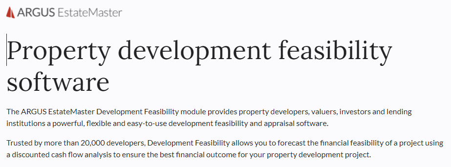

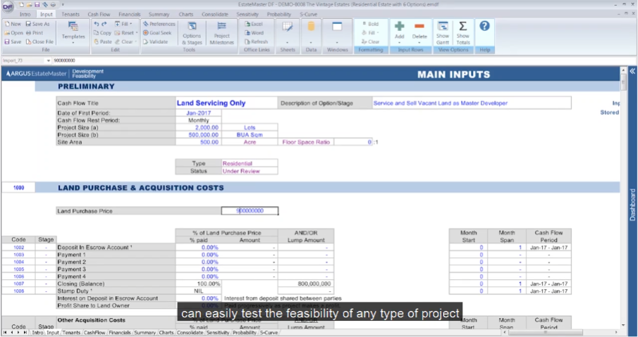

`사업개요`

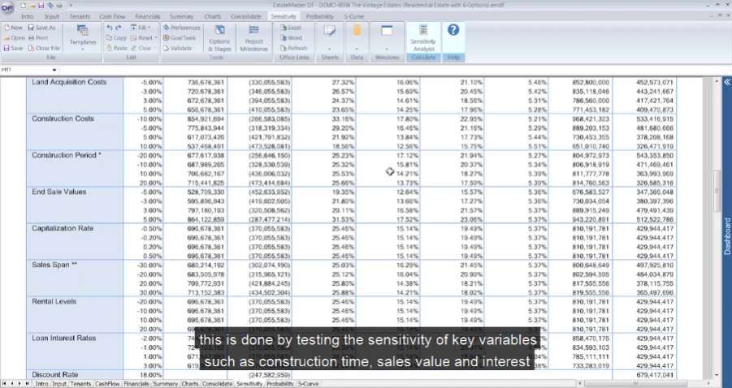

`수익성`

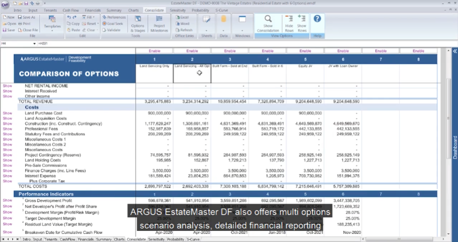

`대안비교`

 

### 부동산 타당성 플랫폼 (BIM)
Archistar  
[https://www.archistar.ai/](https://www.archistar.ai/)

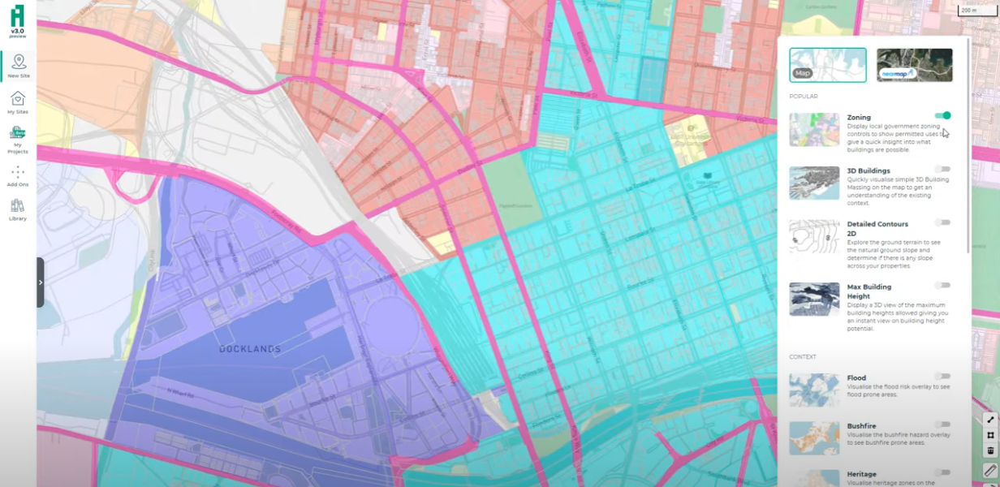

`용도지역`

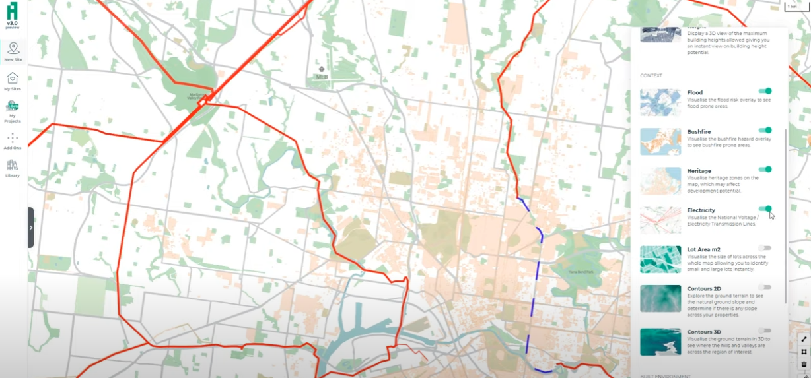

`철도`

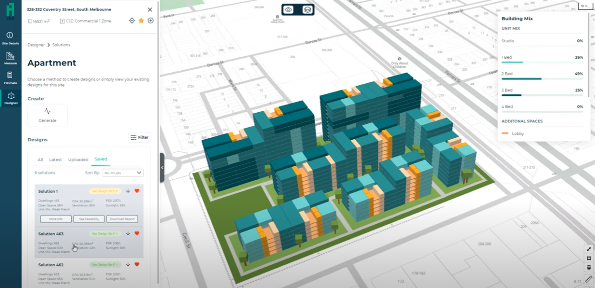

`공동주택 모델링`

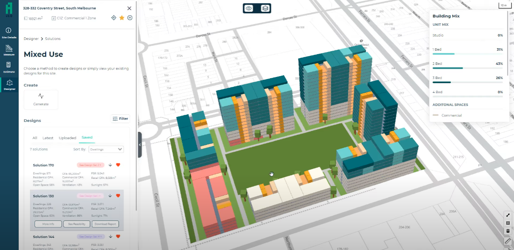

`복합 개발`

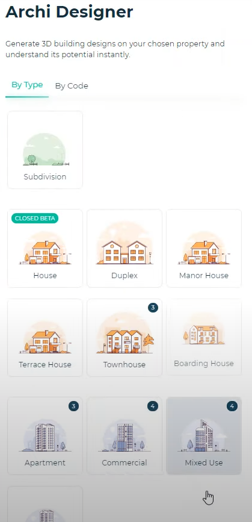

`용도 변경`

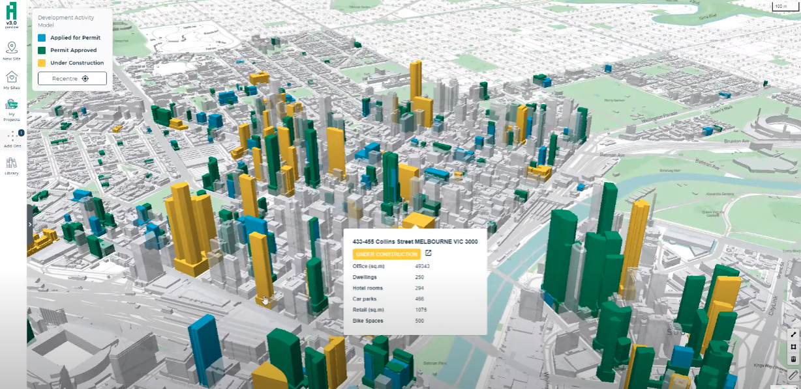

`주변 건물 현황`

 

### 종합 부동산 정보 제공
disco.re  
[https://www.disco.re/](https://www.disco.re/)

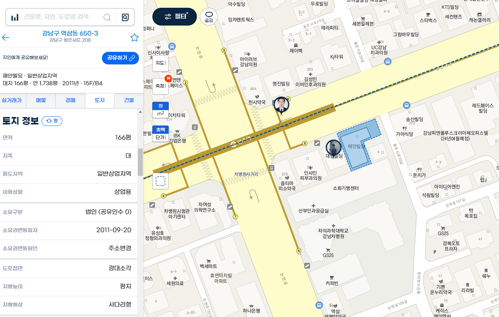

`토지 정보`

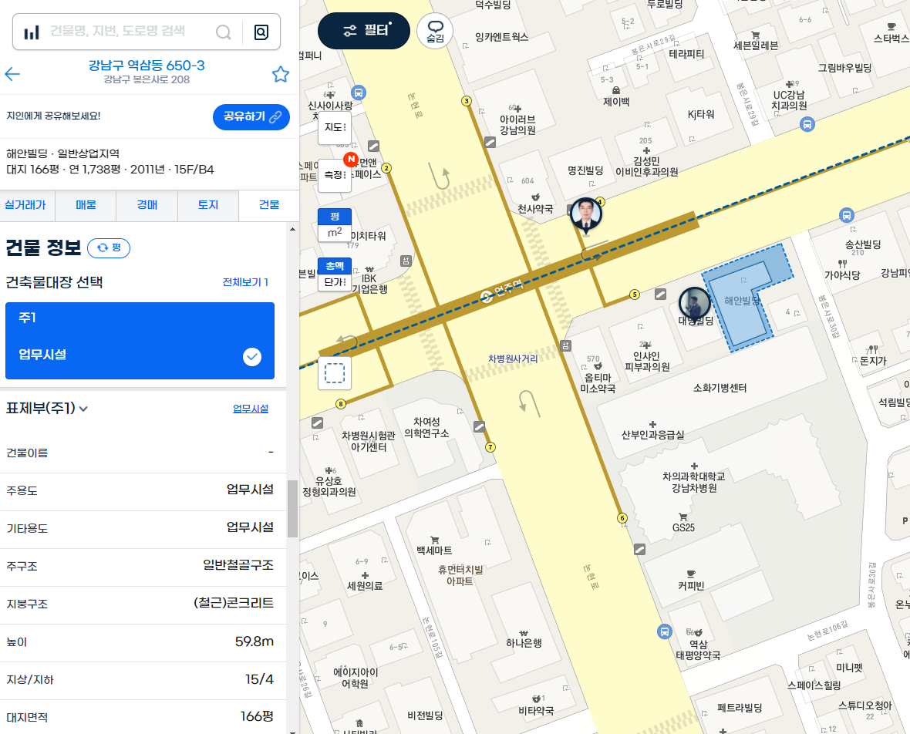

`건물 정보`

 
 

## 사업성 분석 사례

### 시장분석

#### 인근지역 분양시장 현황
- 세대수 증가 추이
- 주택유형별 현황
- 공동주택 공급평형 현황
- 지역별 분양시장 현황
- 최근 분양 사례
- 신규 분양예정 사례
- 사례 단지 규모 및 시설현황 분석

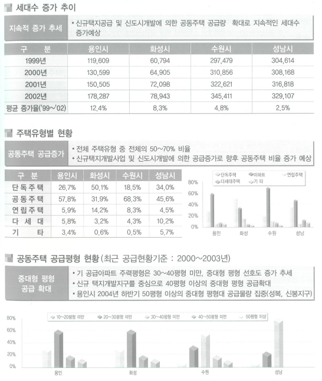

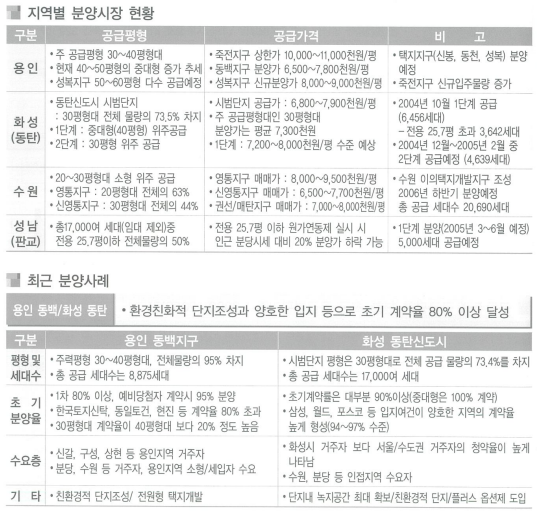

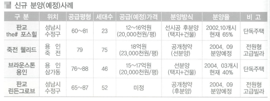

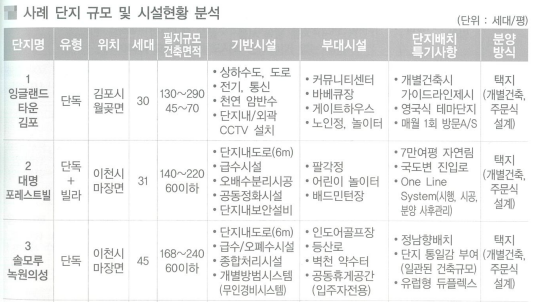

#### 수요추정
- 인구현황
- 자가비율 및 주택비율
- 수요 추정

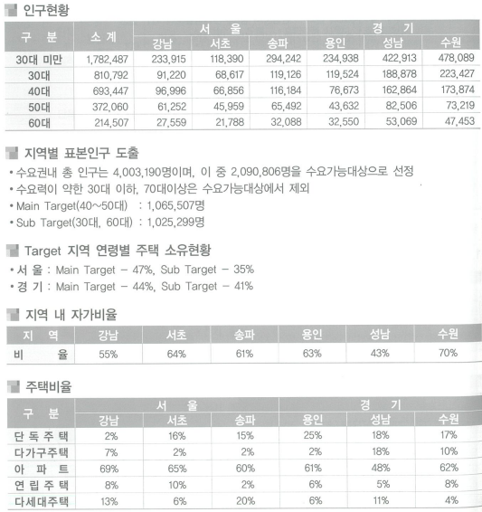

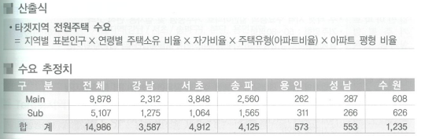

### 분양가격 산정

#### 시세 분석
- 지역별 시세 분석
- 동일 지역 시세 분석
- 분양가 적정 수용범위

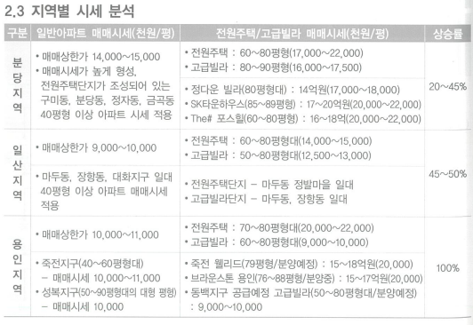

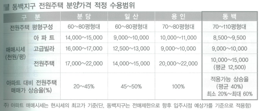

### 사업수지 및 수익률 추정
#### 매출액 산정
- 평당 평균분양가격 산정
- 평형별 분양가격 산정
- 총 매출액 산정

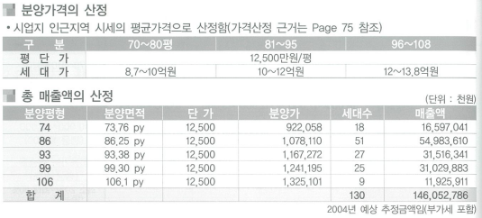

#### 추정 손익계산서
- 계정과목별 금액 산정
- 매출액 및 매출원가 산정
- 판매비, 관리비 산정

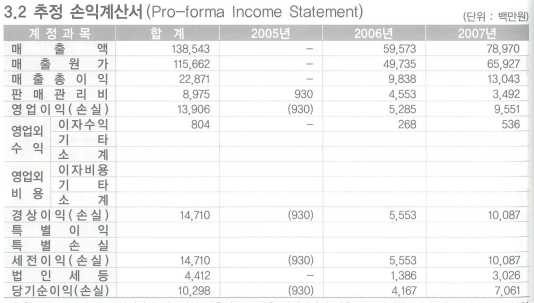

#### 추정 대차대조표

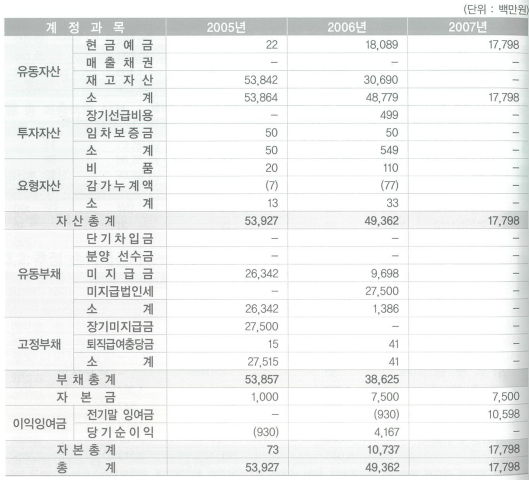

### 총 투자비 산정
#### 총 투자비 산정
- 소요자금 구성

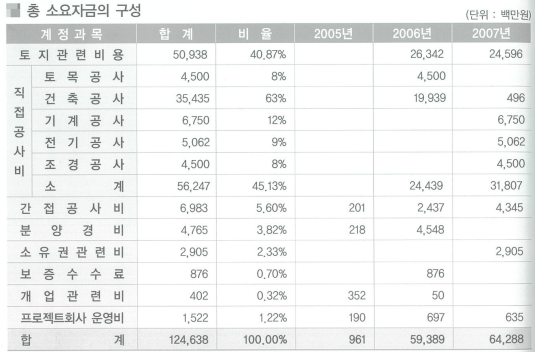

#### 토지관련 비용
- 토지비용
- 토지비 지급계획

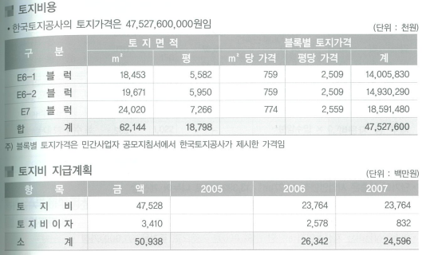

#### 공사관련 비용
- 직접공사비
- 간접공사비

#### 수수료 및 경비