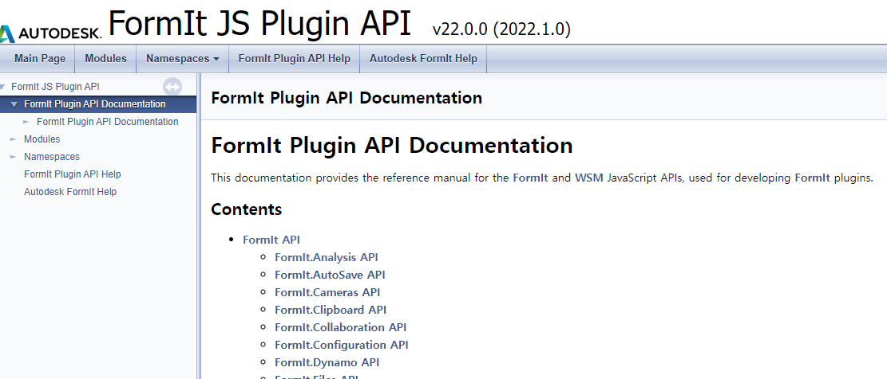
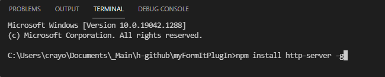
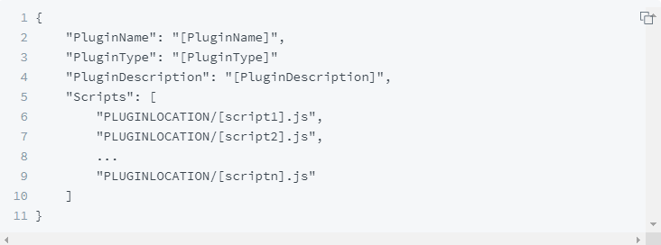
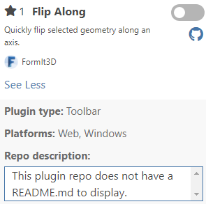
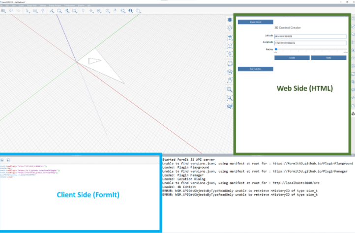

`2022.03.23`
- 사업성분석 내용 제외
- 규모검토내용 우선 기획

# 면적/ 규모검토 시스템
BIM, 빅데이터, 제너레이티브, 딥러닝 기반 규모검토 (단계별 개발)

## 개요
BIM 플랫폼 기반으로한 규모 검토 기능
- 대지 분석, 대지작업
- 용도지역 등 정보 조회/ 분석
- 매스 모델링
- 층 작성
- 제너레이트디자인
- 세대평면 패밀리

## 프로세스
- 앱 실행
- 프로젝트 생성
- 대지정보 관리
  - 지도 연동
  - 지역지구, 용도 등 기본정보 불러오기
  - 건축기준, 법규, 조래 확인
- 대지 작업
  - 지도 연동
  - 지형 CAD 불러오기
  - 주변건물 작업 (GIS 불러오기, 자동 모델링)
- 기본매스작업
  - 대지정보이용 자동 모델링
  - 기본대안검토
- 매스편집
  - 매스수정
  - 매스배치
- 건축기준적용
  - 매스편집
  - 매스 시각화 검토
  - 사선 검토
  - 용적률, 건폐율 검토

## 플랫폼 검토 (FormIt)
- Autodesk 판 스케치업
- 웹 방식 API 제공 (js)
- 객체 생성, 수정, 정보취득
- Opensource 방식
- Github호스팅, 로컬호스팅 방식
- Github 호스팅시 애드인구동을 위한 인터넷연결 필요
- 로컬 방식에서는 불필요

## 개발 기초
- API Document https://formit3d.github.io/FormItExamplePlugins/docs/FormItJSAPI/index.html
- https://windows.help.formit.autodesk.com/plugins/how-to-develop-plugins/advanced-development/hosting-a-plugin-on-a-local-server

- FormIt 플러그인인 'Plugin Playground' 활용하여 간단한 테스트 가능

- VS Code 또는 다른 IDE 사용 가능
- 기존 플러그인 Github 통해 참조 가능

### 로컬서버에서 플러그인 호스팅
vs code 에서 간단히 http-server 설치하여 호스팅 가능

### Manifest 플러그인 설정

### 웹 Html, 클라이언트 FormIt
UI는 html 방식의 웹으로 구동되며, function은 js 방식으로 동작(manifest.json)

### Html 에서 클라이언트 사이드 기능 호출방식
Method 1: FormItInterface.CallMethod
Method 2: FormIt.CallJS
Method 3 (async/await)
Method 4 (RegisterAsyncAPI)