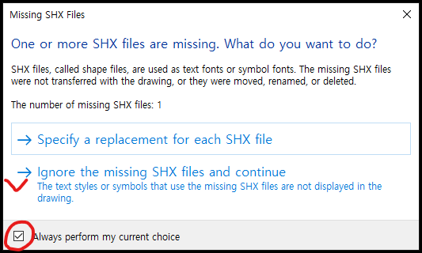
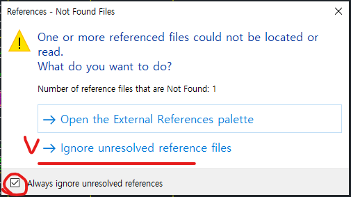
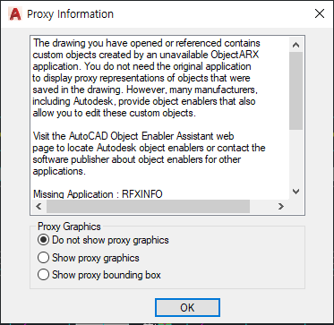
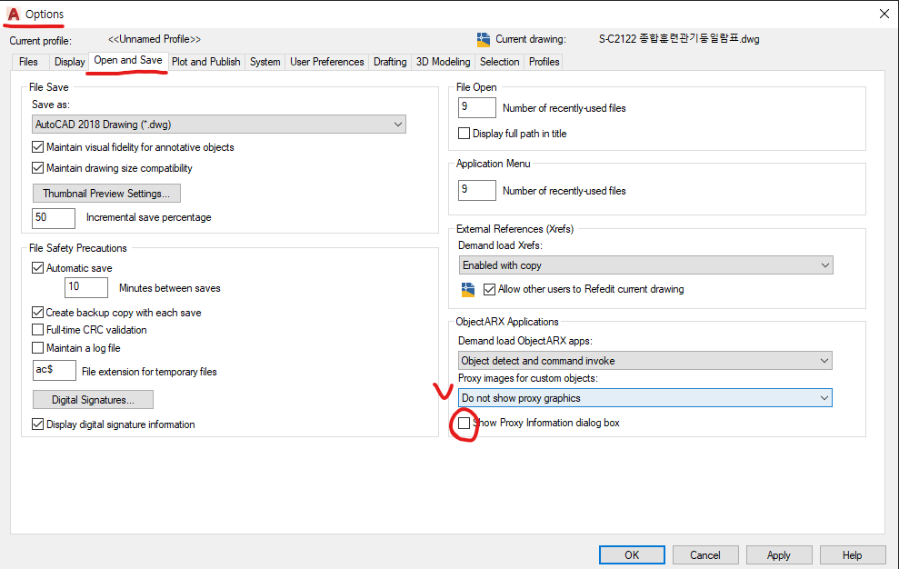
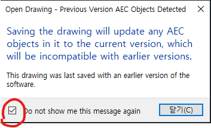
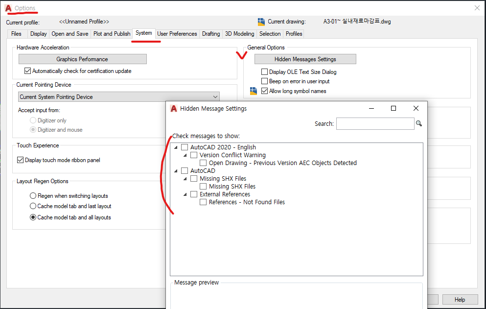

`2022.02.07`

# AutoCAD 문서 열때 메시지 창
## 문서열기/ 닫기 자동화 작업 관리
- DWG 파일 여는 과정에서 다양한 형태의 경로 오류 메시지와 기타 설정 메시지가 출력되게 된다. 이러한 메시지창은 자동으로 열고 닫는 과정의 방해요소 이며, 코딩 방식과 AutoCAD 셋팅 방식으로 메시지창을 숨기거나 자동으로 닫아 줘야 이후 진행이 가능하다.
- AutoCAD 에서는 일부 제외한 메시지창을 Always Hidden 처리 가능하고 이러한 숨겨진 창의 관리도 가능하다.
- 'Studant Version 에서 작성된 문서' 라는 메시지는 현재 관리 가능하지 않다. (Always Hidden 불가능)

## 메시지 창 종류
### Missing SHX Files

### References - Not Found Files

### Proxy Information
  
- 이 메시지창은 다른 방식으로 관리되고 있다.
- Options > Open and Save > ObjectARX Applications 에서 관리 가능하다.  

### Open Drawing - Previous Version AEC Objects Detected

## 메시지창 숨김 설정
- Options > System > General Options > Hidden Messages Settings
- 여기의 목록은 Always Hidden 설정된 메시지이며 해제하길 원하면 체크 후 OK 버튼 클릭하면 된다.  

