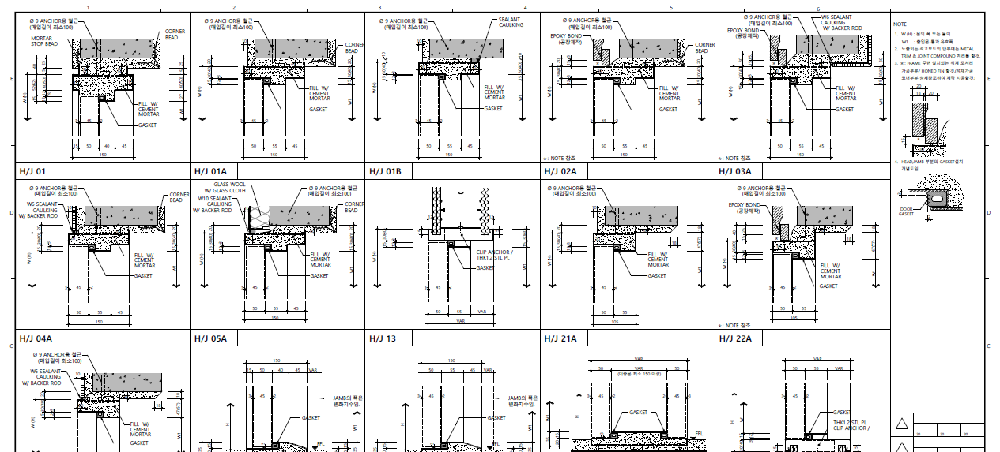

`2022.02.10`

# 도면 정보
## 데이터 수집
- 도면(DWG) 분석 및 분계 후 수집 방식
- 수집프로그램을 통한 이관서버 접근
- 도면 종류, 진행단계 및 프로젝트 선택 (도면종류 확대 예정)
- AutoCAD 자동 오픈 및 추출 작업 진행
- 추출 종료 후 DB 전송

## 데이터화 도면 및 개요
### 실내마감재료표
실명을 기준으로 한 벽, 바닥, 걸레받이, 천정의 마감재료 정보 수집

### 실내마감상세도
상세도 블록 단위 추출, 그림(PNG, SVG..), 마감종류, 마감번호, 실명 수집

### 창호하드웨어일람표
하드웨어 명칭, 이미지, 스팩, 사용 장소 수집

### 문 일람표
실명, 문 크기, 도어타입, 재료타입, HEAD/JAMB/SILL 상세번호, 비고 등 추출/ 수집

### 문 HEAD, JAMB, SILL 상세도
문틀 단면 상세 블록 단위 추출, 그림(PNG, SVG..), 상세번호(문일람표와 연계) 수집

