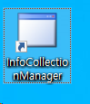
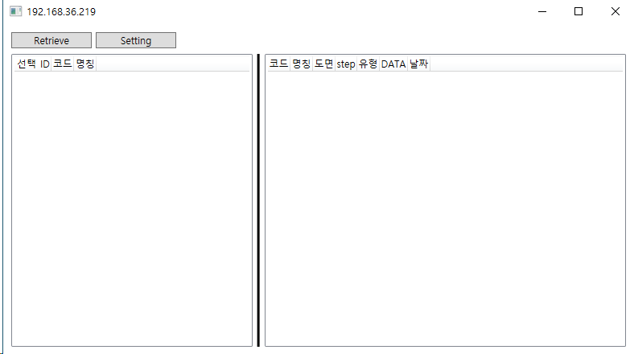
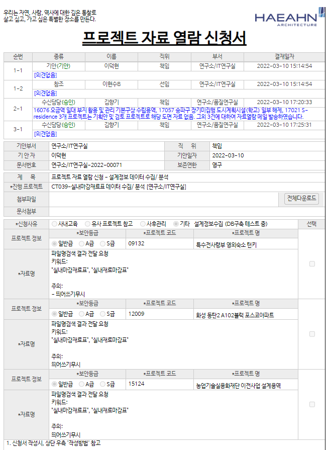
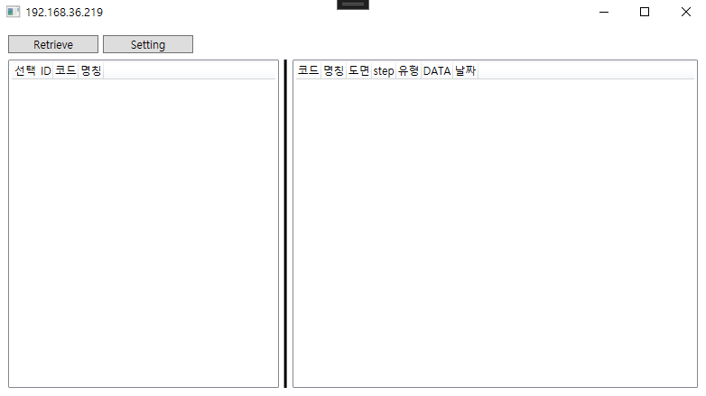
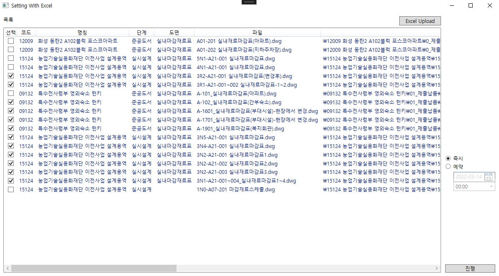
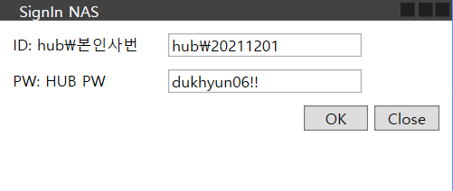

`2022.03.14`

# DWG-Info Collection

## 추출 작업

### 서버

- 접속: 원격데스크톱
- IP: 192.168.40.34
- 사용자명: user
- 비밀번호: 없음

### 추출 프로그램

- InfoCollectionManager
- 바탕화면 아이콘

### 추출 절차

1. 이관프로젝트 도면 열람 신청
2. 대상 파일목록 수신 (엑셀파일)
3. 추출서버 접속
4. 추출 프로그램 실행
5. 열람 대상 파일목록 엑셀파일 업로드
6. 프로젝트 및 도면 목록 확인
7. 추출 진행
8. 추출 완료 확인

### 추출 절차 세부

#### 종료프로젝트 조회 (추출 대상 선정)

1. HUB > HEXA 접속
2. 프로젝트 탭 선택
3. [종료 프로젝트 목록] 클릭 및 엑셀 다운로드
4. '프로젝트 자료 보안등급', '이관 시점', '이관 연도' 를 바탕으로 선정

- 추출 대상 선정시 '보안등급'별로 구분하여 선정하는것이 합리적임
- '보안등급' 관련하여 아래 추가 설명

#### 보안등급

- '일반급'이 아닌 A, S 급의 경우 해당프로젝트 PL에게 권한부여받아야 함
- '일반급'은 PL무관하게 대상 선정 하여도 됨
- A, S급은 PL별로 필터링하여 대상 선정

#### 도면 열람 신청

1. 전자결재 > [프로젝트 자료 열람 신청서] 작성
2. 종료프로젝트 목록에서 선택한 대상 작성
3. 보안등급 및 PL별로 일괄 상신하여야 함
4. 신청서 > 자료명: '리스트 형식(공유된 개인 폴더내, 자료 경로 포함)'

### 추출 진행

- 추출프로그램에서 [Setting] 클릭
- [Excel Upload] 클릭하여 품질연구실 담당자에게 받은 엑셀파일 선택
- 항목 선택후 [진행] 클릭
- 자료열람신청한 직원 본인의 사번(hub\사번)과 허브 비밀번호 입력

#### 추출 완료 확인

- 서버의 C:\Users\user\AppData\Roaming\Haeahn\DWGCollection\Collects 접속
- 추출 작업 Task ID (순서) 별 폴더에서 json 데이터 추출여부 확인
- (옵션) 192.168.36.219 DB 접속 후 정보 조회
