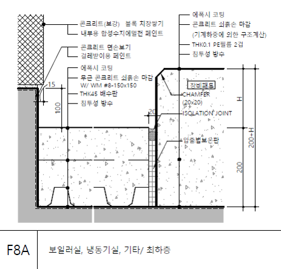

DWG 도면에서 선택영역의 '그림' 을 변환하기 위한 절차를 고민해보자.

- COBA에서 만들었던 'DWG to Image' 모듈을 가공하면 될 것이다.

## 좌표방식

AutoCAD의 좌표방식은 'X축: 좌->우, Y축: 아래->위' 로 값이 커진다. 반면 이미지(png, svg)는 X축은 동일하나 'Y축: 위->아래' 로 반대이다.

오브젝트들의 좌표를 읽을때 Y축을 바꾸는 작업이 필요하다. (COBA 모듈에 이미 적용되어져 있다.)

## 변환 오브젝트

- Text
- Line
- Arc
- Circle
- Hatch

도면의 대부분의 오브젝트는 Text, Line, Arc, Circle 로 만들수 있다. 대부분이라 함은 Spline은 제외하기 때문이다.

치수선, 폴리선은 객체를 분할할 경우 Line으로 변환가능하지만 만약 도면으로 재변환을 한다면 다시 치수선, 폴리선으로 돌아가기엔 힘든 부분이 있다. 폴리선의 경우 Grouping 을 통해 DWG로 Import 할때 join 처리를 하면 되긴한다.

