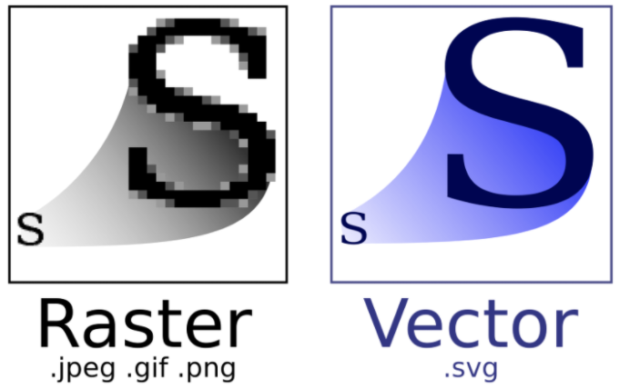
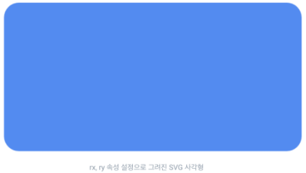

## 참고

* [SVG 그래픽](https://a11y.gitbook.io/graphics-aria/svg-graphics)

* [SVG 구조, 렌더링 성능 알고 쓰기](https://velog.io/@ggong/SVG-알고-쓰기-최적화)


## SVG 개요

DWG 도면의 정보중 '그림' 정보를 DB에 저장하기 위한 방법중 SVG로 변환하는 방법이 있다.  



SVG는 설명에서와 같이 Vector 방식으로 '도면'을 웹에서 보여주기에 적합하다.  

SVG의 기본 형태는 다음과 같다.
 

```
<!DOCTYPE html>
<html>
    <body>
        <svg height="300" width="400">
            <rect width="300" height="400" style="fill:rgb(0,0,0)" />
            <line x1="0" y1="0" x2="200" y2="200" style="stroke:rgb(255,0,0);stroke-width:2" />
        </svg>
    </body>
</html>
```


[SVG 연습하기](https://www.w3schools.com/graphics/tryit.asp?filename=trysvg_line)


## SVG 레이아웃

- SVG 캔버스(Canvas) 혹은 뷰포트(Viewport)
- SVG 뷰박스(viewBox)

```
<svg 
  width="512" height="512" 
  viewBox="0 0 512 512">
  ...
</svg>
```

viewPort는 HTML 문서에서 svg가 렌더링되는 공간을 말한다. svg 렌더링은 설정된 캔버스(=viewPort)의 너비, 높이 안에서만 이루어진다.

viewBox는 뷰포트에 맵핑되는 공간을 명시한다. 값으로는 min-x, min-y, width, height를 지정할 수 있다. 뷰포트와 뷰박스 사이즈가 다를 경우, 그래픽의 가로:세로 비율을 유지하거나 크기를 확대/축소하는 스케일링 설정을 할 수 있는데 이때는 preserveAspectRatio 속성을 사용한다.

```
<svg
  width="512" height="512"
  viewBox="0 0 512 512"
  preserveAspectRatio="xMaxYMin meet">
  ...
</svg>
```

preserveAspectRatio 속성 값으로는 두 가지의 매개변수를 받을 수 있는데, <align>(정렬) 과 <meetOrSlide>(채우거나 자름)이다. 각 매개변수 값들을 어떻게 지정하느냐에 따라 뷰포트 안에 뷰박스가 어떤 위치에 자리하느냐를 지정할 수 있다.

위 예시에서 지정된 preserveAspectRatio="xMaxYMin meet"는 아래 의미와 같다.

가로:세로 비율을 유지함. 뷰포트의 오른쪽 x, 위쪽 y 값에 위치시킴
뷰박스와 뷰포트 크기가 다를 경우, 뷰박스를 뷰포트 안에 모두 표시함
preserveAspectRatio의 더 많은 속성은 [여기](https://a11y.gitbook.io/graphics-aria/svg-graphics/svg-layout#preserveaspectratio)서 확인 가능하다.

  
<br>

SVG로 도형을 그리기 위해서 자주 사용되는 기본 태그들은 아래와 같다.

- 사각형(rect)
- 원(circle)
- 직선(line)
- 다각형(polygon)

그리고 각 도형의 스타일을 제어하기 위한 속성은 아래와 같다.

- 너비(width)
- 높이(height)
- 색상(fill)
- 뷰포트 내부 특정 지점으로 위치(x, y)
- 둥근 테두리(rx, ry)
- 테두리 색상(stroke)
- 테두리 두께(stroke-width)


만약 특정 svg 소스를 개발자가 수정해서 내부 컬러를 변경하고 싶다면, fill 속성이나 stroke 속성을 변경하면 된다.

```
<svg>
  <rect width="480" height="240" fill="#3d87fb" x="20" y="40" rx="20" ry="20" />
</svg>
```




```
<svg>
  <circle 
    cx="200" cy="200" r="50" 
    fill="none" stroke="#f9b10a" stroke-width="14" />
</svg>
```


또한 svg에서는 더 복잡한 도형을 그리기 위해 <path> 도형을 사용할 수 있다. <path> 도형은 패스 데이터(d)를 통해 도형의 모양을 그리는데, 이 패스 데이터에는 패스를 그리는 moveTo, lineTo, closePath, curve 등을 의미하는 각 명령 이름과 좌표값이 들어있다. 데이터에 명시된 좌표값과 명령문을 이용해 도형을 이루는 선을 그리게 된다.

```
<svg>
  <path 
    d="M248.761,92c0,9.801-7.93,17.731-17.71,17.731c-0.319,0-0.617,0-0.935-0.021c-10.035,37.291-51.174,65.206-100.414,65.206 c-49.261,0-90.443-27.979-100.435-65.334c-0.765,0.106-1.531,0.149-2.317,0.149c-9.78,0-17.71-7.93-17.71-17.731 c0-9.78,7.93-17.71,17.71-17.71c0.787,0,1.552,0.042,2.317,0.149C39.238,37.084,80.419,9.083,129.702,9.083c49.24,0,90.379,27.937,100.414,65.228h0.021c0.298-0.021,0.617-0.021,0.914-0.021C240.831,74.29,248.761,82.22,248.761,92z" 
    fill="#f9ef21" stroke="#f9cf01" stroke-width="7" stroke-linejoin="round" />
</svg>
```


## SVG의 컨테이너 요소

- <g> 요소 : 그룹화를 위한 컨테이너 요소.
- <use> 요소 : 문서 전반에서 요소를 재사용할 수 있다. xlint:href="#식별자ID"처럼 쓰면 재사용할 요소를 호출하여 사용할 수 있다.
- <defs> 요소 : <defs> 요소내에 선언된 그래픽은 svg 뷰포트에 렌더링되지 않는다. 렌더링하려면 <use>를 통해 참조해야 한다. 약간 js의 변수 선언 같다는 느낌을 받았다. 

아래 코드로 컨테이너 요소들을 사용하는 방법에 대한 예시를 알아볼 수 있다.

```
<svg width="512" height="512" viewBox="0 0 512 512">
  
  <!-- 그래픽 정의 defs -->
  <defs>
    <!-- 그래픽 3개를 묶은 그룹 요소 선언 -->
    <g id="cherry-tree-group">
      <g id="fruit-cherry" transform="translate(0 100) scale(0.3)">...</g>
      <use xlink:href="#fruit-cherry" x="50" y="100" />
      <use xlink:href="#fruit-cherry" x="150" />
    </g>
  </defs>
  
  <!-- defs 내부에 선언된 그래픽 3개 그룹 재사용 -->
  <use xlink:href="#cherry-tree-group" />
  <use xlink:href="#cherry-tree-group" x="200" y="100" />
  
</svg>
```

## SVG 기본 사용법

### img 태그 사용

대부분의 경우에 가장 좋은 성능을 보인다.

```

```