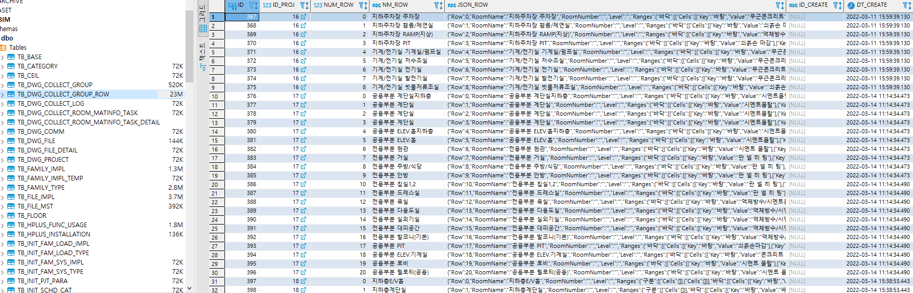

`2022.03.29`
`DWG 정보 수집 시스템`

## 개요
DWG 원본 도면파일에서 설계 소스로 사용될 정보나 분석에 활용될 내용들을 DB형태로 수집한다. 수집작업을 시스템화 하여 별도 장비를 통하여 자동화 한다. 지정 양식으로 작성된 파일목록을 선택, 필터링된 정보를 조회하며 수집할 도면을 선택 후 자동화 작업을 시작한다.

다수의 파일을 선택시 AutoCAD가 반복해서 열고 닫으며 정보를 수집/ 전송한다. 수집 성공 여부, 수집한 데이터를 볼 수 있도록 하여 작업과 데이터의 관리를 원할히 한다.

 

## 프로젝트 조회
수집한 프로젝트를 목록으로 보여주며 도면별 어떠한 설계단계이고 도면의 유형은 무엇인지, 추출 성공 여부를 확인할 수 있다.

 

 

 

## 프로젝트별 데이터 조회
수집된 데이터를 보며 추출이 성공적이었는지 확인할 수 있다. json 데이터 형태로 보여주므로 각종 viewer에서 재활용할 수 있다.

 

## DWG 추출 작업 (셋팅)
지정 양식(품질기술팀 제공)의 파일목록을 업로드하여 그중 수집 대상을 선택하게 된다. 폴더 경로를 분석하여 프로젝트코드, 프로젝트명, 도면의 유형, 설계단계 등을 필터링 한다. 

폴더명을 분석하여 백업자료, 업무연락 등 중복되거나 제외해야 하는 대상은 자동으로 필터링한다. 

 

## DWG 추출 결과 (json 포맷)
json 포맷으로 결과를 추출하고 자동화를 통해 DB 전송하게 된다. 프로젝트코드, 설계단계, 실의 명칭이 포함되어 있으므로 차후 데이터 조회 사이트에서 다양한 활용이 기대된다.

