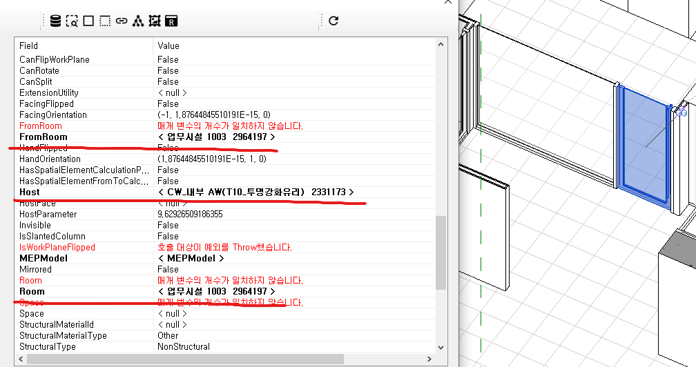
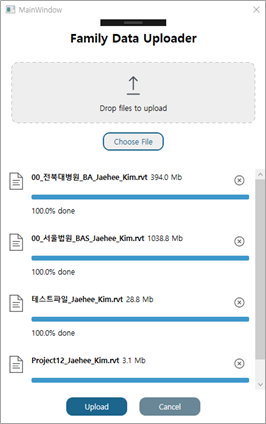

## 패밀리
- 윈도우, 도어

## 정보

### 해안 일반 속성

카테고리별 필수 또는 기본의 속성 정리

### 설계단계 속성

패밀리가 사용되는데 적합한 설계단계 명기

### 관계정보

- 어떤 공간(s)
- 어떤 벽(s)
- 어떤 프로젝트(s)
- 어떤 바닥 위(s)



## 수집시스템

### 프로젝트전체정보

- Central Model에서 모든 인스턴스 및 패밀리 정보 추출하기 (민성재)
- 패밀리 수집과는 다른 루트
- (옵션)추가적인 판단을 위한 내용

### 프로젝트에서 패밀리 추출

- 관리자(매크로) 기능으로 패밀리 추출하기



- Family, Symbol 레벨 추출

### 유사 패밀리 찾기

Category, FamilyName, TypeName, Parameters(KeyName)를 통해서 유사성을 판단하여야 한다.

* Window FamilySymbol Parameters 예제
```json
{
  "PG_IDENTITY_DATA": {
    "Manufacturer": null,
    "Code Name": "",
    "Type Name": "PW_1190(595) X 2100",
    "Type Comments": "PW4",
    "Assembly Code": "",
    "URL": null,
    "건설정보분류체계-부위분류": null,
    "Type Mark": "37",
    "Edited by": "",
    "조달청표준공사코드": null,
    "Cost": "0",
    "Assembly Description": "",
    "Keynote": null,
    "Description": "WINDOW",
    "HB_Material_Code": null,
    "Type Image": "<None>",
    "HB_NWC_Code": null,
    "Model": null,
    "OmniClass Title": "Windows",
    "Workset": "Family  : Windows : HB_WIN_Sliding(One_2)_Ext_Railing",
    "Design Option": "-1",
    "OmniClass Number": "23.30.20.00"
  },
  "PG_ANALYTICAL_PROPERTIES": {
    "Solar Heat Gain Coefficient": "0",
    "Thermal Resistance (R)": "0.0000 (m²·K)/W",
    "Visual Light Transmittance": "0",
    "Define Thermal Properties by": "Schematic Type",
    "Analytic Construction": "<None>",
    "Heat Transfer Coefficient (U)": "0.0000 W/(m²·K)"
  },
  "INVALID": {
    "VAR(MO)": "10",
    "SubFrame Depth": "40",
    "창호 유리문": null,
    "VAR(MO) Bottom": "10",
    "Category": "Windows",
    "Railing": "No",
    "Family Name": "HB_WIN_Sliding(One_2)_Ext_Railing",
    "Frame(W)": "120",
    "Frame(D)": "50",
    "SubFrame Offset": "5",
    "VAR(MO)Top": "10",
    "창호 기타 부속철물": null,
    "창호 유리창": null,
    "창호 문틀/창틀": null
  },
  "PG_GEOMETRY": {
    "Height": "2,100",
    "Mid_Bar_Location": "495",
    "Width": "1,190",
    "Mid_Bar_Location2": "595",
    "Glass Thickness": "24",
    "Railing_Height": "0",
    "Rough Width": "1,210",
    "Mid_Bar_Center": "Yes",
    "Rough Height": "2,110"
  },
  "PG_CONSTRUCTION": {
    "Construction Type": null,
    "Wall Closure": "By host"
  },
  "PG_MATERIALS": {
    "Railing_Material": "#금속재_STS01_STS",
    "Glass Material": "#HB_GL04_고강도 투명방화유리_THK8",
    "Reenforce Material": "<By Category>",
    "Spandrel Material": "<By Category>",
    "Frame Material": "#플라스틱_PLT01_"
  },
  "PG_TEXT": {
    "HB_Category-1": null,
    "HB_Category-2": null
  },
  "PG_IFC": {
    "Operation": null
  }
}
```

Parameters Group 을 관리할 필요가 있음

## 관리자

### 패밀리정보비교

명칭, 매개변수, 형상 등을 비교하여 동일 또는 유사도 판단한다.

```json
{
  "PG_IDENTITY_DATA": {
    "Manufacturer": null,
    "Code Name": "",
    "Type Name": "PW_1190(595) X 2100",
    "Type Comments": "PW4",
    "Assembly Code": "",
    "URL": null,
    "건설정보분류체계-부위분류": null,
    "Type Mark": "37",
    "Edited by": "",
    "조달청표준공사코드": null,
    "Cost": "0",
    "Assembly Description": "",
    ...
    },
}
```

- Json 형태의 매개변수를 비교한다.
1. PG.. 등의 'Parameter Group' 유무를 비교한다.
2. Parameters Key(Name) 유무를 비교한다.
3. Parameters Value의 일치 여부를 판단한다. 

### 기계학습

매개변수, 형상 등을 학습하여 유사한 것이 들어왔을 때 자동 판단, 자동 관리

### 삭제

사용성 떨어지거나 중복되는 패밀리 삭제

### 추가

업로드 방식 또는 유형추가 애드인

### 정보편집(기본, 매개변수)

RFA의 속성에서 편집하거나 DB의 정보 편집한다.
1. rfa의 Parameters를 DB Json 형태로도 수집한다.
2. 비교 후 정리된 패밀리의 경우 rfa 자체에서 매개변수를 빼도록 한다.
3. DB의 Parameters를 정리한다.
4. 배포시에 rfa에 DB Parameters를 탑재한다.

### 정보 일괄 정리

기본적인 속성 제외하고 전체를 삭제하거나 공통의 속성 일괄 넣기

## 브라우저

### 썸네일
썸네일은 기본으로 뽑는다.

### 3D 뷰어
obj 등으로 형상을 추출하여 three.js 뷰어를 통한 검토가 가능하도록 한다.

### 평입단면
이 패밀리를 쓰면 도면 작성시 어떻게 표현되는지 확인 가능하도록 보여준다.

### 통합검색
명칭, 매개변수, 이미지 등 한 번에 검색 되도록 한다.

### 요청
원하는 패밀리가 검색되지 않을 경우 생성을 요청한다.

### 생성
원하는 패밀리가 없어 생성 요청이 들어오면 유형을 추가하던, 패밀리를 새로 만들던, 사람이 만들던, 기계가 자동으로 만들던 한다.

### 업로드(요청?)
내가 가진 패밀리가 등록되었으면 좋겠다? 검토 요청 및 승인 절차

### 다운로드
패밀리 다운로드

### 프로젝트로드
프로젝트 로드

### 프로젝트의 패밀리와 브라우저의 패밀리 내용 비교(애플사례)
현재 프로젝트에 사용된 패밀리와 비교하여 차이점을 나타내며 문제가 될만한 내용을 알려준다.

## 검색
- 명칭
- 매개변수
- 만든사람
- 형상(이미지)
- 카테고리
- 인기, 최신 등 정렬
- 관련정보
- 창호형태(사전분류)

## 버전 관리
- Revit 종속 문제
- Revit 버전별 관리
- 지속적인 업그레이드(자동화)
- 버전을 관리해야할까?
- 정보만 가지면 버전 종속적이지 않을 것 같은데

## 사용, 이력수집
패밀리를 취할 수 있는 모든 루트를 관리한다.
- 패밀리 브라우저 사용현황 수집
- 웹 다운로드 이력 수집
- NAS 접속, 복사 이력 수집

사용자, 조회수, 다운로드수, 로드수