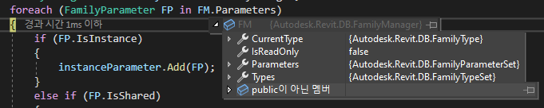

- 파일
- 정의
- 유형 정의(Symbol)
- 유형 파라매터
- 인스턴스 파라매터
- 인스턴스 관계정보

- 패밀리 메니저에 대부분의 파라매터가 있다.
- 프로젝트 파라매터도 가져오고 싶으니 프로젝트 레벨의 InstanceParameters도 가져오자.
- 모든 파라매터는 Family와 Rel 걸자.
- 파라매터의 정보에 Symbol, Instance 구분하자.
- 인스턴스 파라매터의 Family, Project 구분하자.

Instance가 모델링 되었는지도 여부를 넣자
