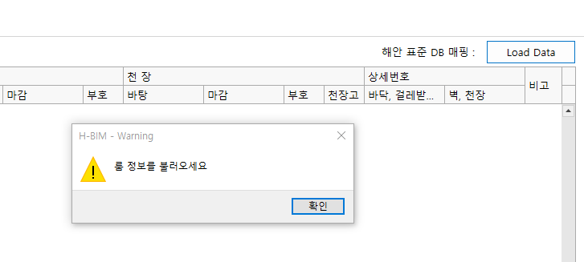
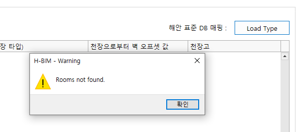
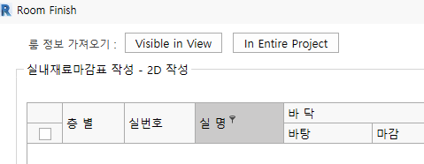
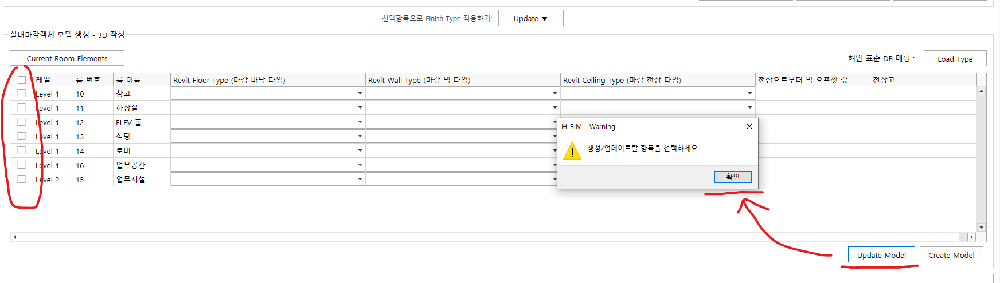
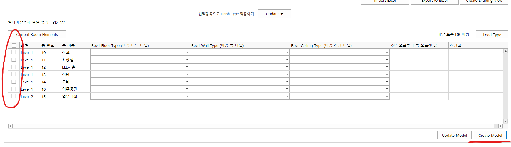

`2022.02.07`

# Alpha 버전 테스트
## 메시지

## 한글화

- 현재 뷰, 프로젝트 전체

## 창 닫김
- 룸 선택하지 않고 Update Model 버튼 누르면 창 닫혀버림

## 아무 반응없음
- 룸 선택하지 않고 Create Model 버튼 누르면 아무 메시지 없음
- '룸을 선택해 주세요' 등의 메시지 필요 

# 개선 필요
## Modal -> Modeless
- 현재 Modal 폼으로 개발, 창을 닫아야 모델 정보 확인 가능함
- 데이터를 보면서 설정해야할 필요 있음
- Modeless 변경 필요

## View Zoomin
- 룸 마감을 설정하면서 해당 위치로 뷰를 옮겨주는 기능 필요