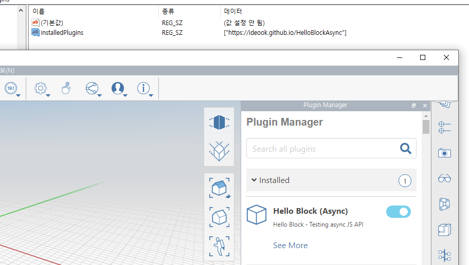
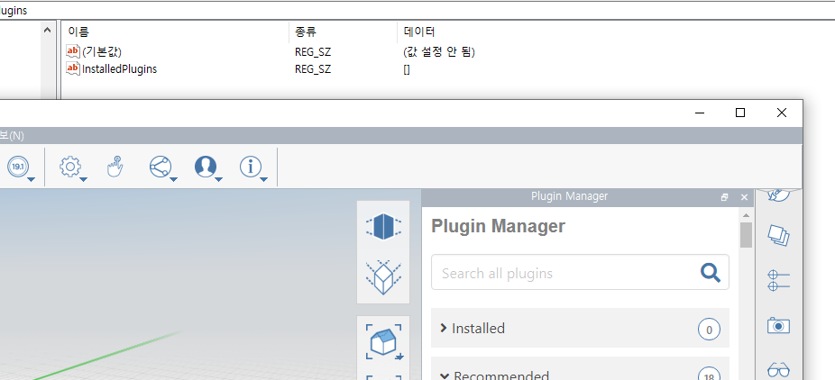
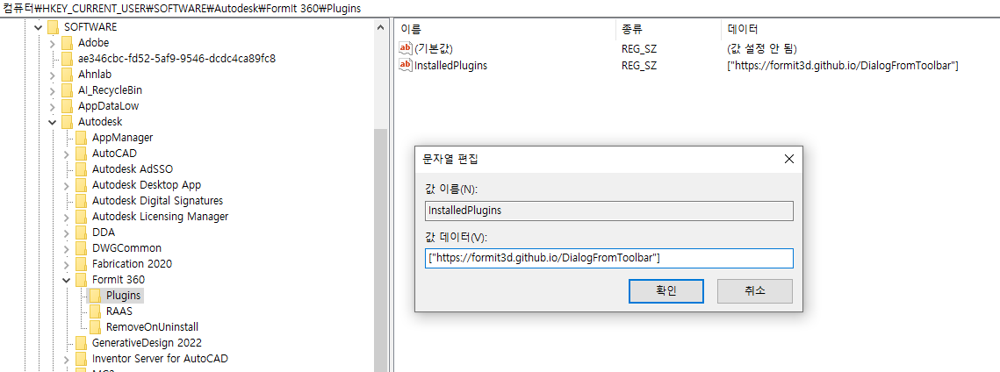

FormIt 플러그인의 설치 상태는 레지스트리에서 관리되고 있다. `HKEY_CURRENT_USER\SOFTWARE\Autodesk\FormIt 360\Plugins` 키의 `InstalledPlugins` 문자열 값에 호스팅 URL 을 입력하여 관리된다.
<br>

FormIt 에서 인스톨한 플러그인은 해당 hosting URL이 레지스트리에 등록되고 FormIt 종료후 재시작하여도 계속사용할 수 있다. 반대로 레지스트리를 직접 편집하여 상태를 관리할 수도 있다. 플러그인 배포시 레지스트리 입력 방식을 통해 관리될 수 있을 것이다.
<br>


<br>


<br>
<br>

데이터는 배열값으로 관리되며 `[]` 안에 쉽표로 구분하여 hosting URL을 입력하면 된다. 

```
["https://formit3d.github.io/DialogFromToolbar", "https://ideook.github.io/HelloBlockAsync"]
```
<br>

