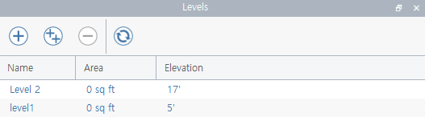
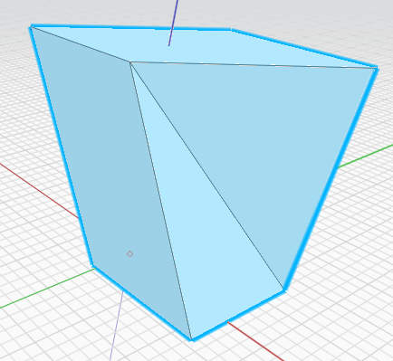
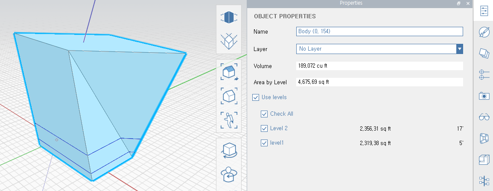
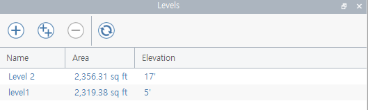

## FormIt 레벨 설정

* FormIt 레벨 설정 및 오브젝트 적용

Elevation 과 함께 Level 을 등록한다. 



레벨을 적용시킬 오브젝트를 선택해 준다.  




Properties 창을 열어 'Use levels' 체크한다.

적용을 원하는 레벨을 체크한다.




레벨을 처음 생성 했을때와 다르게 Level 별로 바닥면적의 합계를 확인할 수 있다.



<br>

## 레벨 APIs
* Level 이름으로 존재여부 확인
```
// historyDepth: undo의 Depth 를 이야기 하는 것 같음
// "level1": 셋팅된 레벨의 명칭 
let isLevel = await FormIt.Levels.IsExistingLevel(historyDepth, "level1");
```

* 전체 Levels 가져오기 (Elevation으로 정렬)
```
// historyDepth: undo의 Depth 를 이야기 하는 것 같음
let levels = await FormIt.Levels.GetLevelsData(historyDepth, true);
```

* 하나의 Level 가져오기
```
// historyDepth: undo의 Depth 를 이야기 하는 것 같음
let nLevelID = levels[m]["Id"]["Object"];
let levels = await FormIt.Levels.GetLevelData(historyDepth, nLevelID);
```

* 지정한 Level의 Elevation 값 변경하기
```
// 전체 레벨에서 하나 가져오기
// 변경할 Elevation 값 입력 (인치계)
let nLevelID = levels[m]["Id"]["Object"];
await FormIt.Levels.ChangeLevelElevation(historyDepth, nLevelID, 15);
```

```
// [154, 1085]번 오프젝트에 설정된 Level 들의 바닥면적 합계를 계산하여 줌
let nLevelID = levels[m]["Id"]["Object"];
let dArea = await FormIt.Levels.GetAreaForObjects(historyDepth, nLevelID, [154, 1085]);
```
