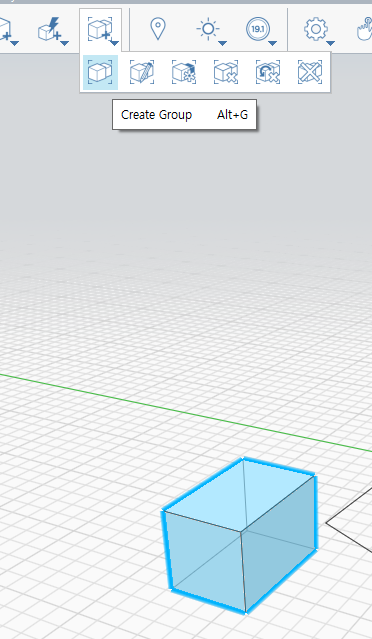
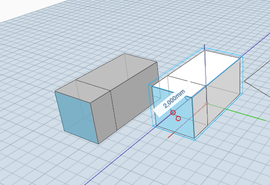
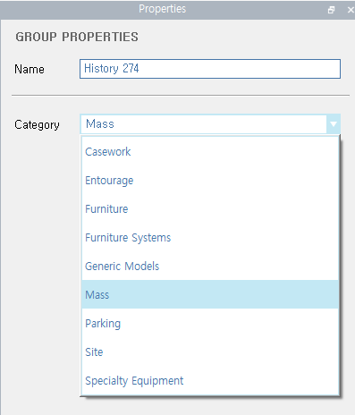
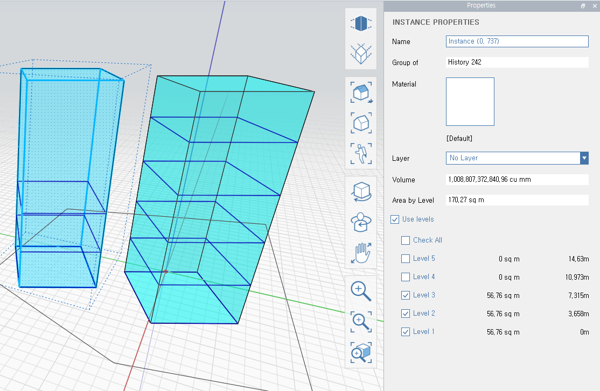
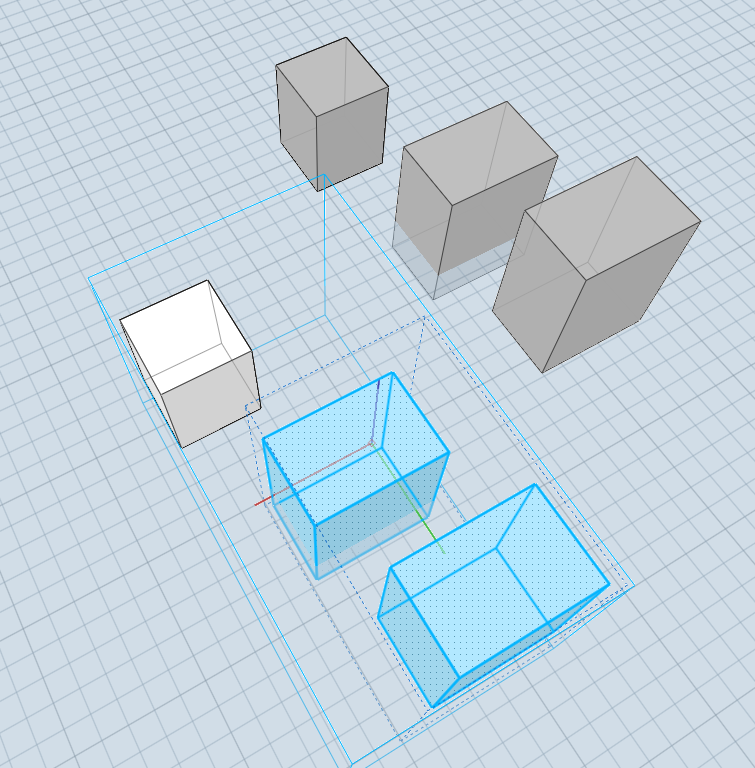
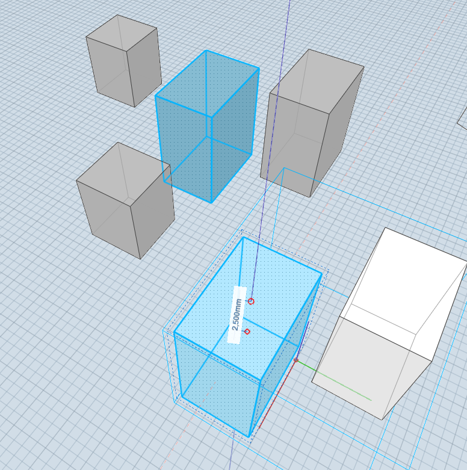

FormIt에도 Reference/ Instance 개념이 있다. 그룹을 생성할 경우 기본적으로 Reference화 된다. Reference의 수정이 모든 Instance 들에 반영되는 개념인 것이다. 

* Cube 를 생성하고 'Create Group' 을 실행해 그룹으로 변경한다. 이 과정만으로 Revit의 패밀리 개념이 완성된다.

* Cube 를 복제하고 하나를 더블클릭하여 'Edit Group' 모드로 들어간다. 그리고 Cube의 형상을 수정하면 모든 Instance에 반영되는 것을 확인할 수 있다. 실시간으로 수정상황이 보이므로 유용할 수 있다.

Revit의 경우 부재의 프로파일도 패밀리타입으로 만들수 있기 때문에 Inatance 별로 Parameter를 이용해 형상을 바꿀수 있다는 점이 다르다.

* 'Edit' 모드에서 그룹의 명칭과 카테고리를 변경할수 있다. 카테고리의 유형을 추가할수 있을지는 모르고 크게 유용할지는 모르지만 기본적인 구분에는 유용할것 같다.

* 그릅의 각 Inatance 에게 별도의 설정을 할수 있다. Name, Material, Layer, Levels를 Inatance별로 조정 가능하다.

* Cube 2개를 묶은 그룹에 Cube 1개를 추가로 묶어 2단계 그룹을 만들수 있다.

* 그룹내의 또다른 그룹의 경우 Cube의 볼륨의 변화와 함께 위치까지 Inatance 끼리 연동된다.

