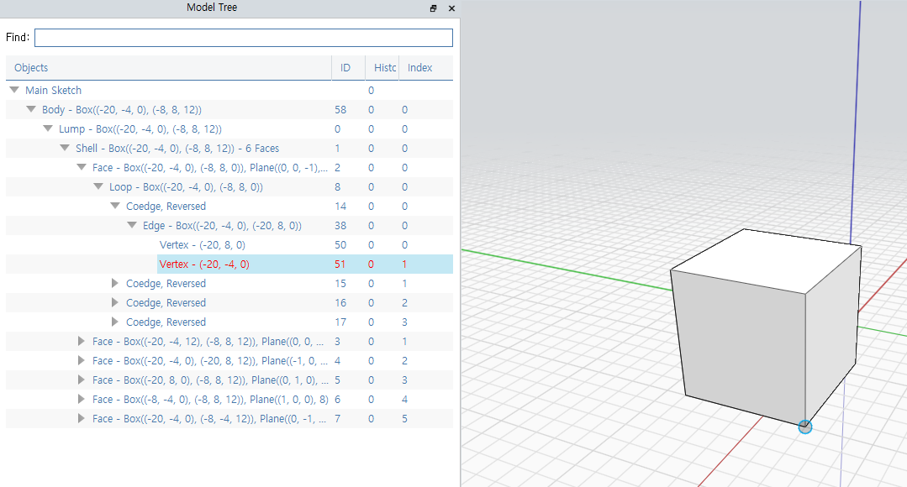

Model Tree에서는 Objects의 모든 지오메트리 구조를 보여주고 있다. 

1. Object
    - Type
    - BoundingBox Min, Max Coordinates
    - List Count
    - Plane Normal, Offset
    - Vertex Coordinates
2. ID
3. History
4. Index (for List)

트리의 항목을 클릭하면 View에서 하이라이트 되고, View에서 객체를 클릭해도 해당 항목이 트리에서 하이라이트 된다.