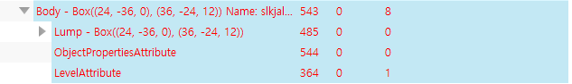
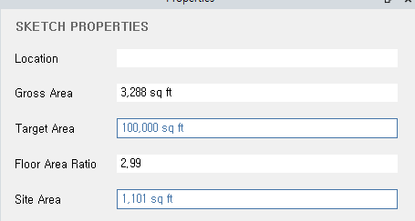
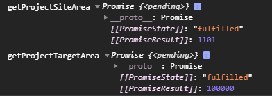
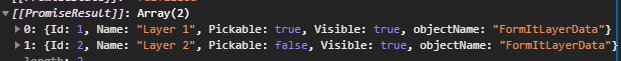

- Get Selection Objects

```js
let selection = await FormIt.Selection.GetSelections();
```

- Selection 활용

```js
for (var j = 0; j < selection.length; j++) {
  console.log("selection: ", selection[j]);
}
```

- historyDepth, ObjectId, ObjectName 가져오기

```js
let j = 0;

let historyDepth = selection[j]["ids"].length - 1;
// 0

let nObjectID = selection[j]["ids"][historyDepth]["Object"];
// 309

let sObjName = FormIt.Model.GetObjectName(nObjectID);
// 'Body (0, 543)'
// APIGetObjectPropertiesReadOnly 의 sObjectName에 비해서 확실히 가져와짐
```

- WSM API 활용한 속성 가져오기

```js
let historyDepth = selection[j]["ids"].length - 1;

let nObjectID = selection[j]["ids"][historyDepth]["Object"];

let objectProperties = WSM.APIGetObjectPropertiesReadOnly(
  historyDepth,
  nObjectID
);
// bReportAreaByLevel: true
// sObjectName: "" <-- Name이 잘 안가져와짐, SetObjectName 이후에는 가져와짐
// 비동기 function 의 경우 await 로 가져왔었어야 함, 가져오기 성공!

let objectName = WSM.APIGetObjectNameReadOnly(historyDepth, nObjectID);
// objectName: "Body" <-- SetName 해도 기본적인 Object Name을 가져옴

let Attributes = WSM.APIGetObjectAttributesReadOnly(historyDepth, nObjectID);
// 직접적인 Attributes 를 가져오지 못하고
// ObjectPropertiesAttribute ID, LevelAttribute ID를 이용해 재 쿼리를 해야함 (아래 이미지), 방법은 아직..
```


<br>
<br>

- Get Selected Object Properties

```js
let properties = FormIt.Model.GetPropertiesForSelected();
console.log(properties);

// 출력
allowOtherCategories: false
alpha: 0
area: "3,000 sq ft"
bMultipleMaterials: false
center:
    objectName: "Point3d"
    x: 0
    y: 0
    z: 0
__proto__: Object
curveType: 0
dSiteArea: 0
dTargetArea: 0
dynamoModelId: ""
idMaterial: 4294967295
idReferencedHistory: 4294967295
imageId: 0
isCalculatingAreaByLevel: true
isGeneratedFromBuiltinRFA: false
isGeneratedFromRFA: false
isSatelliteImage: false
layerIDs: Array(1)
0: 18446744073709552000
length: 1
__proto__: Array(0)
length: "0'"
meshCount: ""
nControlPoints: ""
name: "lkjkjskldjjlLVFJLJLJKJKLJKLJKLJ"
normal:
    objectName: "UnitVector3d"
    x: 0
    y: 0
    z: 0
__proto__: Object
numEdgesSelected: 0
numFacesSelected: 0
numImagesSelected: 0
numInstancesSelected: 0
numLineMeshesSelected: 0
numMeshesSelected: 0
numObjectsSelected: 1
numPointMeshesSelected: 0
objectName: "FormItSelectedProperties"
radius: ""
revitFamilyCategory: ""
revitFamilyExtraData: ""
revitFamilyReference: ""
revitFamilyType: ""
sFloorAreaRatio: ""
sGrossArea: ""
sLocation: ""
showEdgeProperties: false
showFaceProperties: false
showGroupProperties: false
showImageProperties: false
showInstanceProperties: false
showLayerProperties: true
showLevels: true
showLineMeshProperties: false
showMeshProperties: false
showObjectProperties: true
showPointMeshProperties: false
showSketchProperties: false
surfaceArea: "0 sq ft"
surfaceType: 0
volume: "45,000 cu ft"
```

* 프로젝트 전체 면적 값
* 자동으로 집계되는 부분 아님
* 사용자 입력 내용임, 계산하여 Set 하는 방식이 맞음
```js
let getProjectSiteArea = FormIt.Model.GetProjectSiteArea();

console.log("getProjectSiteArea", getProjectSiteArea);


let getProjectTargetArea = FormIt.Model.GetProjectTargetArea();

console.log("getProjectTargetArea", getProjectTargetArea);
```






* Get Layers Data
```js
let getAllLayerData = FormIt.Layers.GetAllLayerData();

console.log("getAllLayerData", getAllLayerData);


let getLayerData = FormIt.Layers.GetLayerData(layerID)

console.log("getLayerData", getLayerData);
```


<br>
<br>

* Get LayerID from object
```js
let getObjectLayerID = FormIt.Layers.GetObjectLayerID(historyDepth, id)	

console.log("getObjectLayerID", getObjectLayerID);
```
