지난 시간까지 해서 리액트(React) 프로젝트를 생성하고 비주얼 스튜디오 코드(VSC)를 이용해서 개발 환경을 구축하는 시간을 가졌습니다. 이번 시간에는 깃(Git)을 이용해서 소스코드를 관리하는 방법에 대해서 알아보도록 하겠습니다. 우리는 향후 프로젝트의 효과적인 관리를 위해서 Git 저장소(Repository)를 생성한 뒤에 해당 저장소에 소스코드를 올리게 될 것입니다.

일단 깃에 소스코드를 올리기 전에 전체 소스코드의 윤곽을 잡고 나서 올리는 것이 좋습니다.

따라서 간단히 소스코드를 수정하며 프로젝트의 윤곽을 이해하는 시간을 가져보도록 하겠습니다.

※ App.js ※

App.js는 실질적인 웹 사이트 화면에 대한 내용 출력을 담당하는 부분입니다.

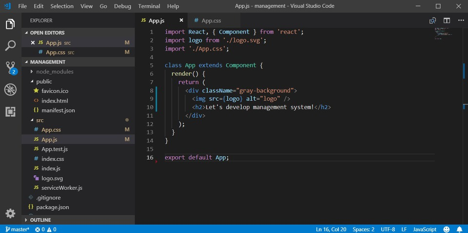

```js
import React, { Component } from 'react';
import logo from './logo.svg';
import './App.css';

class App extends Component {
  render() {
    return (
      <div className="gray-background">
        
        <h2>Let's develop management system!</h2>
      </div>
    );
  }
}

export default App;
```

※ App.css ※

App.css 파일은 App.js와 연동되어 웹 사이트의 메인 부분에 해당하는 내용의 디자인(Design)을 담당합니다. 저는 간단히 기존의 내용을 지운 뒤에 .gray-background라는 이름의 클래스(Class)를 만들어 보았습니다. 클래스는 웹 문서 내 각 요소의 디자인을 구분하기 위한 문법입니다.

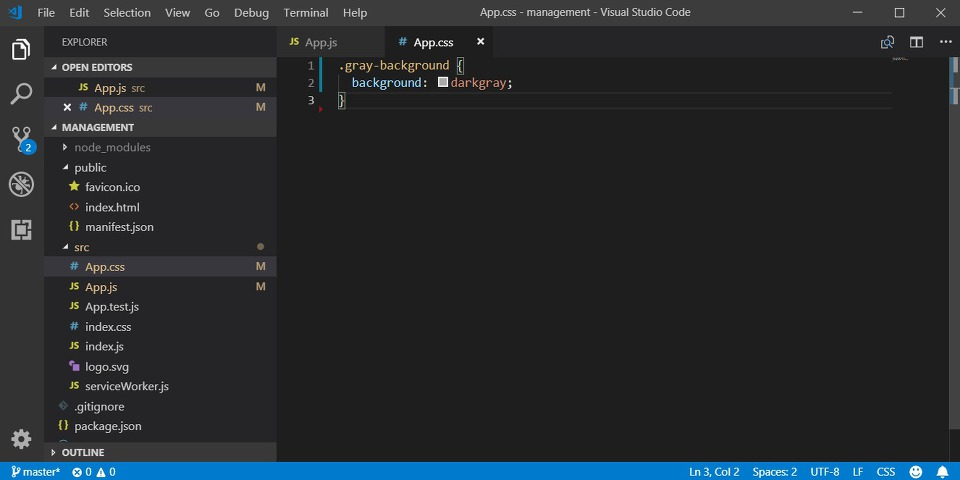

```css
.gray-background {
  background: darkgray;
}
```

※ index.html ※

이후에 index.html을 수정합니다. 기존의 index.html 파일은 온갖 주석으로 가득 차 있었을 거예요. 그러한 주석을 모두 지워주시면 됩니다. 참고로 index.html 소스코드 내에는 <div id="root"></div>라는 부분이 있는데, 이 root 영역에 실제로 App.js의 내용이 출력됩니다.

```html
<!DOCTYPE html>
<html lang="en">
  <head>
    <meta charset="utf-8" />
    <link rel="shortcut icon" href="%PUBLIC_URL%/favicon.ico" />
    <meta
      name="viewport"
      content="width=device-width, initial-scale=1, shrink-to-fit=no"
    />
    <meta name="theme-color" content="#000000" />
    <link rel="manifest" href="%PUBLIC_URL%/manifest.json" />
    <title>React App</title>
  </head>
  <body>
    <noscript>You need to enable JavaScript to run this app.</noscript>
    <div id="root"></div>
  </body>
</html>
```

※ README.md ※

이어서 README.md 파일을 수정합니다. 이것은 깃 허브(Git Hub)에 올라가 출력될 내용입니다. 프로젝트의 소개, 설치 방법, 레퍼런스 등의 문구가 들어가는 공간이라고 이해하시면 돼요.

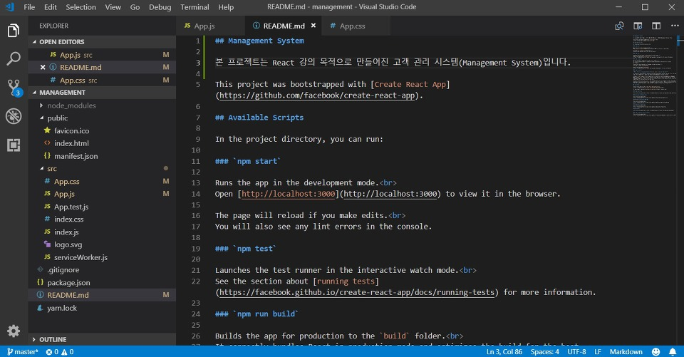

```
## Management System

본 프로젝트는 React 강의 목적으로 만들어진 고객 관리 시스템(Management System)입니다.
```

모든 소스코드를 저장해주신 뒤에 웹 사이트를 새로고침(F5) 해보시면 정상적으로 적용된 것을 확인할 수 있습니다.

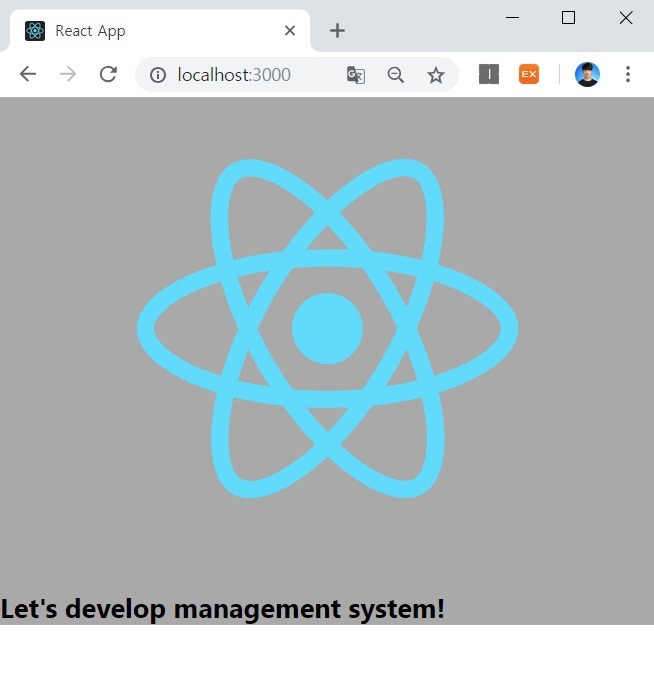

※ 깃으로 프로젝트 관리하기 ※

이제 깃 허브에 저장소를 생성하여 우리 프로젝트를 관리해 봅시다.

▶ 깃 허브(Git Hub) 주소: https://github.com/

깃 허브에 회원가입 및 로그인을 해주신 뒤에 [Create Repository]를 진행해주시면 됩니다. 말 그대로 소스코드가 올라갈 수 있는 하나의 저장 공간을 만들어 준다고 이해하시면 됩니다.

본인의 github 에 접속합니다.

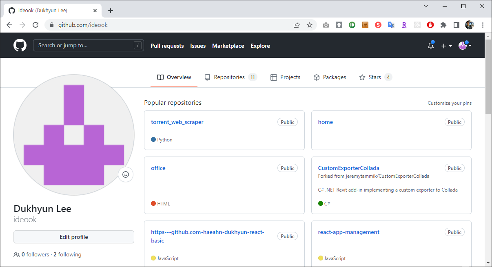

관리중인 조직(Organizations)이 하니일 경우 위와같이 나옵니다.

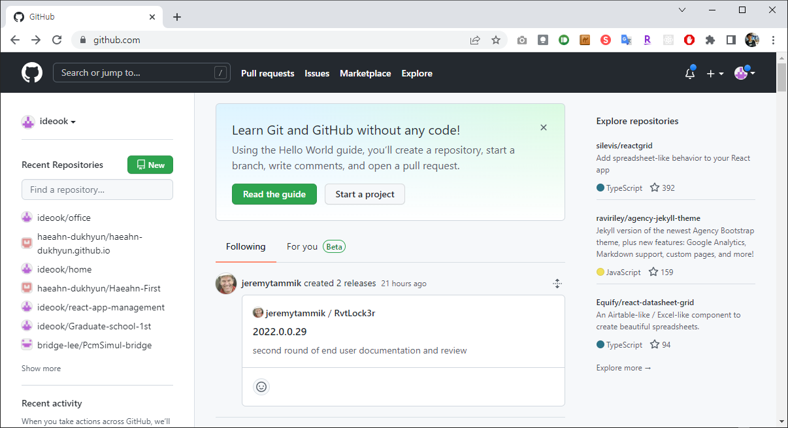

관리중인 조직(Organizations)이 여러개일 경우 아래와 같이 나옵니다.

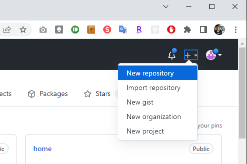

우측상단 + > [New Repository] 를 누릅니다.

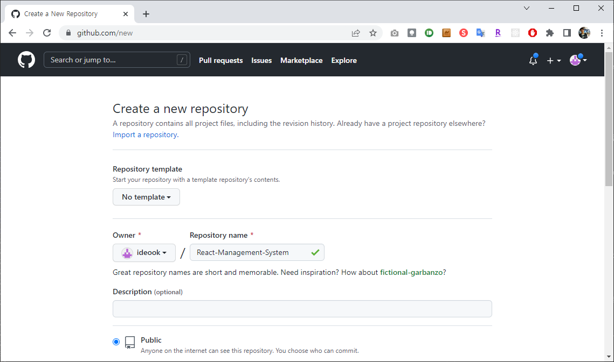

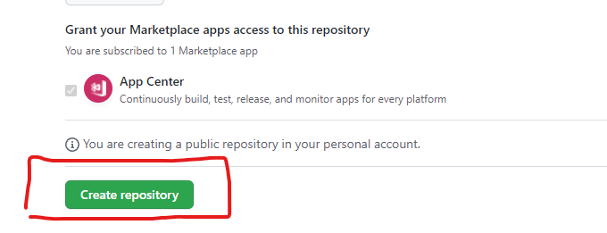

위와 같이 프로젝트의 이름만 지어 주신 뒤에 생성 버튼을 눌러주시면 다음과 같이 저장소가 생성됩니다. (이름: React-Management-System)

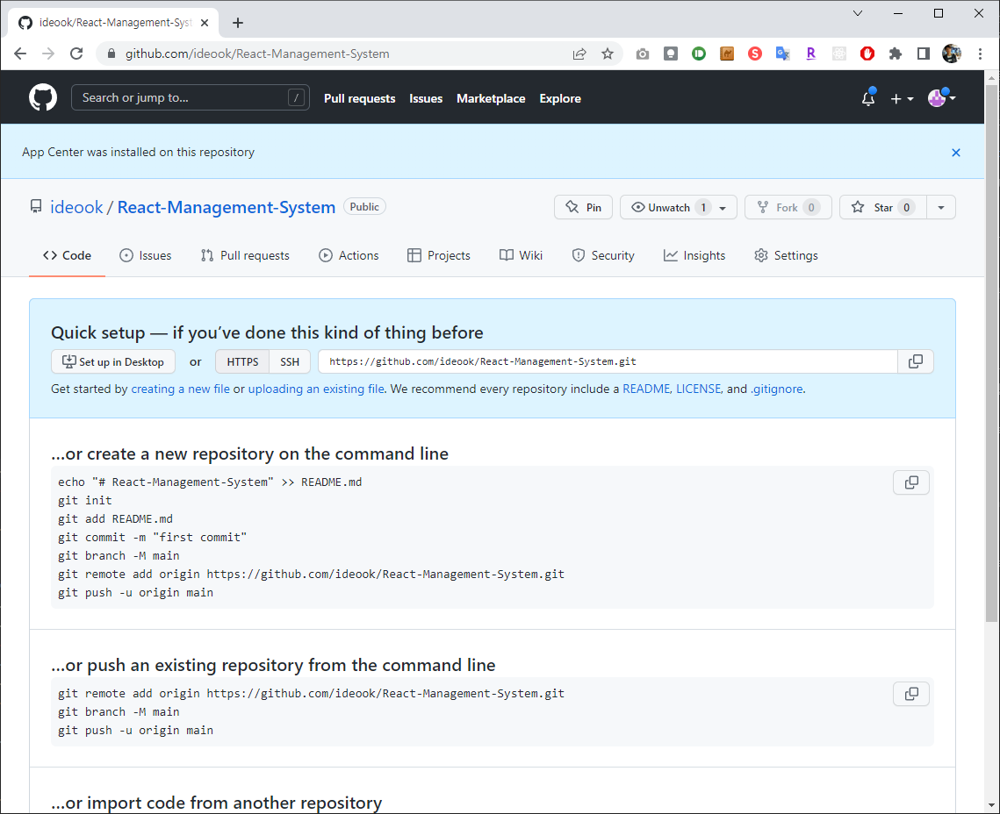

이후 자동으로 페이지가 이동되고 위의 화면이 나옵니다.

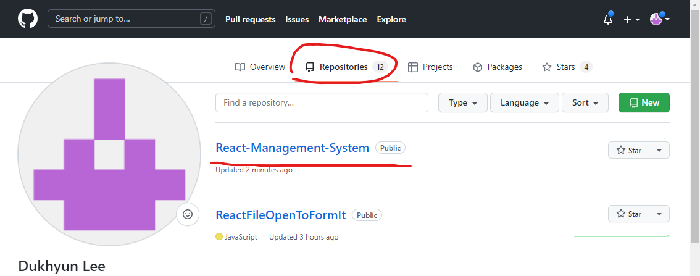

또는 본인의 github 에 재 접속해서 방금 만든 'React-Management-System' 를 찾아 클릭하여 접속할 수 있습니다.

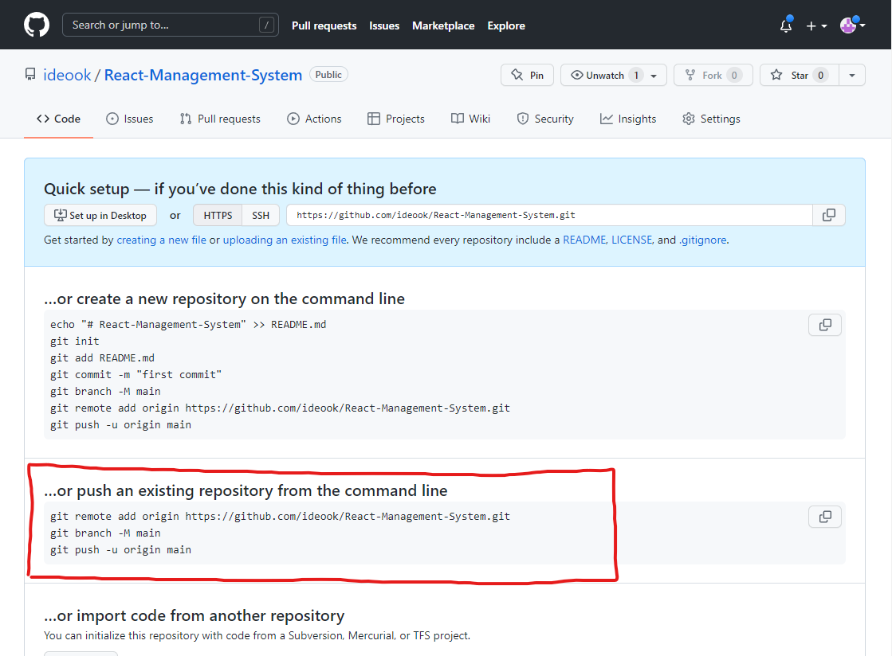

이후에 github 의 '…or push an existing repository from the command line' 부분을 VSC 에 한줄씩 실행하겠습니다.

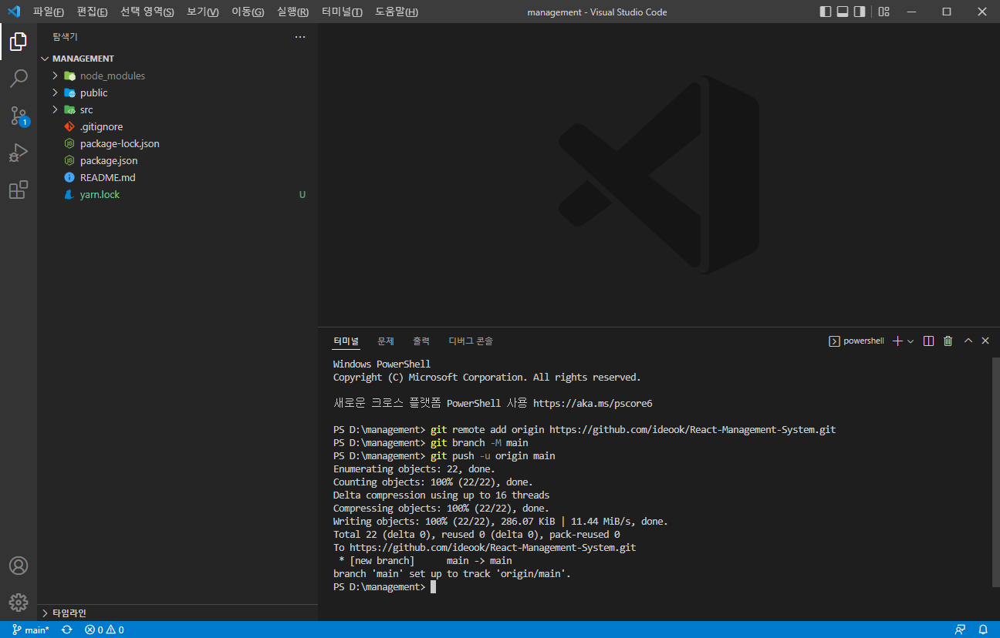

이후에 깃 허브 저장소를 새로고침 해보시면 다음과 같이 소스코드가 모두 업로드 되어 있는 것을 확인할 수 있습니다.

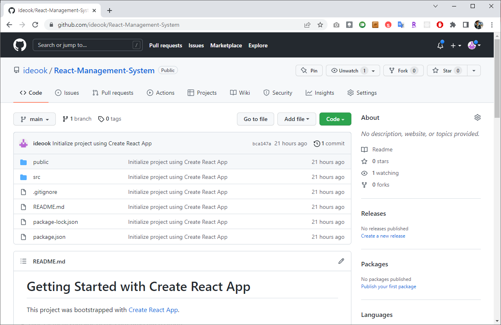

출처: https://ndb796.tistory.com/213?category=1030599 [안경잡이개발자]
