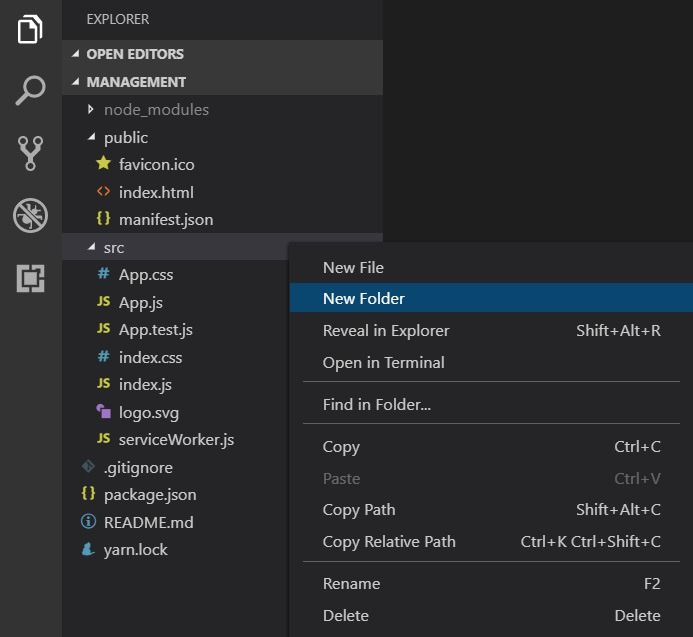
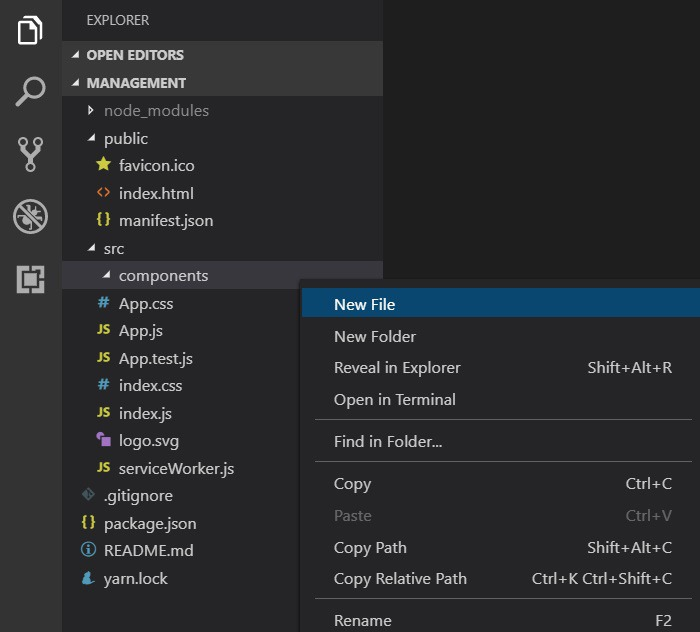
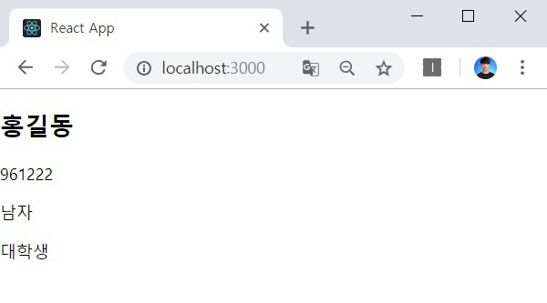

이번 시간에는 고객 컴포넌트(Customer Component)를 만들어 보는 시간을 가져보도록 하겠습니다. 말 그대로 한 명의 고객에 대한 정보를 보여주기(View) 위한 기능입니다. 기본적으로 React는 HTML 웹 문서를 효과적으로 보여주기 위한 라이브러입니다. 그래서 컴포넌트란 말 그대로 웹 문서에서 어떠한 내용을 보여주기 위한 기본적인 단위라고 이해하시면 됩니다.

※ Customer 컴포넌트 ※

Customer 컴포넌트를 만들어 주도록 하겠습니다. 지금부터 만들 컴포넌트(Component)들은 하나의 공간에 모아 놓으려고 해요. 그래서 src 폴더에서 [New Folder]를 눌러 새로운 폴더를 만들어 주도록 하겠습니다. 이름은 components에요.



이후에 다음과 같이 components 폴더에서 [New File]을 눌러서 Customer.js 컴포넌트를 생성해주도록 합시다.



이후에 소스코드를 작성해주시면 됩니다.

▶ import: 특정한 라이브러리를 불러오기 할 때 사용

▶ export: 특정한 라이브러리를 내보내기 할 때 사용

말 그대로 React Component 라이브러리를 사용하기 위해서 import 구문이 먼저 나와야 합니다. 그리고 나중에 다른 컴포넌트에서 지금 우리가 만든 컴포넌트를 사용하기 위해서는 export를 해주셔야 하는 거예요.


```js
import React from "react";

class Customer extends React.Component {
  render() {
    return (
      <div>
        <h2>홍길동</h2>
        <p>961222</p>
        <p>남자</p>
        <p>대학생</p>
      </div>
    );
  }
}

export default Customer;
```

※ App.js ※

이제 App.js에서 방금 우리가 만든 Customer 컴포넌트를 사용하도록 해볼게요.

```js
import React, { Component } from "react";
import Customer from "./components/Customer";
import "./App.css";

class App extends Component {
  render() {
    return <Customer />;
  }
}

export default App;
```

이제 웹 브라우저를 확인해 보시면 다음과 같이 한 명의 고객에 대한 정보가 출력되는 것을 확인할 수 있어요.



※ Props를 이용해 구조화하기 ※

이제 Props를 이용해서 App.js에서 데이터(Data)를 가진 상태에서 고객에 대한 정보를 출력하도록 구조화하도록 하겠습니다.

▶ App.js

```js
import React, { Component } from "react";
import Customer from "./components/Customer";
import "./App.css";

const customer = {
  name: "홍길동",
  birthday: "961222",
  gender: "남자",
  job: "대학생",
};

class App extends Component {
  render() {
    return (
      <Customer
        name={customer.name}
        birthday={customer.birthday}
        gender={customer.gender}
        job={customer.job}
      />
    );
  }
}

export default App;
```

▶ Customer.js

```js
import React from "react";

class Customer extends React.Component {
  render() {
    return (
      <div>
        <h2>{this.props.name}</h2>
        <p>{this.props.birthday}</p>
        <p>{this.props.gender}</p>
        <p>{this.props.job}</p>
      </div>
    );
  }
}

export default Customer;
```

실행 결과는 동일합니다. 기존에 객체 지향 프로그래밍을 해보신 분들이라면 현재의 소스코드가 그러한 객체 지향 프로그래밍의 구조를 정확히 잘 따르고 있다는 사실을 확인할 수 있을 거예요.

출처: https://ndb796.tistory.com/214 [안경잡이개발자]
