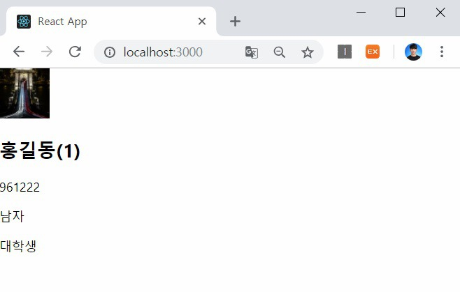
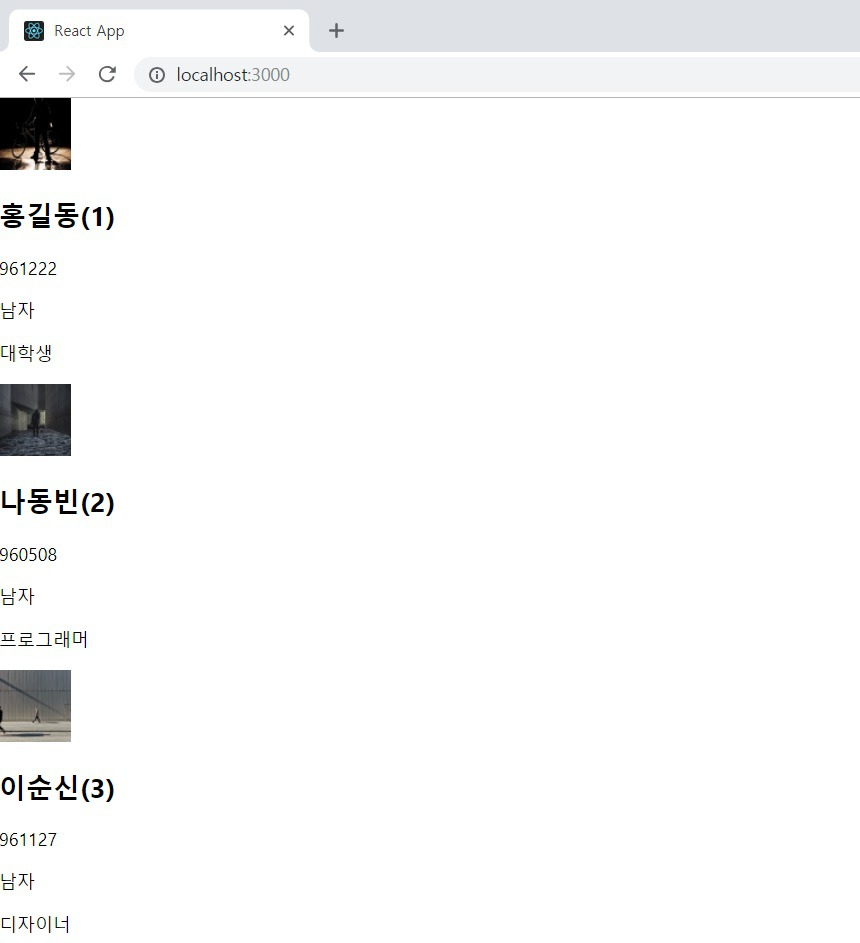
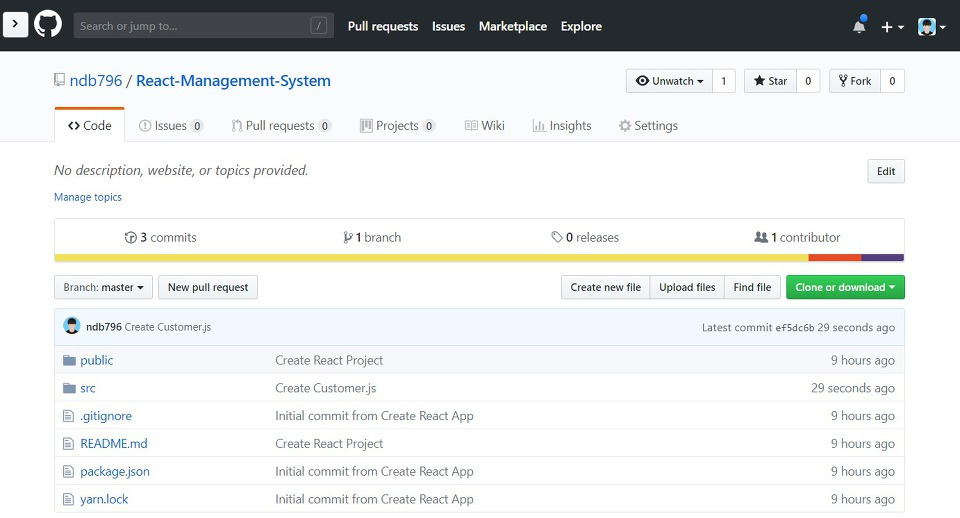

지난 시간에는 한 명의 고객(Customer)에 대한 정보를 담아 출력하는 Customer.js 컴포넌트를 만들어 보았습니다. 다만 한 명의 고객이 담고 있는 정보가 많아 다루기 어려울 때는 어떻게 할 수 있을까요? 바로 컴포넌트의 내용을 분리하는 것입니다. 컴포넌트의 내용을 잘게 분해하면 관리하기가 쉬워지며 생산성이 높아집니다. 따라서 이번 시간에는 고객 컴포넌트의 내용을 분리해 볼 거예요.

▶ App.js

이제 우리는 한 명의 회원에 대한 정보를 확장해보도록 할 거예요.

```js
import React, { Component } from 'react';
import Customer from './components/Customer'
import './App.css';

const customer = {
  'id': 1,
  'image': 'https://placeimg.com/64/64/any',
  'name': '홍길동',
  'birthday': '961222',
  'gender': '남자',
  'job': '대학생'
}

class App extends Component {
  render() {
    return (
      <Customer
        id={customer.id}
        image={customer.image}
        name={customer.name}
        birthday={customer.birthday}
        gender={customer.gender}
        job={customer.job}
      />
    );
  }
}

export default App;
```

▶ Customer.js

Customer.js는 실질적으로 한 명의 고객에 대한 정보를 출력하는 역할을 수행합니다. 그래서 출력할 내용이 많으면 이를 적절히 구조화하여 관리하는 것이 중요합니다. 따라서 저는 기존의 Customer를 CustomerProfile(고객 프로필)과 CustomerInfo(고객 정보) 두 가지 요소로 구분하여 구조화하도록 해보겠습니다.

```js
import React from 'react';

class Customer extends React.Component {
    render() {
        return (
            <div>
                <CustomerProfile id={this.props.id} image={this.props.image} name={this.props.name}/>
                <CustomerInfo birthday={this.props.birthday} gender={this.props.gender} job={this.props.job}/>
            </div>
        )
    }
}

class CustomerProfile extends React.Component {
    render() {
        return (
            <div>
                
                <h2>{this.props.name}({this.props.id})</h2>
            </div>
        )
    }
}

class CustomerInfo extends React.Component {
    render() {
        return (
            <div>
                <p>{this.props.birthday}</p>
                <p>{this.props.gender}</p>
                <p>{this.props.job}</p>
            </div>
        )
    }
}

export default Customer;
```



결과적으로 데이터가 계층적으로 구성되었습니다.

※ 출력할 데이터 개수 늘려보기 ※

이제부터는 데이터의 개수를 늘려보도록 하겠습니다. 기본적으로 컴포넌트(Component)는 리액트 요소(React Element)를 반환하는 형태로 개발이 되어야 하는데, 리액트 요소는 JSX를 이용해 생성할 수 있습니다. JSX의 특징은 내부 데이터가 2개 이상이라면 반드시 <div>와 같은 태그로 감싸서 사용해야 한다는 점입니다.

```js
import React, { Component } from 'react';
import Customer from './components/Customer'
import './App.css';

const customers = [
  {
    'id': 1,
    'image': 'https://placeimg.com/64/64/1',
    'name': '홍길동',
    'birthday': '961222',
    'gender': '남자',
    'job': '대학생'
  },
  {
    'id': 2,
    'image': 'https://placeimg.com/64/64/2',
    'name': '나동빈',
    'birthday': '960508',
    'gender': '남자',
    'job': '프로그래머'
  },
  {
    'id': 3,
    'image': 'https://placeimg.com/64/64/3',
    'name': '이순신',
    'birthday': '961127',
    'gender': '남자',
    'job': '디자이너'
  }
]

class App extends Component {
  render() {
    return (
      <div>
        <Customer
          id={customers[0].id}
          image={customers[0].image}
          name={customers[0].name}
          birthday={customers[0].birthday}
          gender={customers[0].gender}
          job={customers[0].job}
        />
        <Customer
          id={customers[1].id}
          image={customers[1].image}
          name={customers[1].name}
          birthday={customers[1].birthday}
          gender={customers[1].gender}
          job={customers[1].job}
        />
        <Customer
          id={customers[2].id}
          image={customers[2].image}
          name={customers[2].name}
          birthday={customers[2].birthday}
          gender={customers[2].gender}
          job={customers[2].job}
        />
      </div>
    );
  }
}

export default App;
```



다만 위와 같이 작성하게 되면 소스코드가 지나치게 길어질 수 있습니다. 흔히 프로그래밍에서는 반복문을 이용해서 반복되는 소스코드를 줄일 수 있습니다. 바로 다음과 같이 작성하면 됩니다.

```js
class App extends Component {
  render() {
    return (
      <div>
        {customers.map(c => {
          return <Customer key={c.id} id={c.id} image={c.image} name={c.name} birthday={c.birthday} gender={c.gender} job={c.job} />
        })}
      </div>
    );
  }
}

export default App;
```

맵(Map) 문법은 파이썬(Python)에서의 문법과 정확히 동일합니다. 특정한 리스트(List)가 있을 때 해당 리스트의 각 원소에 특정한 문법을 적용한 결과 리스트를 반환합니다. 다시 말해서 customers 배열에 있는 모든 원소에 대한 Customer Element를 반환하는 것입니다. 쉽게 말해 그냥 반복문을 사용해 각 고객에 대한 정보를 출력하도록 명시한 것입니다.

또한 추가적으로 알아두면 좋은 점은 맵(Map)을 이용해 다수의 정보를 출력할 때는 key라는 이름의 Props를 사용해야 한다는 점입니다. 이를 사용하지 않으면 자바스크립트 콘솔(Console)에 관련 오류가 출력됩니다.

마지막으로 작업한 내용에 대해서 커밋(Commit)과 푸시를 진행해주시면 됩니다.



출처: https://ndb796.tistory.com/215?category=1030599 [안경잡이개발자]
