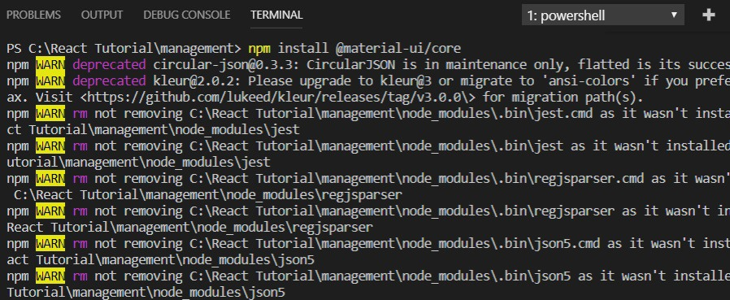

본 강의에서는 CSS를 활용한 웹 디자인에 대해서는 자세히 다루지 않습니다. 그래서 이번 시간에 Material UI를 이용해서 CSS에 대해서 모르더라도 빠르게 예쁜 디자인을 할 수 있는 방법에 대해서 알려드리도록 합니다. Material UI는 리액트(React)에서 가장 많이 사용되는 디자인 프레임워크입니다. 과거에 가장 많이 사용되었던 Bootstrap UI와 비슷하다고 보시면 됩니다.

CSS에 대해서 전혀 모르는 사람도 웹 문서를 뒤져가면서 하나씩 갖다 붙이기만 해도 예쁘게 화면이 구성된다는 특징이 있습니다.

▶ Material UI: https://material-ui.com/getting-started/installation/

공식 사이트에 접속해서 Material UI의 사용법에 대해서 알아 볼 수 있습니다.


따라서 Material UI를 설치하기 위해서 터미널(Terminal)에서 다음과 같은 명령어를 입력해주세요.

▶ Material UI 설치 명령어: npm install @material-ui/core



설치 이후에는 서버를 종료시킨 이후에 다시 yarn start를 입력하여 구동시키면 됩니다.


※ Material UI를 사용해 테이블 만들어보기 ※

고객 목록에 대한 정보는 테이블(Table) 형태로 출력하는 것이 효과적입니다. Material UI의 테이블 사용 예제는 다음 사이트에서 확인할 수 있습니다. https://material-ui.com/demos/tables/

▶ Customer.js

고객(Customer) 컴포넌트를 다음과 같이 수정합니다. 한 명의 고객에 대한 정보는 테이블에서 하나의 행(Row)을 차지합니다.

```js
import React from 'react';
import TableRow from '@material-ui/core/TableRow';
import TableCell from '@material-ui/core/TableCell';

class Customer extends React.Component {
    render() {
        return (
            <TableRow>
                <TableCell>{this.props.id}</TableCell>
                <TableCell></TableCell>
                <TableCell>{this.props.name}</TableCell>
                <TableCell>{this.props.birthday}</TableCell>
                <TableCell>{this.props.gender}</TableCell>
                <TableCell>{this.props.job}</TableCell>
            </TableRow>
        )
    }
}

export default Customer;
```

▶ App.js

이후에 테이블의 몸통(Body) 부분에서 각 고객에 대한 정보를 하나씩 출력하도록 처리하면 됩니다.

```js
import React, { Component } from 'react';
import Customer from './components/Customer'
import './App.css';
import Table from '@material-ui/core/Table';
import TableHead from '@material-ui/core/TableHead';
import TableBody from '@material-ui/core/TableBody';
import TableRow from '@material-ui/core/TableRow';
import TableCell from '@material-ui/core/TableCell';

const customers = [
  {
    'id': 1,
    'image': 'https://placeimg.com/64/64/1',
    'name': '홍길동',
    'birthday': '961222',
    'gender': '남자',
    'job': '대학생'
  },
  {
    'id': 2,
    'image': 'https://placeimg.com/64/64/2',
    'name': '나동빈',
    'birthday': '960508',
    'gender': '남자',
    'job': '프로그래머'
  },
  {
    'id': 3,
    'image': 'https://placeimg.com/64/64/3',
    'name': '이순신',
    'birthday': '961127',
    'gender': '남자',
    'job': '디자이너'
  }
]

class App extends Component {
  render() {
    return (
      <div>
        <Table>
          <TableHead>
            <TableRow>
              <TableCell>번호</TableCell>
              <TableCell>이미지</TableCell>
              <TableCell>이름</TableCell>
              <TableCell>생년월일</TableCell>
              <TableCell>성별</TableCell>
              <TableCell>직업</TableCell>
            </TableRow>
          </TableHead>
          <TableBody>
            {customers.map(c => {
              return <Customer key={c.id} id={c.id} image={c.image} name={c.name} birthday={c.birthday} gender={c.gender} job={c.job} />
            })}
          </TableBody>
        </Table>
      </div>
    );
  }
}

export default App;
```

적용 결과는 다음과 같습니다.


※ CSS 적용하기 ※

이후에 withStyles 라이브러리를 이용해서 CSS를 적용할 수 있습니다.

```js
import React, { Component } from 'react';
import Customer from './components/Customer'
import './App.css';
import Paper from '@material-ui/core/Paper';
import Table from '@material-ui/core/Table';
import TableHead from '@material-ui/core/TableHead';
import TableBody from '@material-ui/core/TableBody';
import TableRow from '@material-ui/core/TableRow';
import TableCell from '@material-ui/core/TableCell';
import { withStyles } from '@material-ui/core/styles';

const styles = theme => ({
  root: {
    width: "100%",
    marginTop: theme.spacing.unit * 3,
    overflowX: "auto"
  },
  table: {
    minWidth: 1080
  }
});

const customers = [
  {
    'id': 1,
    'image': 'https://placeimg.com/48/48/1',
    'name': '홍길동',
    'birthday': '961222',
    'gender': '남자',
    'job': '대학생'
  },
  {
    'id': 2,
    'image': 'https://placeimg.com/48/48/2',
    'name': '나동빈',
    'birthday': '960508',
    'gender': '남자',
    'job': '프로그래머'
  },
  {
    'id': 3,
    'image': 'https://placeimg.com/48/48/3',
    'name': '이순신',
    'birthday': '961127',
    'gender': '남자',
    'job': '디자이너'
  }
]

class App extends Component {
  render() {
    const { classes } = this.props;
    return (
      <Paper className={classes.root}>
        <Table className={classes.table}>
          <TableHead>
            <TableRow>
              <TableCell>번호</TableCell>
              <TableCell>이미지</TableCell>
              <TableCell>이름</TableCell>
              <TableCell>생년월일</TableCell>
              <TableCell>성별</TableCell>
              <TableCell>직업</TableCell>
            </TableRow>
          </TableHead>
          <TableBody>
            {customers.map(c => {
              return <Customer key={c.id} id={c.id} image={c.image} name={c.name} birthday={c.birthday} gender={c.gender} job={c.job} />
            })}
          </TableBody>
        </Table>
      </Paper>
    );
  }
}

export default withStyles(styles)(App);
```


결과적으로 작업한 내역을 커밋(Commit) 및 푸시(Push) 해주시면 됩니다.


출처: https://ndb796.tistory.com/216?category=1030599 [안경잡이개발자]
