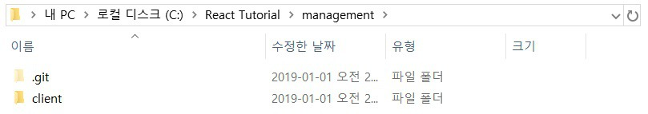
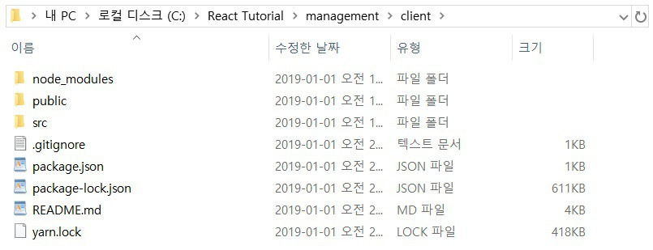
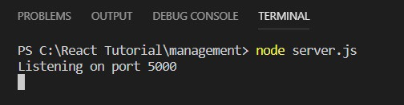
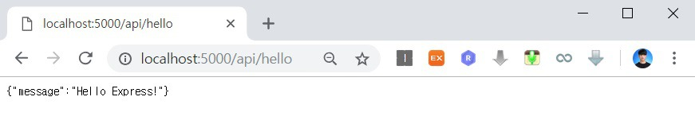

이번 시간에는 Node.js Express를 리액트(React) 클라이언트 서비스와 연동하는 방법에 대해서 알아보도록 하겠습니다. 우리는 이미 클라이언트(Client) 파트를 구축하여 개발하고 있는 상태이므로 이어서 서버(Server) 모듈을 개발하여 클라이언트와 연동시키면 됩니다. 다시 말해 Node.js Express를 이용해 서버 API를 개발해서 고객 관리 시스템의 백 엔드를 구축할 수 있는 것입니다.

따라서 가장 먼저 우리의 프로젝트 루트 폴더에서 client라는 이름의 폴더를 생성합니다. 그리고 기존에 존재했던 모든 소스코드를 이 client 폴더 안으로 넣으시면 됩니다. 그러면 다음과 같이 루트 폴더와 client 폴더가 구성됩니다.





이후에 Node.js Express 서버를 개발하기 전에 환경 설정을 진행해주도록 하겠습니다. 이를 위해 루트 폴더에 package.json을 생성합니다. package.json 파일에서는 client 폴더에서 클라이언트 모듈을 실행하고, 루트 폴더에서는 서버 모듈을 실행하도록 명시해주도록 하겠습니다.

▶ package.json

```json
{
    "name": "management",
    "version": "1.0.0",
    "scripts": {
      "client": "cd client && yarn start",
      "server": "nodemon server.js",
      "dev": "concurrently --kill-others-on-fail \"yarn server\" \"yarn client\""
    },
    "dependencies": {
      "body-parser": "^1.18.3",
      "express": "^4.16.4"
    },
    "devDependencies": {
      "concurrently": "^4.0.1"
    }
 }
```

이제 루트 폴더에 클라이언트와 동일한 형태의 .gitignore 파일을 위치시킵니다. 이 .gitignore 파일이 없으면 우리가 설치한 노드 모듈 또한 모두 깃 허브(Git Hub)에 올라가기 때문에 비효율적입니다. 이후에 루트 폴더를 기준으로 nodemon을 설치합니다.

서버는 기본적으로 클라이언트와는 다르게 코드 변경시 재시작이 필요합니다. nodemon 플러그인을 활용하면 서버 코드 변경시 서버를 자동으로 재시작 해줍니다.

```console
$ npm install -g nodemon
```

▶ yarn

이제 서버 모듈 개발을 위해 루트 폴더에 server.js 파일을 생성합니다.

▶ server.js

```js
const express = require('express');
const bodyParser = require('body-parser');
const app = express();
const port = process.env.PORT || 5000;
app.use(bodyParser.json());
app.use(bodyParser.urlencoded({ extended: true }));

app.get('/api/hello', (req, res) => {
  res.send({ message: 'Hello Express!' });
});

app.listen(port, () => console.log(`Listening on port ${port}`));
```

이후에 node server.js 명령어로 서버를 구동시킬 수 있습니다.



※ GET 방식의 API 테스트하기 ※

<http://localhost:5000/api/hello> 에 접속합니다.



출처: https://ndb796.tistory.com/217?category=1030599 [안경잡이개발자]
