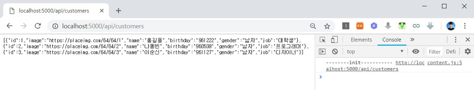
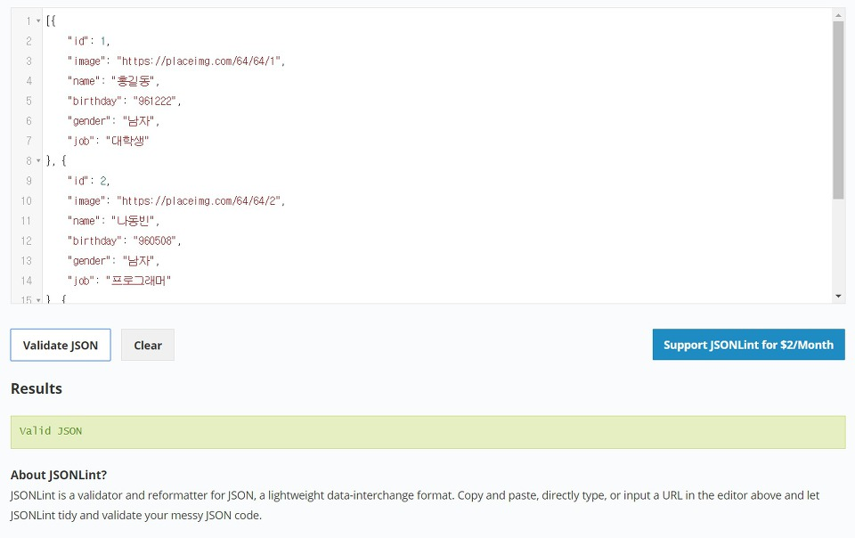
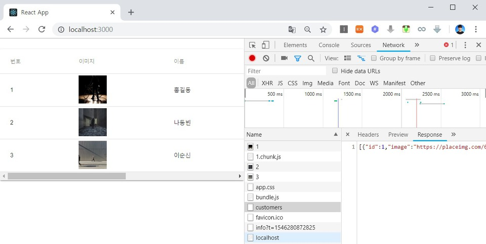

이번 시간에는 지난 시간에 설치한 Node.js Express를 활용하여 REST API를 구축하는 방법에 대해서 알아보도록 하겠습니다. REST API는 최근 상당수의 웹 서버 프레임워크에서 기본적으로 지원하는 기능으로 서버와 클라이언트가 웹 프로토콜을 기반으로 하여 효과적으로 데이터를 주고 받을 수 있도록 해줍니다. 이를 실습하기 위해 가장 먼저 기존의 서버 모듈에 전체 고객 목록을 불러오는 API를 구현해보도록 합시다.

▶ server.js

실제로는 데이터베이스에 있는 고객 정보를 불러오는 형태로 개발이 되어야 합니다. 하지만 일단 다음과 같이 하드코딩을 해봅시다.

```js
const express = require('express');
const bodyParser = require('body-parser');
const app = express();
const port = process.env.PORT || 5000;
app.use(bodyParser.json());
app.use(bodyParser.urlencoded({ extended: true }));

app.get('/api/customers', (req, res) => {
    res.send([
        {
            'id': 1,
            'image': 'https://placeimg.com/64/64/1',
            'name': '홍길동',
            'birthday': '961222',
            'gender': '남자',
            'job': '대학생'
        },
        {
            'id': 2,
            'image': 'https://placeimg.com/64/64/2',
            'name': '나동빈',
            'birthday': '960508',
            'gender': '남자',
            'job': '프로그래머'
        },
        {
            'id': 3,
            'image': 'https://placeimg.com/64/64/3',
            'name': '이순신',
            'birthday': '961127',
            'gender': '남자',
            'job': '디자이너'
        }
    ]);
});

app.listen(port, () => console.log(`Listening on port ${port}`));
```

우리가 만든 /api/customers 경로에 들어가 보면 다음과 같이 고객 목록이 출력됩니다.



고객 목록 데이터가 정상인지 확인하기 위하여 JSON 검증 서비스를 이용해보도록 합시다.

▶ JSON 검증 서비스: <https://jsonlint.com/>

그대로 결과 JSON 문서를 붙여넣기 해보면 다음과 같이 정상적인 데이터라는 것을 확인할 수 있습니다.



이후에 클라이언트(Client)에서 해당 API에 접근하여 고객 목록을 비동기적으로 가져오도록 만들면 됩니다. 가장 먼저 5000번 포트를 API 서버로 이용하기 위해서 클라이언트(Client)의 package.json 파일에 다음의 문구를 추가하시면 됩니다.

"proxy": "http://localhost:5000/"

이제 app.js 파일을 작성하여 실제로 API 서버에 접근할 수 있도록 처리하시면 됩니다.

▶ app.js

비동기적으로 API 요청 기능을 수행하기 위해서 async - await 구문을 사용했습니다. 서버로부터 JSON 데이터를 받아올 때까지는 테이블에 내용을 출력하지 않다가 데이터를 모두 받아왔을 때 비로소 테이블에 내용을 채우게 됩니다.

```js
import React, { Component } from 'react';
import Customer from './components/Customer'
import './App.css';
import Paper from '@material-ui/core/Paper';
import Table from '@material-ui/core/Table';
import TableHead from '@material-ui/core/TableHead';
import TableBody from '@material-ui/core/TableBody';
import TableRow from '@material-ui/core/TableRow';
import TableCell from '@material-ui/core/TableCell';
import { withStyles } from '@material-ui/core/styles';

const styles = theme => ({
  root: {
    width: "100%",
    marginTop: theme.spacing.unit * 3,
    overflowX: "auto"
  },
  table: {
    minWidth: 1080
  }
});

class App extends Component {

  state = {
    customers: ''
  }

  componentDidMount() {
    this.callApi()
      .then(res => this.setState({customers: res}))
      .catch(err => console.log(err));
  }

  callApi = async () => {
    const response = await fetch('/api/customers');
    const body = await response.json();
    return body;
  }

  render() {
    const { classes } = this.props;
    return (
      <Paper className={classes.root}>
        <Table className={classes.table}>
          <TableHead>
            <TableRow>
              <TableCell>번호</TableCell>
              <TableCell>이미지</TableCell>
              <TableCell>이름</TableCell>
              <TableCell>생년월일</TableCell>
              <TableCell>성별</TableCell>
              <TableCell>직업</TableCell>
            </TableRow>
          </TableHead>
          <TableBody>
            {this.state.customers ? this.state.customers.map(c => {
              return <Customer key={c.id} id={c.id} image={c.image} name={c.name} birthday={c.birthday} gender={c.gender} job={c.job} />
            }) : ''}
          </TableBody>
        </Table>
      </Paper>
    );
  }
}

export default withStyles(styles)(App);
```

이후에 yarn dev 명령어를 이용해 서버를 구동시킬 수 있습니다.



출처: https://ndb796.tistory.com/218?category=1030599 [안경잡이개발자]
