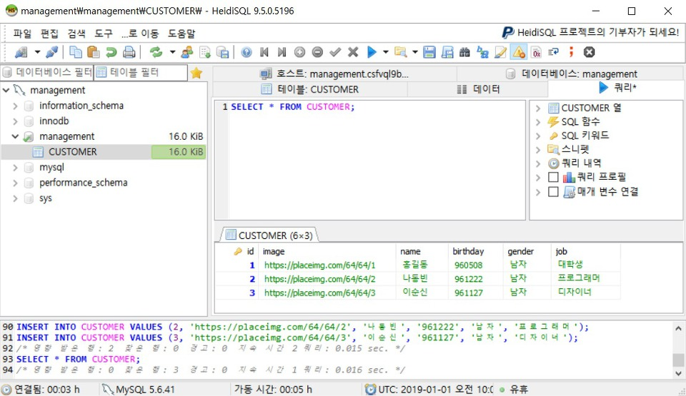
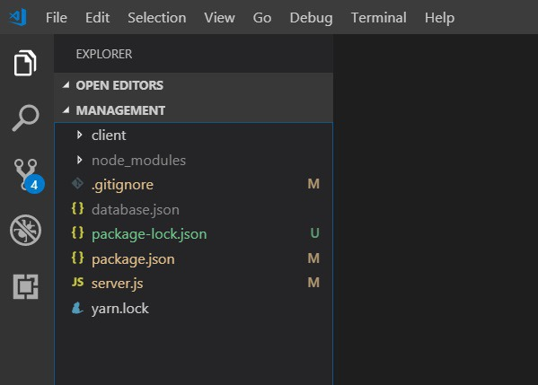
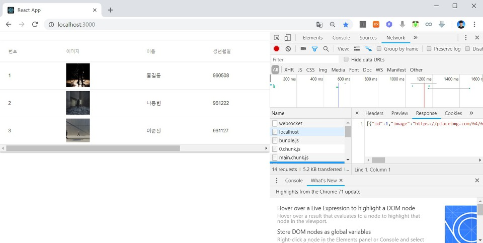
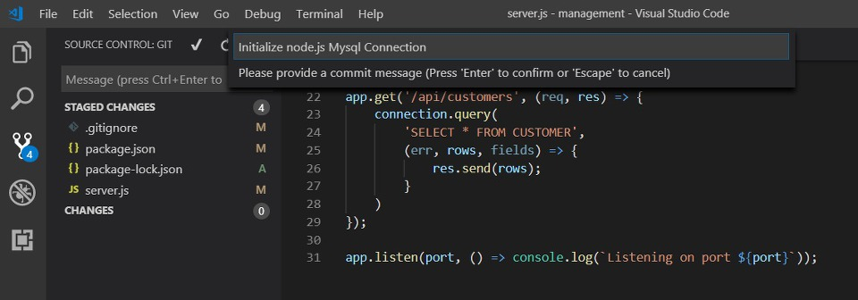
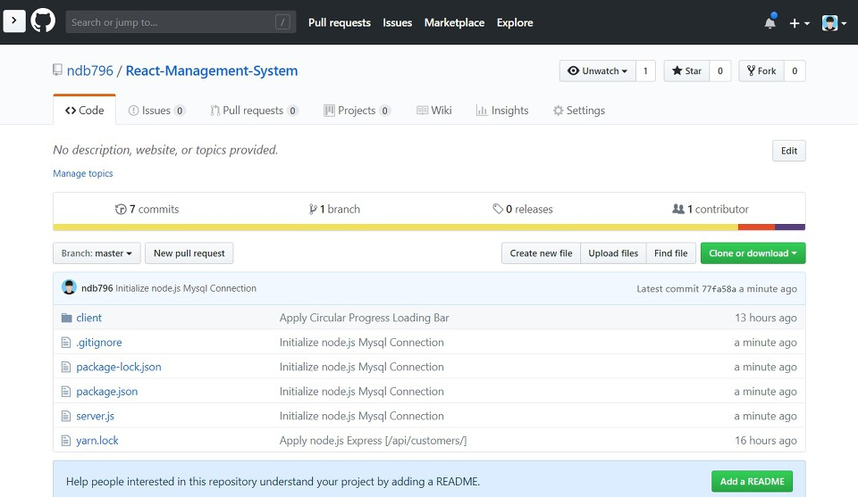

지난 시간에는 AWS RDS 서비스를 이용해서 우리 고객 관리 시스템 프로젝트의 데이터베이스를 구축하는 시간을 가졌습니다. 이번 시간에는 실제로 우리가 지난 시간에 만든 MySQL 데이터베이스에 고객(Customer) 테이블을 구축한 뒤에 데이터를 삽입하는 시간을 가져보도록 하겠습니다.

※ 데이터베이스 테이블 구축하기 ※

데이터베이스 이름을 management로 설정했으므로 여기에 들어가서 고객 테이블을 구축하여 데이터를 넣도록 소스를 작성해보겠습니다.

```sql
USE management;

CREATE TABLE CUSTOMER (
	id INT PRIMARY KEY AUTO_INCREMENT,
	image VARCHAR(1024),
	name VARCHAR(64),
	birthday VARCHAR(64),
	gender VARCHAR(64),
	job VARCHAR(64)
) DEFAULT CHARACTER SET utf8 COLLATE utf8_general_ci;


INSERT INTO CUSTOMER VALUES (1, 'https://placeimg.com/64/64/1', '홍길동', '960508', '남자', '대학생');
INSERT INTO CUSTOMER VALUES (2, 'https://placeimg.com/64/64/2', '나동빈', '961222', '남자', '프로그래머');
INSERT INTO CUSTOMER VALUES (3, 'https://placeimg.com/64/64/3', '이순신', '961127', '남자', '디자이너');

SELECT * FROM CUSTOMER;
```



※ .gitignore ※

이제 데이터베이스와 연동하는 작업을 처리하도록 하겠습니다. 기본적으로 데이터베이스 관련 정보는 Git Ignore 처리를 해서 깃 허브(Git Hub)에 올라가지 않도록 처리해야 합니다. 따라서 서버 프로그램의 .gitignore 파일을 다음과 같이 수정합니다.

```
# database
/database.json
```

이후에 database.json에서 데이터베이스 정보를 설정하시면 됩니다.

```json
{
    "host": 데이터베이스 주소,
    "user": 데이터베이스 사용자,
    "password": 데이터베이스 비밀번호,
    "port": "3306",
    "database": 데이터베이스 이름
}
```



그러면 위와 같이 프로젝트가 구성됩니다.

※ Node.js와 MySQL 연동하기 ※

이제 Node.js와 MySQL을 연동해 봅시다. 가장 먼저 NPM을 이용하여 MySQL 라이브러리를 설치하셔야 합니다.

▶ npm install -S mysql

이후에 설치된 mysql 라이브러리를 활용하여 node.js와 MySQL을 연동할 수 있습니다.

```js
const fs = require('fs');
const express = require('express');
const bodyParser = require('body-parser');
const app = express();
const port = process.env.PORT || 5000;
app.use(bodyParser.json());
app.use(bodyParser.urlencoded({ extended: true }));

const data = fs.readFileSync('./database.json');
const conf = JSON.parse(data);
const mysql = require('mysql');

const connection = mysql.createConnection({
    host: conf.host,
    user: conf.user,
    password: conf.password,
    port: conf.port,
    database: conf.database
});
connection.connect();

app.get('/api/customers', (req, res) => {
    connection.query(
        'SELECT * FROM CUSTOMER',
        (err, rows, fields) => {
            res.send(rows);
        }
    )
});

app.listen(port, () => console.log(`Listening on port ${port}`));
```

결과적으로 다음과 같이 서버 API가 정상적으로 동작하는 것을 확인할 수 있습니다.



이후에 깃 허브(Git Hub)에 소스코드를 반영하면 다음과 같습니다.



데이터베이스 설정 파일인 database.json 파일은 깃 허브에 올라가지 않는 것을 확인할 수 있습니다.



출처: https://ndb796.tistory.com/221?category=1030599 [안경잡이개발자]
