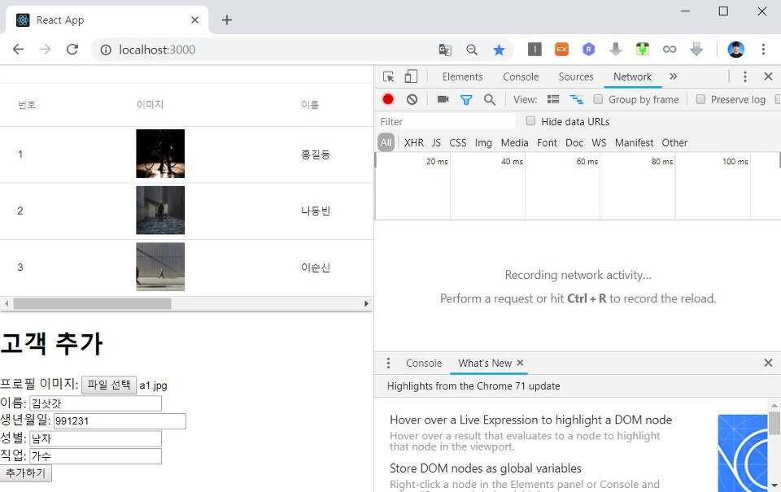

React에서 Form을 처리하기 위해서는 이벤트 처리(Event Handling)를 수행해야 합니다. 이번 시간에는 그러한 이벤트 처리 방법에 대해서 이해하고, 결과적으로 서버로 고객 데이터를 전송하여 데이터베이스에 신규 고객 정보를 등록하는 방법까지 알아보도록 하겠습니다. 따라서 가장 먼저 React 클라이언트의 components 폴더에 CustomerAdd.js를 만들어 보도록 하겠습니다.


이제 디자인을 입히지 않은 상태로 하나의 <form> 태그를 작업하는 시간을 가져보도록 하겠습니다. 이를 위해 가장 먼저 서버와의 통신 목적의 라이브러리인 axios를 설치해주도록 하겠습니다. client 폴더로 이동하여 npm install --save axios 명령어를 입력하시면 됩니다. 이제 CustomerAdd.js 컴포넌트를 작업해 줍니다.

▶ CustomerAdd.js

```js
import React from 'react'
import { post } from 'axios';

class CustomerAdd extends React.Component {

  constructor(props) {
    super(props);
    this.state = {
      file: null,
      userName: '',
      birthday: '',
      gender: '',
      job: '',
      fileName: ''
    }
    this.handleFormSubmit = this.handleFormSubmit.bind(this)
    this.handleFileChange = this.handleFileChange.bind(this)
    this.handleValueChange = this.handleValueChange.bind(this)
    this.addCustomer = this.addCustomer.bind(this)
  }

  handleFormSubmit(e) {
    e.preventDefault()
    this.addCustomer()
    .then((response) => {
      console.log(response.data);
    })
  }

  handleFileChange(e) {
    this.setState({
      file: e.target.files[0],
      fileName: e.target.value
    });
  }

  handleValueChange(e) {
    let nextState = {};
    nextState[e.target.name] = e.target.value;
    this.setState(nextState);
  }

  addCustomer(){
    const url = '/api/customers';
    const formData = new FormData();
    formData.append('image', this.state.file)
    formData.append('name', this.state.userName)
    formData.append('birthday', this.state.birthday)
    formData.append('gender', this.state.gender)
    formData.append('job', this.state.job)
    const config = {
      headers: {
        'content-type': 'multipart/form-data'
      }
    }
    return post(url, formData, config)
  }

  render() {
    return (
        <form onSubmit={this.handleFormSubmit}>
          <h1>고객 추가</h1>
          프로필 이미지: <input type="file" name="file" file={this.state.file} value={this.state.fileName} onChange={this.handleFileChange} /><br/>
          이름: <input type="text" name="userName" value={this.state.userName} onChange={this.handleValueChange} /><br/>
          생년월일: <input type="text" name="birthday" value={this.state.birthday} onChange={this.handleValueChange} /><br/>
          성별: <input type="text" name="gender" value={this.state.gender} onChange={this.handleValueChange} /><br/>
          직업: <input type="text" name="job" value={this.state.job} onChange={this.handleValueChange} /><br/>
          <button type="submit">추가하기</button>
        </form>
      )
    }
  }

export default CustomerAdd
```

▶ App.js

이제 작업한 CustomerAdd 컴포넌트를 화면에 출력해 보도록 하겠습니다. 따라서 App.js를 수정해 봅시다.

```js
import CustomerAdd from './components/CustomerAdd';
```

위와 같이 CustomerAdd 컴포넌트를 추가해주신 이후에 다음과 같이 렌더링 되는 부분을 수정합니다.

```js
      <div>
        <Paper className={classes.root}>
          <Table className={classes.table}>
            <TableHead>
              <TableRow>
                <TableCell>번호</TableCell>
                <TableCell>이미지</TableCell>
                <TableCell>이름</TableCell>
                <TableCell>생년월일</TableCell>
                <TableCell>성별</TableCell>
                <TableCell>직업</TableCell>
              </TableRow>
            </TableHead>
            <TableBody>
              {this.state.customers ?
                this.state.customers.map(c => {
                  return <Customer key={c.id} id={c.id} image={c.image} name={c.name} birthday={c.birthday} gender={c.gender} job={c.job} />
                }) :
                <TableRow>
                  <TableCell colSpan="6" align="center">
                    <CircularProgress className={classes.progress} variant="determinate" value={this.state.completed} />
                  </TableCell>
                </TableRow>
              }
            </TableBody>
          </Table>
        </Paper>
        <CustomerAdd/>
      </div>
```

실제로 이를 브라우저의 개발자 도구에서 테스트를 해보시면 서버로 데이터를 전송하는 것을 알 수 있습니다.


아래쪽에 고객 추가 양식이 존재하며 여기에 데이터를 입력하여 실제로 고객을 추가할 수 있습니다.



데이터를 입력해 [추가하기] 버튼을 누른 결과 다음과 같이 서버로 데이터가 전송되는 것을 알 수 있습니다. 실제로 이미지 파일은 바이너리 코드 형태로 서버로 전달됩니다. 따라서 다음 시간에 이러한 사용자의 요청 데이터를 적절히 처리하여 데이터베이스에 등록한 뒤에 그에 맞는 응답을 보내주는 작업을 수행해야 하빈다.


출처: https://ndb796.tistory.com/222?category=1030599 [안경잡이개발자]
