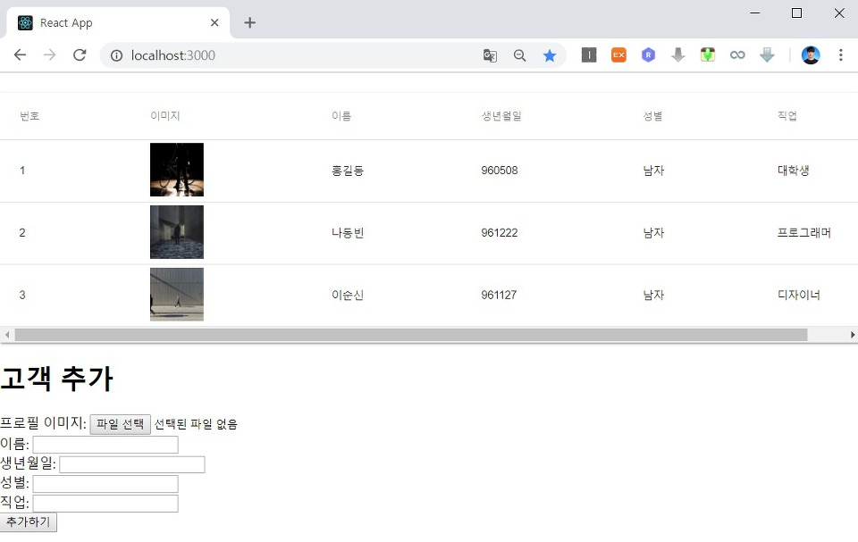
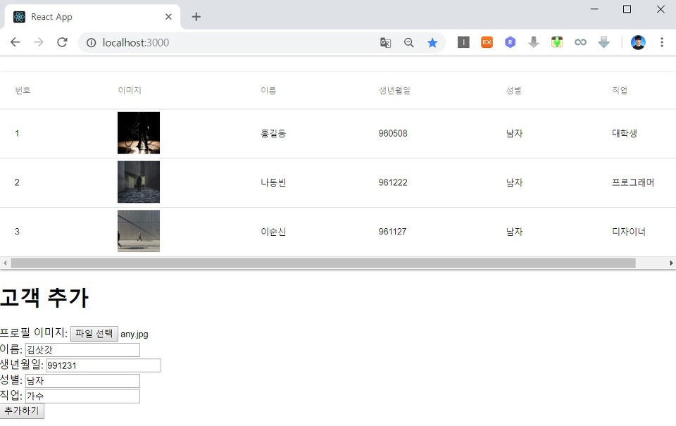
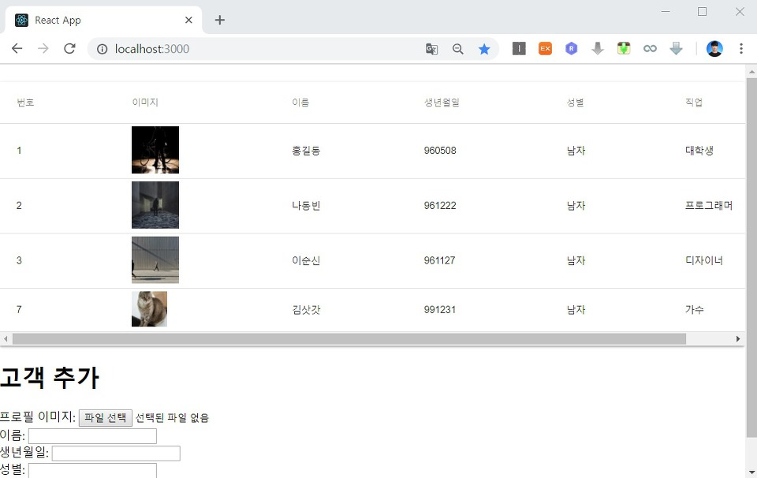

이번 시간에는 사용자가 보낸 고객 데이터를 Node.js Express로 처리하여 서버의 특정한 폴더에 파일 업로드 처리를 하는 방법에 대해서 알아보도록 하겠습니다. 이후에 고객 정보를 실제 MySQL 데이터베이스(Database)에 삽입하고, 업로드 폴더를 클라이언트에서 접근할 수 있도록 하여 고객이 이를 확인할 수 있도록 처리하는 시간을 가져 볼 것입니다.

▶ CustomerAdd.js

따라서 가장 먼저 CustomerAdd.js의 handleFormSubmit() 함수를 수정해주도록 합시다. 데이터를 전송한 이후에는 고객 추가 양식(Form)을 비운 뒤에 페이지를 새로고침(Refresh)하여 등록된 고객 데이터를 확인하는 것입니다. 실제 배포 버전에서는 전체 페이지를 새로고침 하는 방향으로 코딩을 하면 안 되지만 빠른 테스트를 위해서 잠시 이와 같이 코딩해주도록 하겠습니다.

```js
handleFormSubmit(e) {
  e.preventDefault()
  this.addCustomer()
  .then((response) => {
    console.log(response.data);
  })
  this.setState({
    file: null,
    userName: '',
    birthday: '',
    gender: '',
    job: '',
    fileName: ''
  })
  window.location.reload();
}
```

이제 node.js에서 이러한 파일 업로드 요청을 처리하시면 됩니다. 이 때는 multer 라이브러리를 사용하시면 됩니다. 따라서 루트 폴더로 이동하셔서 `npm install --save multer` 명령어를 수행하신 뒤에 다음 소스코드를 작성합니다.

▶ server.js

```js
const fs = require("fs");
const express = require("express");
const bodyParser = require("body-parser");
const app = express();
const PORT = process.env.PORT || 5000;
app.use(bodyParser.json());
app.use(bodyParser.urlencoded({ extended: true }));

const data = fs.readFileSync("./database.json");
const conf = JSON.parse(data);

const config = {
  server: conf.host,
  port: conf.port,
  database: conf.database,
  user: conf.user,
  password: conf.password,
  encrypt: false,
};

const sql = require("mssql");

const multer = require("multer");
const upload = multer({ dest: "./upload" });

sql.connect(config, function (err) {
  if (err) {
    return console.error("error : ", err);
  }
  console.log("MSSQL 연결 완료");
});

app.get("/api/customers", (req, res) => {
  var request = new sql.Request();
  q = "SELECT * FROM CUSTOMER";
  request.query(q, (err, rows, fields) => {
    res.send(rows.recordset);
  });
});

app.use("/image", express.static("./upload"));

app.post("/api/customers", upload.single("image"), (req, res) => {
  let image = "/image/" + req.file.filename;
  let name = req.body.name;
  let birthday = req.body.birthday;
  let gender = req.body.gender;
  let job = req.body.job;

  var request = new sql.Request();
  q = `INSERT INTO CUSTOMER VALUES ('${image}', '${name}', '${birthday}', '${gender}', '${job}')`;
  console.log(q);
  request.query(q, (err, rows, fields) => {
    res.send(rows.recordset);
  });
});

app.listen(PORT, () => {
  console.log(`Server is running on port ${PORT}.`);
});

```

이제 루트 폴더에서 upload 폴더를 생성해 주세요. 또한 사용자가 업로드한 파일은 깃 허브(Git Hub)에 공개적으로 올라가면 안 된다는 점에서 .gitignore에도 이 내용을 추가해주도록 합니다.

```
# upload
/upload
```

**http://localhost:3000 은 Haeahn 보안규정으로 인해 파일 업로드가 차단됩니다. 파일 업로드 테스트시에만 http://127.0.0.1:3000 으로 접속하여 테스트 진행합니다.** 


※ 실행 결과 ※





실제로 고객 데이터와 파일이 업로드 된 이후에 새로고침이 자동으로 이루어지면서 추가된 고객 정보를 확인할 수 있습니다.



결과적으로 다음과 같이 upload 폴더에서도 업로드 된 파일을 확인할 수 있습니다. 파일의 이름은 multer 라이브러리에 의해서 중복되지 않는 형태로 자동으로 바뀌어서 올라가게 됩니다.


(+ 추가)

실제로는 이러한 이미지 업로드 기능은 AWS S3과 같은 서비스를 이용해서 저장하면 매우 효과적입니다. 현재 소스코드 상으로는 데이터베이스와 서버에 업로드 된 이미지가 완전히 일치한다는 것을 보장하기 어렵기 때문입니다. 그리고 현재 소스코드에서는 새로운 고객 데이터가 등록된 이후에, 이를 확인하기 위해 전체 페이지를 새로고침(Refresh)하지만 실제로는 다시 고객 목록 데이터를 가져오는 식으로 코드를 동작시켜야 합니다.

출처: https://ndb796.tistory.com/223?category=1030599 [안경잡이개발자]
