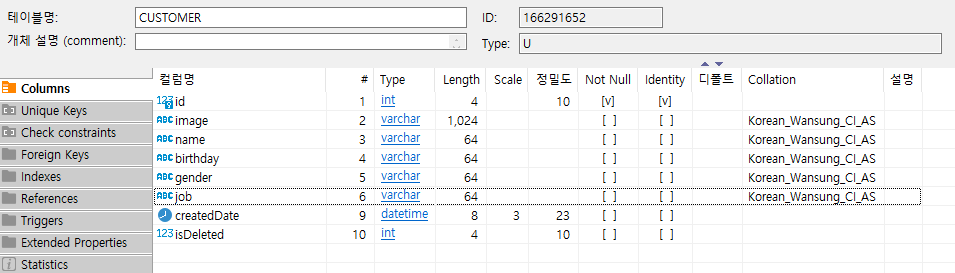
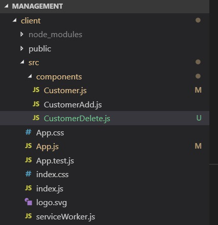
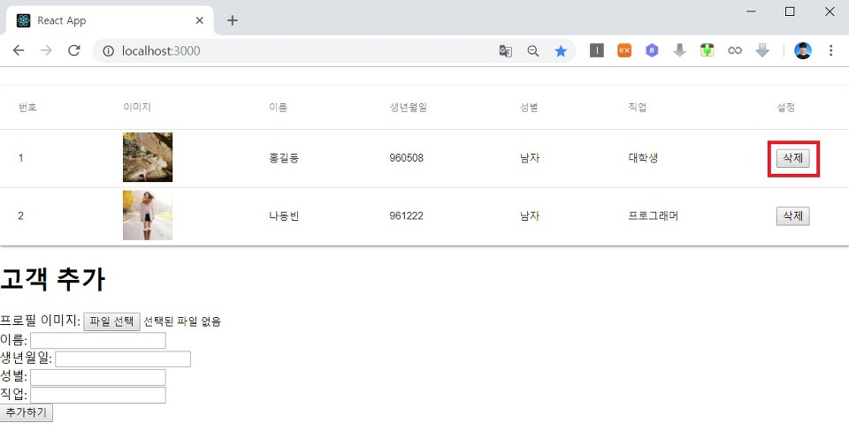
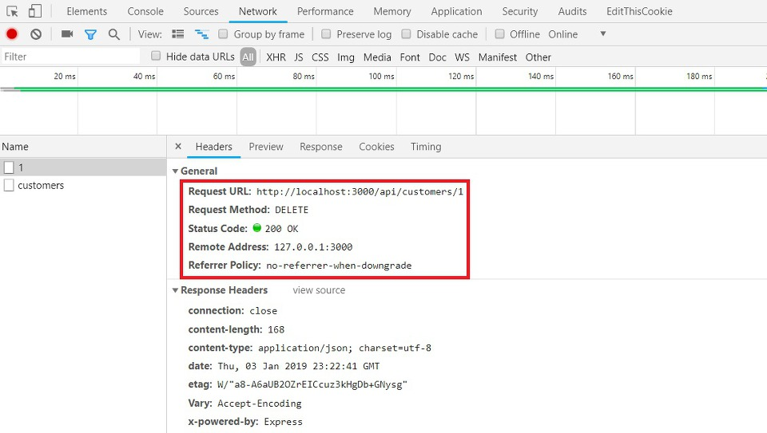
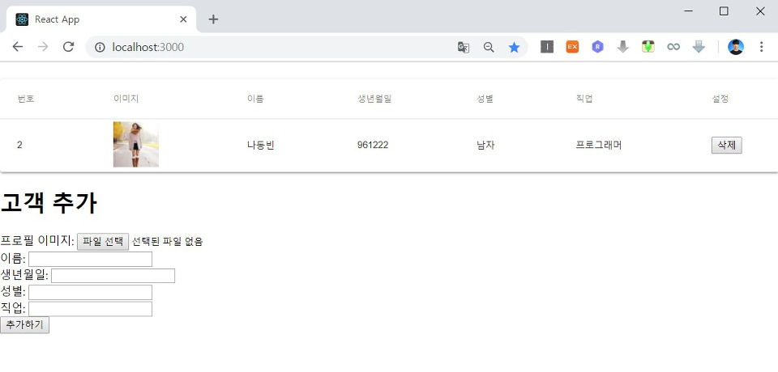

이번 시간에는 고객(Customer) 정보를 삭제하는 기능을 구현하는 시간을 가져보도록 하겠습니다. 특정한 데이터의 삭제 기능을 구현하는 방법은 굉장히 다양합니다. 몇 가지 예제를 살펴보자면 ① 삭제를 수행했을 때 실제 테이블에서 데이터를 삭제하는 방식이 있으며 ② 삭제를 수행했을 때 삭제 체크만 한 뒤에 실제 데이터베이스에는 남겨 놓는 방식이 있습니다.

우리는 두 번째 방식으로 구현하겠습니다. 따라서 Customer 테이블의 정보부터 수정하도록 하겠습니다.

```sql
ALTER TABLE CUSTOMER ADD createdDate DATETIME;
ALTER TABLE CUSTOMER ADD isDeleted INT;
```

또한 기본적으로 현재 들어있던 데이터에는 새로운 속성(Property)에 대한 데이터가 없으므로 이를 채워넣어줄 수 있도록 합니다.

```sql
UPDATE CUSTOMER SET createdDate = GETDATE();
UPDATE CUSTOMER SET isDeleted = 0;
```

위와 같이 테이블 설정 명령어를 수행한 테이블(Table) 정보를 확인해 보시면 다음과 같습니다.



따라서 모든 데이터는 방금 생성이 된 것으로 처리 되었고, 현재 삭제 되지 않은 상태로 남아있게 되었습니다. 이제 새롭게 CustomerDelete.js를 생성해주도록 합니다.



▶ CustomerDelete.js

```js
import React from 'react';

class CustomerDelete extends React.Component {

    deleteCustomer(id){
        const url = '/api/customers/delete/' + id;
        fetch(url, {
           method: 'DELETE'
        });
        this.props.stateRefresh();
    }

    render() {
        return (
            <button onClick={(e) => {this.deleteCustomer(this.props.id)}}>삭제</button>
        )
    }
}

export default CustomerDelete;
```

▶ Customer.js

이제 위에서 만든 Customer Delete 뷰(View)를 한 명의 고객 정보를 출력할 때 함께 보여줄 수 있도록 처리하면 됩니다.

```js
import React from 'react';
import TableRow from "@mui/material/TableRow";
import TableCell from "@mui/material/TableCell";
import CustomerDelete from './CustomerDelete'

class Customer extends React.Component {
    render() {
        return (
            <TableRow>
                <TableCell>{this.props.id}</TableCell>
                <TableCell></TableCell>
                <TableCell>{this.props.name}</TableCell>
                <TableCell>{this.props.birthday}</TableCell>
                <TableCell>{this.props.gender}</TableCell>
                <TableCell>{this.props.job}</TableCell>
                <TableCell><CustomerDelete stateRefresh={this.props.stateRefresh} id={this.props.id}/></TableCell>
            </TableRow>
        )
    }
}

export default Customer;
```

▶ App.js

이후에 다음과 같이 App.js에서 각 고객 컴포넌트에게 stateRefresh 함수를 넘겨 줄 수 있도록 합니다.

```js
<div>
  <Paper className={classes.root}>
    <Table className={classes.table}>
      <TableHead>
        <TableRow>
          <TableCell>번호</TableCell>
          <TableCell>이미지</TableCell>
          <TableCell>이름</TableCell>
          <TableCell>생년월일</TableCell>
          <TableCell>성별</TableCell>
          <TableCell>직업</TableCell>
          <TableCell>설정</TableCell>
        </TableRow>
      </TableHead>
      <TableBody>
        {this.state.customers ?
          this.state.customers.map(c => {
            return <Customer stateRefresh={this.stateRefresh} key={c.id} id={c.id} image={c.image} name={c.name} birthday={c.birthday} gender={c.gender} job={c.job} />
          }) :
          <TableRow>
            <TableCell colSpan="6" align="center">
              <CircularProgress className={classes.progress} variant="determinate" value={this.state.completed} />
            </TableCell>
          </TableRow>
        }
      </TableBody>
    </Table>
  </Paper>
  <CustomerAdd stateRefresh={this.stateRefresh} />
</div>
```

▶ server.js

이제 실제로 Express 서버에 고객 데이터 삭제 모듈을 만들어주면 됩니다. 이 때 기존에 존재하던 고객 정보 삽입 모듈과 고객 목록 불러오기 모듈도 조금씩 바꾸어주시면 됩니다.

```js
const fs = require("fs");
const express = require("express");
const bodyParser = require("body-parser");
const app = express();
const PORT = process.env.PORT || 5000;
app.use(bodyParser.json());
app.use(bodyParser.urlencoded({ extended: true }));

const data = fs.readFileSync("./database.json");
const conf = JSON.parse(data);

const config = {
  server: conf.host,
  port: conf.port,
  database: conf.database,
  user: conf.user,
  password: conf.password,
  encrypt: false,
};

const sql = require("mssql");

const multer = require("multer");
const upload = multer({ dest: "./upload" });

sql.connect(config, function (err) {
  if (err) {
    return console.error("error : ", err);
  }
  console.log("MSSQL 연결 완료");
});

app.get("/api/customers", (req, res) => {
  var request = new sql.Request();
  q = "SELECT * FROM CUSTOMER WHERE isDeleted = 0";
  request.query(q, (err, rows, fields) => {
    res.send(rows.recordset);
  });
});

app.use("/image", express.static("./upload"));

app.post("/api/customers", upload.single("image"), (req, res) => {
  let image = "/image/" + req.file.filename;
  let name = req.body.name;
  let birthday = req.body.birthday;
  let gender = req.body.gender;
  let job = req.body.job;

  var request = new sql.Request();
  q = `INSERT INTO CUSTOMER VALUES ('${image}', '${name}', '${birthday}', '${gender}', '${job}', GETDATE(), 0)`;
  console.log(q);
  request.query(q, (err, rows, fields) => {
    res.send(rows.recordset);
  });
});

app.delete("/api/customers/delete/:id", (req, res) => {
  var request = new sql.Request();
  q = `UPDATE CUSTOMER SET isDeleted = 1 WHERE id = ${req.params.id}`;
  request.query(q, (err, rows, fields) => {
    res.send(rows.recordset);
  });
});

app.listen(PORT, () => {
  console.log(`Server is running on port ${PORT}.`);
});
```

실행 결과는 다음과 같습니다. 다음과 같이 가장 오른쪽에 [삭제] 버튼이 추가된 것을 확인할 수 있습니다.



그래서 결과적으로 다음과 같이 삭제 요청(Request)이 전송되는 것을 확인할 수 있습니다. REST API의 성격에 맞게 DELETE 메소드(Method)로 삭제 요청이 보내졌으며 성공적으로 삭제가 완료된 것입니다.



결과적으로 다음과 같이 고객 목록이 갱신된 것을 확인할 수 있습니다.



출처: https://ndb796.tistory.com/230?category=1030599 [안경잡이개발자]
