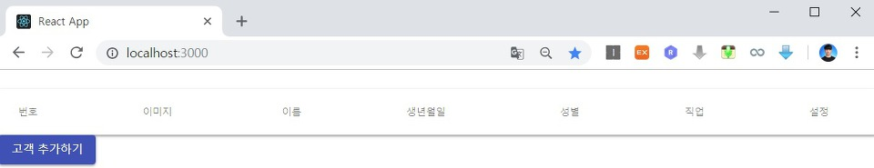
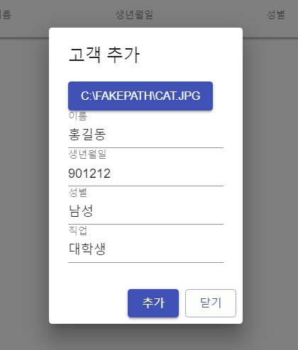
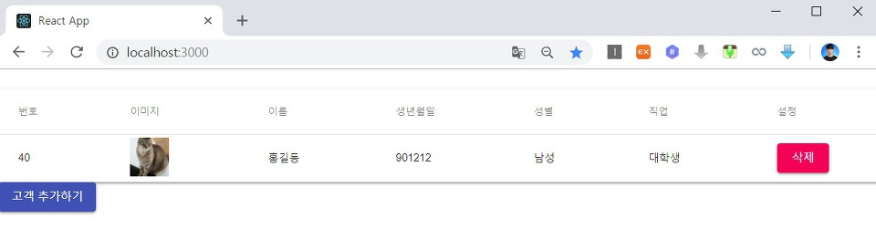
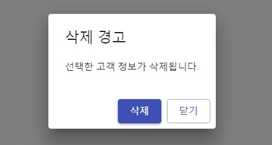

이번 시간에는 모달(Modal) 기능을 이용해서 고객 추가(Customer Add) 기능을 모달 창에서 띄우는 방법에 대해서 알아보도록 하겠습니다. 따라서 Material UI의 Dialog를 import하여 디자인 요소를 활용해야 합니다. 우리는 모달 중에서 다이얼로그(Dialog)를 활용할 것이며 이를 위해서 Dialog 컴포넌트를 사용해야 합니다.

▶ CustomerAdd.js

```js
import React from 'react'
import { post } from 'axios';
import Dialog from '@material-ui/core/Dialog';
import DialogActions from '@material-ui/core/DialogActions';
import DialogContent from '@material-ui/core/DialogContent';
import DialogTitle from '@material-ui/core/DialogTitle';
import TextField from '@material-ui/core/TextField';
import Button from '@material-ui/core/Button';
import { withStyles } from '@material-ui/core/styles';

const styles = theme => ({
  hidden: {
    display: 'none'
  }
});

class CustomerAdd extends React.Component {

  constructor(props) {
    super(props);
    this.state = {
      file: null,
      userName: '',
      birthday: '',
      gender: '',
      job: '',
      fileName: '',
      open: false
    }
    this.handleFormSubmit = this.handleFormSubmit.bind(this)
    this.handleFileChange = this.handleFileChange.bind(this)
    this.handleValueChange = this.handleValueChange.bind(this)
    this.addCustomer = this.addCustomer.bind(this)
    this.handleClickOpen = this.handleClickOpen.bind(this)
    this.handleClose = this.handleClose.bind(this);
  }

  handleFormSubmit(e) {
    e.preventDefault()
    this.addCustomer()
    .then((response) => {
      console.log(response.data);
      this.props.stateRefresh();
    })
    this.setState({
      file: null,
      userName: '',
      birthday: '',
      gender: '',
      job: '',
      fileName: '',
      open: false
    })
  }

  handleFileChange(e) {
    this.setState({
      file: e.target.files[0],
      fileName: e.target.value
    });
  }

  handleValueChange(e) {
    let nextState = {};
    nextState[e.target.name] = e.target.value;
    this.setState(nextState);
  }

  addCustomer(){
    const url = '/api/customers';
    const formData = new FormData();
    formData.append('image', this.state.file)
    formData.append('name', this.state.userName)
    formData.append('birthday', this.state.birthday)
    formData.append('gender', this.state.gender)
    formData.append('job', this.state.job)
    const config = {
      headers: {
        'content-type': 'multipart/form-data'
      }
    }
    return post(url, formData, config)
  }

  handleClickOpen() {
    this.setState({
      open: true
    });
  }

  handleClose() {
    this.setState({
      file: null,
      userName: '',
      birthday: '',
      gender: '',
      job: '',
      fileName: '',
      open: false
    })
  }

  render() {
    const { classes } = this.props;
    return (
        <div>
          <Button variant="contained" color="primary" onClick={this.handleClickOpen}>
            고객 추가하기
          </Button>
          <Dialog open={this.state.open} onClose={this.handleClose}>
            <DialogTitle>고객 추가</DialogTitle>
            <DialogContent>
              <input className={classes.hidden} accept="image/*" id="raised-button-file" type="file" file={this.state.file} value={this.state.fileName} onChange={this.handleFileChange} />
              <label htmlFor="raised-button-file">
                <Button variant="contained" color="primary" component="span" name="file">
                  {this.state.fileName === ''? "프로필 이미지 선택" : this.state.fileName}
                </Button>
              </label><br/>
              <TextField label="이름" type="text" name="userName" value={this.state.userName} onChange={this.handleValueChange} /><br/>
              <TextField label="생년월일" type="text" name="birthday" value={this.state.birthday} onChange={this.handleValueChange} /><br/>
              <TextField label="성별" type="text" name="gender" value={this.state.gender} onChange={this.handleValueChange} /><br/>
              <TextField label="직업" type="text" name="job" value={this.state.job} onChange={this.handleValueChange} /><br/>
            </DialogContent>
            <DialogActions>
              <Button variant="contained" color="primary" onClick={this.handleFormSubmit}>추가</Button>
              <Button variant="outlined" color="primary" onClick={this.handleClose}>닫기</Button>
            </DialogActions>
          </Dialog>
        </div>
      )
    }
  }

export default withStyles(styles)(CustomerAdd)
```

▶ CustomerDelete.js

```js
import React from 'react';
import Button from '@material-ui/core/Button';
import Dialog from '@material-ui/core/Dialog';
import DialogTitle from '@material-ui/core/DialogTitle';
import DialogContent from '@material-ui/core/DialogContent';
import DialogActions from '@material-ui/core/DialogActions';
import Typography from '@material-ui/core/Typography';

class CustomerDelete extends React.Component {

    constructor(props) {
        super(props);
        this.state = {
          open: false
        }
        this.handleClickOpen = this.handleClickOpen.bind(this)
        this.handleClose = this.handleClose.bind(this);
    }

    handleClickOpen() {
        this.setState({
          open: true
        });
    }

    handleClose() {
        this.setState({
          open: false
        })
    }

    deleteCustomer(id){
        const url = '/api/customers/' + id;
        fetch(url, {
           method: 'DELETE'
        });
        this.props.stateRefresh();
    }

    render() {
        return (
            <div>
                <Button variant="contained" color="secondary" onClick={this.handleClickOpen}>
                    삭제
                </Button>
                <Dialog onClose={this.handleClose} open={this.state.open}>
                    <DialogTitle onClose={this.handleClose}>
                        삭제 경고
                    </DialogTitle>
                    <DialogContent>
                        <Typography gutterBottom>
                            선택한 고객 정보가 삭제됩니다.
                        </Typography>
                    </DialogContent>
                    <DialogActions>
                        <Button variant="contained" color="primary" onClick={(e) => {this.deleteCustomer(this.props.id)}}>삭제</Button>
                        <Button variant="outlined" color="primary" onClick={this.handleClose}>닫기</Button>
                    </DialogActions>
                </Dialog>
            </div>
        )
    }
}

export default CustomerDelete;
```

※ 실행결과 ※



고객을 추가합시다.



이어서 삭제도 해봅시다.



삭제도 잘 되네요.



출처: https://ndb796.tistory.com/231?category=1030599 [안경잡이개발자]
