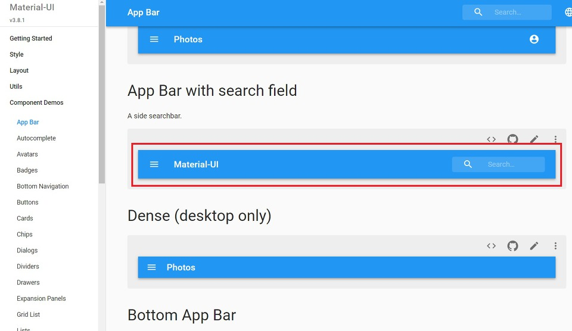
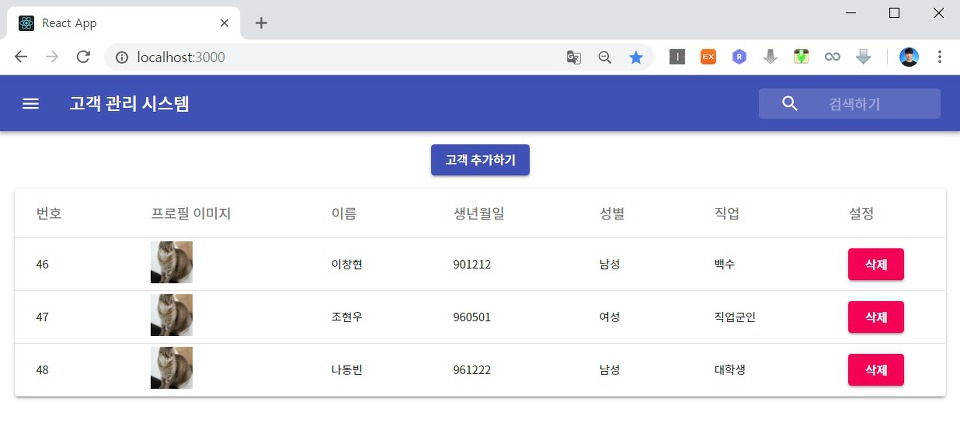

이번 시간에는 안정적인 UI/UX를 위해 AppBar을 적용하는 시간을 가져보도록 하겠습니다. AppBar는 검색 바, 내비게이션 바 등의 목적으로 사용됩니다. 따라서 가장 먼저 client 폴더로 이동해서 다음과 같은 명령어를 입력해서 icons 라이브러리를 받으면 됩니다.

▶ Material UI icons 다운로드 명령어: npm i @material-ui/icons

이제 코딩을 진행해보도록 하겠습니다. 우리가 적용할 AppBar는 React.js의 Material UI 공식 사이트에서 제공하고 있는 기본 예제입니다. 말 그대로 기본 예제라는 점에서 한글 웹 폰트(Web Font) 등은 적용되어 있지 않습니다. 따라서 우리가 직접 웹 폰트 등을 적용해야 합니다.

▶ Material UI AppBar 예제: https://material-ui.com/demos/app-bar/

우리는 아래에 보이는 App Bar with search field 예제를 넣어보도록 하겠습니다.



※ AppBar 적용하기 ※

▶ App.js

```js
import React, { Component } from 'react';
import Customer from './components/Customer'
import './App.css';
import Paper from '@material-ui/core/Paper';
import Table from '@material-ui/core/Table';
import TableHead from '@material-ui/core/TableHead';
import TableBody from '@material-ui/core/TableBody';
import TableRow from '@material-ui/core/TableRow';
import TableCell from '@material-ui/core/TableCell';
import CircularProgress from '@material-ui/core/CircularProgress';
import { withStyles } from '@material-ui/core/styles';
import CustomerAdd from './components/CustomerAdd';
import MenuIcon from '@material-ui/icons/Menu';
import SearchIcon from '@material-ui/icons/Search';
import InputBase from '@material-ui/core/InputBase';
import { fade } from '@material-ui/core/styles/colorManipulator';
import Typography from '@material-ui/core/Typography';
import AppBar from '@material-ui/core/AppBar';
import Toolbar from '@material-ui/core/Toolbar';
import IconButton from '@material-ui/core/IconButton';

const styles = theme => ({
  root: {
    width: "100%",
    minWidth: 1080
  },
  menu: {
    marginTop: 15,
    marginBottom: 15,
    display: 'flex',
    justifyContent: 'center'
  },
  paper: {
    marginLeft: 18,
    marginRight: 18
  },
  progress: {
    margin: theme.spacing.unit * 2
  },
  grow: {
    flexGrow: 1,
  },
  tableHead: {
    fontSize: '1.0rem'
  },
  menuButton: {
    marginLeft: -12,
    marginRight: 20,
  },
  title: {
    display: 'none',
    [theme.breakpoints.up('sm')]: {
      display: 'block',
    },
  },
  search: {
    position: 'relative',
    borderRadius: theme.shape.borderRadius,
    backgroundColor: fade(theme.palette.common.white, 0.15),
    '&:hover': {
      backgroundColor: fade(theme.palette.common.white, 0.25),
    },
    marginLeft: 0,
    width: '100%',
    [theme.breakpoints.up('sm')]: {
      marginLeft: theme.spacing.unit,
      width: 'auto',
    },
  },
  searchIcon: {
    width: theme.spacing.unit * 9,
    height: '100%',
    position: 'absolute',
    pointerEvents: 'none',
    display: 'flex',
    alignItems: 'center',
    justifyContent: 'center',
  },
  inputRoot: {
    color: 'inherit',
    width: '100%',
  },
  inputInput: {
    paddingTop: theme.spacing.unit,
    paddingRight: theme.spacing.unit,
    paddingBottom: theme.spacing.unit,
    paddingLeft: theme.spacing.unit * 10,
    transition: theme.transitions.create('width'),
    width: '100%',
    [theme.breakpoints.up('sm')]: {
      width: 120,
      '&:focus': {
        width: 200,
      },
    },
  }
});

class App extends Component {

  constructor(props) {
    super(props);
    this.state = {
      customers: '',
      completed: 0
    }
    this.stateRefresh = this.stateRefresh.bind(this);
  }

  stateRefresh() {
    this.setState({
      customers: '',
      completed: 0
    });
    this.callApi()
      .then(res => this.setState({customers: res}))
      .catch(err => console.log(err));
  }

  componentDidMount() {
    this.timer = setInterval(this.progress, 20);
    this.callApi()
      .then(res => this.setState({customers: res}))
      .catch(err => console.log(err));
  }

  componentWillUnmount() {
    clearInterval(this.timer);
  }

  callApi = async () => {
    const response = await fetch('/api/customers');
    const body = await response.json();
    return body;
  }

  progress = () => {
    const { completed } = this.state;
    this.setState({ completed: completed >= 100 ? 0 : completed + 1 });
  };

  render() {
    const { classes } = this.props;
    const cellList = ["번호", "프로필 이미지", "이름", "생년월일", "성별", "직업", "설정"]
    return (
      <div className={classes.root}>
        <AppBar position="static">
          <Toolbar>
            <IconButton className={classes.menuButton} color="inherit" aria-label="Open drawer">
              <MenuIcon />
            </IconButton>
            <Typography className={classes.title} variant="h6" color="inherit" noWrap>
              고객 관리 시스템
            </Typography>
            <div className={classes.grow} />
            <div className={classes.search}>
              <div className={classes.searchIcon}>
                <SearchIcon />
              </div>
              <InputBase
                placeholder="검색하기"
                classes={{
                  root: classes.inputRoot,
                  input: classes.inputInput,
                }}
              />
            </div>
          </Toolbar>
        </AppBar>
        <div className={classes.menu}>
          <CustomerAdd stateRefresh={this.stateRefresh} />
        </div>
        <Paper className={classes.paper}>
          <Table>
            <TableHead>
              <TableRow>
                {cellList.map(c => {
                  return <TableCell className={classes.tableHead}>{c}</TableCell>
                })}
              </TableRow>
            </TableHead>
            <TableBody>
              {this.state.customers ?
                this.state.customers.map(c => {
                  return <Customer stateRefresh={this.stateRefresh} key={c.id} id={c.id} image={c.image} name={c.name} birthday={c.birthday} gender={c.gender} job={c.job} />
                }) :
                <TableRow>
                  <TableCell colSpan="6" align="center">
                    <CircularProgress className={classes.progress} variant="determinate" value={this.state.completed} />
                  </TableCell>
                </TableRow>
              }
            </TableBody>
          </Table>
        </Paper>
      </div>
    );
  }
}

export default withStyles(styles)(App);
```

▶ index.css

index.css에서는 Note Sans KR 글씨체를 웹 폰트 형태로 불러오게 됩니다.

```css
@import url(http://fonts.googleapis.com/earlyaccess/notosanskr.css);

body {
  margin: 0;
  padding: 0;
  font-family: "Noto Sans KR", -apple-system, BlinkMacSystemFont, "Segoe UI", "Roboto", "Oxygen",
    "Ubuntu", "Cantarell", "Fira Sans", "Droid Sans", "Helvetica Neue",
    sans-serif;
  -webkit-font-smoothing: antialiased;
  -moz-osx-font-smoothing: grayscale;
}

code {
  font-family: source-code-pro, Menlo, Monaco, Consolas, "Courier New",
    monospace;
}
```

▶ index.js

이제 index.js에서는 Material UI의 테마 폰트로 "Note Sans KR"을 적용해주면 됩니다. 이렇게 해주지 않으면 곳곳에 사용된 Material UI에 전체적인 폰트 적용이 안 될 수도 있습니다.

```js
import React from 'react';
import ReactDOM from 'react-dom';
import './index.css';
import App from './App';
import * as serviceWorker from './serviceWorker';
import { MuiThemeProvider, createMuiTheme } from '@material-ui/core/styles';

const theme = createMuiTheme({
    typography: {
        fontFamily: '"Noto Sans KR", serif',
    },
});

ReactDOM.render(<MuiThemeProvider theme={theme}><App /></MuiThemeProvider>, document.getElementById('root'));

serviceWorker.unregister();
```

※ 실행 결과 ※

결과적으로 다음과 같이 전체적인 UI가 Material한 형태로 업데이트 되었습니다.



출처: https://ndb796.tistory.com/232?category=1030599 [안경잡이개발자]
