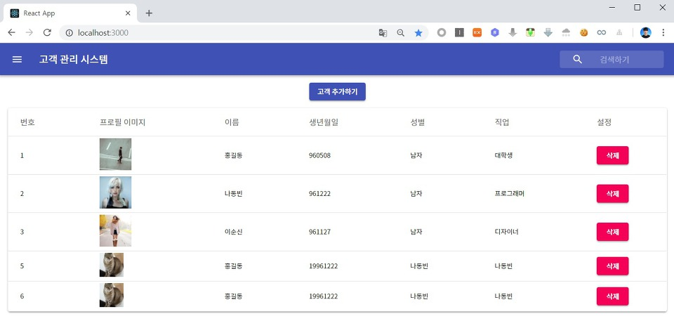
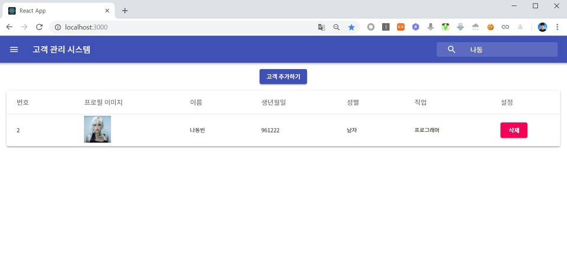

이번 시간에는 필터(Filter) 함수를 이용하여 고객(Customer) 검색 기능을 구현하는 방법에 대해서 알아보도록 하겠습니다.

▶ App.js

기본적으로 검색 창에 사용자가 입력한 문자열을 스테이트(State)에 반영하기 위해서는 다음과 같은 값 변경 처리 함수가 필요합니다. 바로 함수를 만들어 보도록 하겠습니다. `stateRefresh()` 함수 아래에 내용을 추가합니다.

```js
handleValueChange(e) {
  let nextState = {};
  nextState[e.target.name] = e.target.value;
  this.setState(nextState);
}
```

이후에 생성자(Constructor)에서 이를 바인딩(Binding) 처리를 하고 `searchKeyword` 값도 추가합니다.

```js
constructor(props) {
  super(props);
  this.state = {
    customers: '',
    completed: 0,
    searchKeyword: ''
  }
  this.stateRefresh = this.stateRefresh.bind(this);
  this.handleValueChange = this.handleValueChange.bind(this)
}
```

이후에 `<InputBase>` 에서 다음과 같이 작성합니다.

```js
<InputBase
  placeholder="검색하기"
  classes={{
    root: classes.inputRoot,
    input: classes.inputInput,
  }}
  name="searchKeyword"
  value={this.state.searchKeyword}
  onChange={this.handleValueChange}
/>
```

지금까지는 단순히 고객 스테이트가 변경되면 전체 고객을 바로 보여주는 식으로 코드가 동작했습니다. 이제는 전체 고객 컴포넌트를 생성하는 부분을 render() 함수의 가장 윗 부분에서 새롭게 명시해주도록 하겠습니다.

```js
const filteredComponents = (data) => {
  data = data.filter((c) => {
    return c.name.indexOf(this.state.searchKeyword) > -1;
  });
  return data.map((c) => {
    return (
      <Customer
        stateRefresh={this.stateRefresh}
        key={c.id}
        id={c.id}
        image={c.image}
        name={c.name}
        birthday={c.birthday}
        gender={c.gender}
        job={c.job}
      />
    );
  });
};
```

이후에 <TableBody> 부분을 다음과 같이 작성하면 됩니다.

```js
<TableBody>
  {this.state.customers ? (
    filteredComponents(this.state.customers)
  ) : (
    <TableRow>
      <TableCell colSpan="6" align="center">
        <CircularProgress
          className={classes.progress}
          variant="determinate"
          value={this.state.completed}
        />
      </TableCell>
    </TableRow>
  )}
</TableBody>
```

마지막으로 새로운 고객이 추가된 경우 검색 창 내용도 비워질 수 있도록 처리하겠습니다.

```js
stateRefresh() {
  this.setState({
    customers: '',
    completed: 0,
    searchKeyword: ''
  });
  this.callApi()
    .then(res => this.setState({customers: res}))
    .catch(err => console.log(err));
}
```

※ 실행 결과 ※





출처: https://ndb796.tistory.com/254?category=1030599 [안경잡이개발자]
