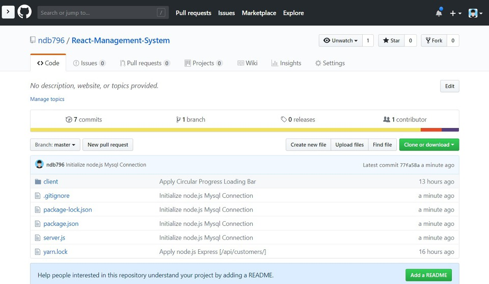

DB 연결이 끝났으니 이제 SQL을 통해 TABLE을 생성하겠습니다.

```sql
CREATE TABLE CUSTOMER (
	id int IDENTITY(1,1) NOT NULL,
	image varchar(1024) COLLATE Korean_Wansung_CI_AS NULL,
	name varchar(64) COLLATE Korean_Wansung_CI_AS NULL,
	birthday varchar(64) COLLATE Korean_Wansung_CI_AS NULL,
	gender varchar(64) COLLATE Korean_Wansung_CI_AS NULL,
	job varchar(64) COLLATE Korean_Wansung_CI_AS NULL,
	CONSTRAINT CUSTOMER_PK PRIMARY KEY (id)
);
```


위 SQL 문을 입력 후 구문 전체를 선택하고 `Ctrl+Enter`를 입력합니다.


정상적으로 실행되면 위와 같이 나오게 됩니다.

이제 테스트 데이터를 입력하겠습니다.

```sql
INSERT INTO CUSTOMER VALUES ('https://placeimg.com/64/64/1', '홍길동', '960508', '남자', '대학생');
INSERT INTO CUSTOMER VALUES ('https://placeimg.com/64/64/2', '나동빈', '961222', '남자', '프로그래머');
INSERT INTO CUSTOMER VALUES ('https://placeimg.com/64/64/3', '이순신', '961127', '남자', '디자이너');

SELECT * FROM CUSTOMER;
```

위와 같이 입력 후 `Ctrl+Enter`를 눌러 데이터를 입력합니다.


※ .gitignore ※

이제 데이터베이스와 연동하는 작업을 처리하도록 하겠습니다. 기본적으로 데이터베이스 관련 정보는 Git Ignore 처리를 해서 깃 허브(Git Hub)에 올라가지 않도록 처리해야 합니다. 따라서 서버 프로그램의 .gitignore 파일을 다음과 같이 수정합니다.

```
# database
/database.json
```

이후 루트 폴더에 database.json 파일을 생성하고 데이터베이스 정보를 설정하시면 됩니다.

```json
{
  "host": "192.168.40.145",
  "user": "BimUser",
  "password": "@summer2014",
  "port": 1433,
  "database": "EKP_BIM"
}
```


그러면 위와 같이 프로젝트가 구성됩니다.

※ Node.js와 MSSQL 연동하기 ※

이제 Node.js와 MSSQL을 연동해 봅시다. 가장 먼저 NPM을 이용하여 MSSQL 라이브러리를 설치하셔야 합니다.

▶ npm install -S mssql

이후에 설치된 mssql 라이브러리를 활용하여 node.js와 MSSQL을 연동할 수 있습니다.

```js
const fs = require('fs');
const express = require('express');
const bodyParser = require('body-parser');
const app = express();
const PORT = process.env.PORT || 5000;
app.use(bodyParser.json());
app.use(bodyParser.urlencoded({ extended: true }));

const data = fs.readFileSync('./database.json');
const conf = JSON.parse(data);

const config = {
  server: conf.host,
  port: conf.port,
  database: conf.database,
  user: conf.user,
  password: conf.password,
  encrypt: false,
};

const sql = require("mssql");

sql.connect(config, function (err) {
  if (err) {
    return console.error("error : ", err);
  }
  console.log("MSSQL 연결 완료");
});

app.get("/api/customers", (req, res) => {
  var request = new sql.Request();
  q = "SELECT * FROM CUSTOMER";
  request.query(q, (err, rows, fields) => {
    res.send(rows.recordset);
  });
});

app.listen(PORT, () => {
  console.log(`Server is running on port ${PORT}.`);
});
```

결과적으로 다음과 같이 서버 API가 정상적으로 동작하는 것을 확인할 수 있습니다.


이후에 깃 허브(Git Hub)에 소스코드를 반영하면 다음과 같습니다.


데이터베이스 설정 파일인 database.json 파일은 깃 허브에 올라가지 않는 것을 확인할 수 있습니다.



출처: https://ndb796.tistory.com/221?category=1030599 [안경잡이개발자]
