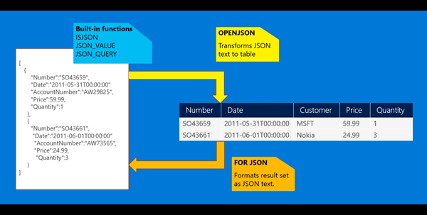

[SQL Server의 JSON 데이터](https://docs.microsoft.com/ko-kr/sql/relational-databases/json/json-data-sql-server?view%3Dsql-server-ver16)

JSON은 최신 웹 및 모바일 애플리케이션에서 데이터를 교환하는 데 사용되는 일반적인 텍스트 데이터 형식입니다. JSON은 로그 파일 또는 Microsoft Azure Cosmos DB와 같은 NoSQL 데이터베이스에 구조화되지 않은 데이터를 저장하는 데에도 사용됩니다. 많은 REST 웹 서비스에서 JSON 텍스트로 형식이 지정된 결과를 반환하거나 JSON으로 형식이 지정된 데이터를 허용합니다. 예를 들어 Azure Search, Azure Storage, Azure Cosmos DB 등 대부분의 Azure 서비스에는 JSON을 반환하거나 사용하는 REST 엔드포인트가 있습니다. 또한 JSON은 AJAX 호출을 사용하여 웹 페이지와 웹 서버 간에 데이터를 교환하는 기본 형식입니다.

SQL Server 2016에서 처음 도입된 JSON 함수를 사용하면 NoSQL과 관계형 개념을 동일한 데이터베이스에서 결합할 수 있습니다. 이제 기본 관계형 열을 동일한 테이블에서 JSON 텍스트로 형식이 지정된 문서를 포함하는 열과 결합하여 관계형 구조로 JSON 문서를 구문 분석하고 가져오거나 관계형 데이터를 JSON 텍스트로 형식을 지정할 수 있습니다.

JSON 텍스트의 예는 다음과 같습니다.

```json
[
  {
    "name": "John",
    "skills": ["SQL", "C#", "Azure"]
  },
  {
    "name": "Jane",
    "surname": "Doe"
  }
]
```



## JSON 텍스트에서 값을 추출하여 쿼리에서 사용

데이터베이스 테이블에 저장된 JSON 텍스트가 있는 경우 다음과 같은 기본 제공 함수를 사용하여 JSON 텍스트의 값을 읽거나 수정할 수 있습니다.

- ISJSON(Transact-SQL)은 문자열에 유효한 JSON이 포함되어 있는지 여부를 테스트합니다.
- JSON_VALUE(Transact-SQL)는 JSON 문자열에서 스칼라 값을 추출합니다.
- JSON_QUERY(Transact-SQL)는 JSON 문자열에서 개체 또는 배열을 추출합니다.
- JSON_MODIFY(Transact-SQL)는 JSON 문자열에 있는 값을 변경합니다.

다음 예제에서 쿼리는 테이블의 관계형 및 JSON 데이터(jsonCol 열에 저장됨)를 모두 사용합니다.

```sql
SELECT Name, Surname,
  JSON_VALUE(jsonCol, '$.info.address.PostCode') AS PostCode,
  JSON_VALUE(jsonCol, '$.info.address."Address Line 1"') + ' '
  + JSON_VALUE(jsonCol, '$.info.address."Address Line 2"') AS Address,
  JSON_QUERY(jsonCol, '$.info.skills') AS Skills
FROM People
WHERE ISJSON(jsonCol) > 0
  AND JSON_VALUE(jsonCol, '$.info.address.Town') = 'Belgrade'
  AND Status = 'Active'
ORDER BY JSON_VALUE(jsonCol, '$.info.address.PostCode')
```

애플리케이션 및 도구는 스칼라 테이블 열에서 가져온 값과 JSON 열에서 가져온 값 간의 차이점을 표시하지 않습니다. Transact-SQL 쿼리의 모든 부분(WHERE, ORDER BY, GROUP BY 절, 창 집계 등 포함)에서 JSON 텍스트 값을 사용할 수 있습니다. JSON 함수는 JavaScript 형식의 구문을 사용하여 JSON 텍스트 내의 값을 참조합니다.

자세한 내용은 기본 함수를 사용하여 JSON 데이터 유효성 검사, 쿼리, 변경(SQL Server), JSON_VALUE(Transact-SQL) 및 JSON_QUERY(Transact-SQL)를 참조하세요.

## JSON 값 변경

JSON 텍스트의 일부를 수정해야 하는 경우 JSON_MODIFY(Transact-SQL) 함수를 사용하여 JSON 문자열에서 속성 값을 업데이트하고 업데이트된 JSON 문자열을 반환할 수 있습니다. 다음 예제에서는 JSON이 포함된 변수에서 속성 값을 업데이트합니다.

```sql
DECLARE @json NVARCHAR(MAX);
SET @json = '{"info": {"address": [{"town": "Belgrade"}, {"town": "Paris"}, {"town":"Madrid"}]}}';
SET @json = JSON_MODIFY(@json, '$.info.address[1].town', 'London');
SELECT modifiedJson = @json;
```

- 결과

modifiedJson

{"info":{"address":[{"town":"Belgrade"},{"town":"London"},{"town":"Madrid"}]}

## JSON 컬렉션을 행 집합으로 변환

SQL Server의 JSON 쿼리에는 사용자 지정 쿼리 언어가 필요 없습니다. JSON 데이터를 쿼리하려면 표준 T-SQL을 사용하면 됩니다. JSON 데이터에 대한 쿼리 또는 보고서를 만들어야 하는 경우 OPENJSON 행 집합 함수를 호출하여 JSON 데이터를 행 및 열로 쉽게 변환할 수 있습니다. 자세한 내용은 OPENJSON을 사용하여 JSON 데이터를 행과 열로 변환(SQL Server)을 참조하세요.

다음 예제에서는 OPENJSON을 호출하고 @json 변수에 저장된 개체 배열을 표준 SQL SELECT 문을 사용하여 쿼리할 수 있는 행 집합으로 변환합니다.

```sql
DECLARE @json NVARCHAR(MAX);
SET @json = N'[
  {"id": 2, "info": {"name": "John", "surname": "Smith"}, "age": 25},
  {"id": 5, "info": {"name": "Jane", "surname": "Smith"}, "dob": "2005-11-04T12:00:00"}
]';

SELECT *
FROM OPENJSON(@json)
  WITH (
    id INT 'strict $.id',
    firstName NVARCHAR(50) '$.info.name',
    lastName NVARCHAR(50) '$.info.surname',
    age INT,
    dateOfBirth DATETIME2 '$.dob'
  );
```

* 결과

| ID  | firstName | lastName | age                 | dateOfBirth |
| --- | --------- | -------- | ------------------- | ----------- |
| 2   | John      | Smith    | 25                  |             |
| 5   | Jane      | Smith    | 2005-11-04T12:00:00 |             |


```sql

delete from TB_FAMILY_SYM where 1=1;
delete from TB_FAMILY where 1=1;
delete from TB_FAMILY_FILE  where 1=1;
delete from TB_FAMILY_PARAM  where 1=1;
delete from TB_FAMILY_RELATION where 1=1;


DECLARE @json NVARCHAR(MAX);
SET @json = N'[  
  {"id": 2, "info": {"name": "John", "surname": "Smith"}, "age": 25},
  {"id": 5, "info": {"name": "Jane", "surname": "Smith", "skills": ["SQL", "C#", "Azure"]}, "dob": "2005-11-04T12:00:00"}  
]';

SELECT id, firstName, lastName, age, dateOfBirth, skill  
FROM OPENJSON(@json)  
  WITH (
    id INT 'strict $.id',
    firstName NVARCHAR(50) '$.info.name',
    lastName NVARCHAR(50) '$.info.surname',  
    age INT,
    dateOfBirth DATETIME2 '$.dob',
    skills NVARCHAR(MAX) '$.info.skills' AS JSON
  )
OUTER APPLY OPENJSON(skills)
  WITH (skill NVARCHAR(8) '$');
  
 
 
 select * from TB_FAMILY
 select * from TB_FAMILY_SYM 
 
SELECT 
	SEQ,
	ID_REL_FML,
	NM_SYM, 
	JSON_VALUE(GEOM_SYM, '$.SurfaceArea') as SurfaceArea,
	GEOM_SYM 
FROM 
	TB_FAMILY_SYM
WHERE
	ISJSON(GEOM_SYM) > 0 AND 	
	JSON_QUERY(GEOM_SYM, '$.Faces') is not null
	
	
	convert (float, JSON_VALUE(GEOM_SYM, '$.SurfaceArea')) > 0

```